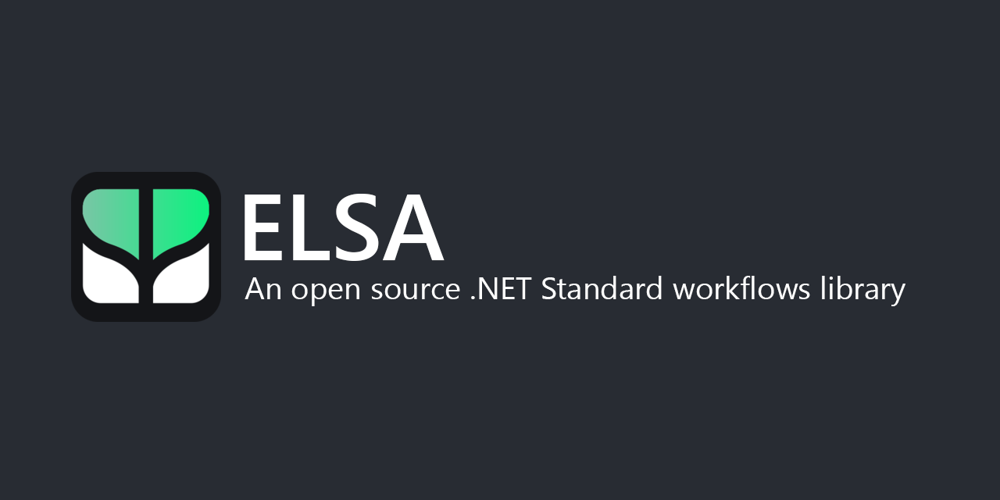
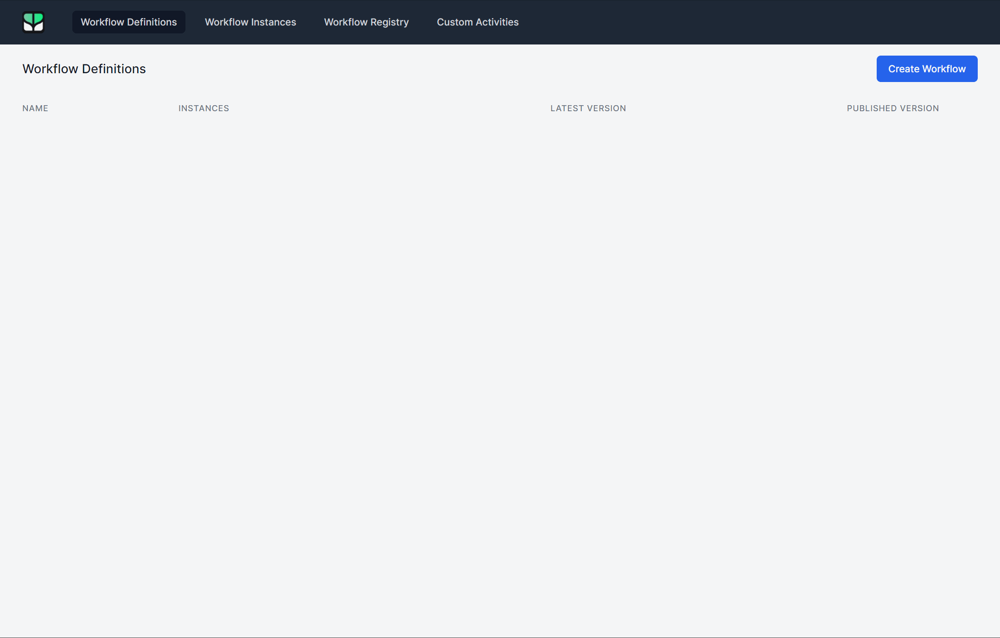

<a href="https://elsa-workflows.github.io/elsa-core/">
  <p align="center">
    
  </p>
</a>

## Elsa Workflows

[](https://www.nuget.org/packages/Elsa/2.0.0-rc1-0)
[](https://www.myget.org/gallery/elsa-2)
[](https://ci.appveyor.com/project/sfmskywalker/elsa)
[](https://discord.gg/hhChk5H472)
[]( http://stackoverflow.com/questions/tagged/elsa-workflows )
[](https://github.com/elsa-workflows/elsa-core/actions/workflows/publish-latest-dashboard-and-server-docker.yml)
[](https://hub.docker.com/repository/docker/elsaworkflows/elsa-dashboard-and-server)

Elsa Core is a workflows library that enables workflow execution in any .NET Core application.
Workflows can be defined using code and using the visual workflow designer.

<p align="center">
  
</p>

## Documentation

Documentation can be found [here](https://elsa-workflows.github.io/elsa-core/docs/next/quickstarts/quickstarts-console-hello-world).

## Getting Started

```bash
dotnet new console -n "MyConsoleApp"

cd MyConsoleApp

dotnet add package Elsa
```

Create a new file called `HelloWorldWorkflow.cs` and add the following:

```csharp
using Elsa.Activities.Console;
using Elsa.Builders;

namespace MyConsoleApp
{
    public class HelloWorld : IWorkflow
    {
        public void Build(IWorkflowBuilder builder) => builder.WriteLine("Hello World!");
    }
}
```

Modify `Program.cs` as follows:

```csharp
using System.Threading.Tasks;
using Elsa.Services;
using Microsoft.Extensions.DependencyInjection;

namespace MyConsoleApp
{
    class Program
    {
        private static async Task Main()
        {
            var services = new ServiceCollection()
                .AddElsa(options => options
                    .AddConsoleActivities()
                    .AddWorkflow<HelloWorld>())
                .BuildServiceProvider();
            
            var workflowRunner = services.GetRequiredService<IBuildsAndStartsWorkflow>();
            await workflowRunner.BuildAndStartWorkflowAsync<HelloWorld>();
        }
    }
}
```

Run the program:

```bash
dotnet run
```

Output:

```bash
Hello World!
```

Check out the [Quickstart guides](https://elsa-workflows.github.io/elsa-core/docs/next/quickstarts/quickstarts-console-hello-world) for more examples, including how to setup the Elsa Dashboard to create and manage visual workflows.

## Docker

A quick and easy way to give Elsa a spin is to run the following Docker command:

```bash
docker run -t -i -e ELSA__SERVER__BASEURL='http://localhost:13000' -p 13000:80 elsaworkflows/elsa-dashboard-and-server:latest
```

Then navigate to http://localhost:13000.

## Building From Source

When you clone the repo, the solution file to open is `Elsa.sln` which should build with no issues.

### Elsa Dashboard & Client Assets
If you want to run the sample project `ElsaDashboard.Samples.AspNetCore.Monolith.csproj`, you should build the client assets first.

The easiest way to do that is by running the `.\build-assets.ps1` file in the root of the repo (where this README.md is as well).
Alternatively, you might run `.\build-assets-and-run-dashboard-monolith.ps1` that will first build the client assets and then run the dashboard application to give Elsa a quick whirl.

### Docker Compose

Another quick way to try out Elsa is to run `build-and-run-dashboard-monolith-with-docker.ps1`, which will use Docker Compose to build an image and start a container.
When the container starts, you can reach the Elsa Dashboard at http://localhost:6868 

## Roadmap

Version 1.0

- [x] Workflow Invoker
- [x] Long-running Workflows
- [x] Workflows as code
- [x] Workflows as data
- [x] Correlation
- [x] Persistence: CosmosDB, Entity Framework Core, MongoDB, YesSQL 
- [x] HTML5 Workflow Designer Web Component
- [x] ASP.NET Core Workflow Dashboard
- [x] JavaScript Expressions
- [x] Liquid Expressions
- [x] Primitive Activities
- [X] Control Flow Activities
- [x] Workflow Activities
- [x] Timer Activities
- [x] HTTP Activities
- [x] Email Activities

Version 2.0

- [x] Composite Activities API
- [x] Service Bus Messaging
- [x] Workflow Host REST API
- [x] Workflow Server
- [x] Distributed Hosting Support (support for multi-node environments)
- [x] Persistence: MongoDB, YesSQL, Entity Framework Core (SQL Server, SQLLite, PostgreSql)
- [x] New Workflow Designer + Dashboard
- [x] Generic Command & Event Activities
- [x] State Machines
- [ ] Test Workflows from Designer
- [ ] Debug Workflows from Designer
- [ ] Sagas
- [ ] Localization Support
- [ ] Lucene Indexing

Version 3.0 (engine redesign)

- [ ] Programming model similar to WF
- [ ] Sequential Workflows
- [ ] Flowchart Workflows
- [ ] State Machine Workflows
- [ ] Sagas
- [ ] BPMS Workflows
- [ ] Actor Model for Distributed Workflows

## Workflow Designer

Workflows can be visually designed using the Elsa Designer, a reusable & extensible HTML5 web component built with [StencilJS](https://stenciljs.com/).
To manage workflow definitions and instances, Elsa comes with an NPM package providing a set of HTML web components and a reusable Razor Class Library that wraps this package. The NPM package can be used in any type of web application, while the RCL provides Razor Components to embed the Elsa Dashboard SPA component as well as individual components in your ASP.NET Core application.

## Programmatic Workflows

Workflows can be created programmatically and then executed using one of the various APIs, which vary from low-level control to high-level ease of use.

### Hello World
The following code snippet demonstrates creating a workflow with two WriteLine activities from code and then invoking it:

```c#

// Define a strongly-typed workflow.
public class HelloWorldWorkflow : IWorkflow
{
    public void Build(IWorkflowBuilder builder)
    {
        builder
            .WriteLine("Hello World!")
            .WriteLine("Goodbye cruel world...");
    }
}

// Setup a service collection.
var services = new ServiceCollection()
    .AddElsa()
    .AddConsoleActivities()
    .AddWorkflows<HelloWorldWorkflow>()
    .BuildServiceProvider();

// Get a workflow runner.
var workflowRunner = services.GetService<IBuildsAndStartsWorkflow>();

// Run the workflow.
await workflowRunner.BuildAndStartWorkflowAsync<HelloWorld>();

// Output:
// /> Hello World!
// /> Goodbye cruel world...
```

## Persistence

Elsa abstracts away data access, which means you can use any persistence provider you prefer. 

## Long Running Workflows

Elsa has native support for long-running workflows. As soon as a workflow is halted because of some blocking activity, the workflow is persisted.
When the appropriate event occurs, the workflow is loaded from the store and resumed. 

## Features

- Create workflows using the **Workflow Builder API**.
- Create & manage workflows **visually** using the Elsa Dashboard SPA.
- Design **long-running** workflows.
- REST **API Endpoints** to manage and integrate with Elsa from external applications.
- Create higher-level activities using the **Composite Activity API**.
- **Rich set of activities** such as SetVariable, For, ForEach, ParallelForEach, Fork, Join, HttpEndpoint, SendHttpRequest, SendEmail, MessageReceived and much more.
- Create **custom activities**.
- **Workflow Expressions** allow you to configure activity properties with expressions that are evaluated at runtime. Supported syntaxes are JavaScript ans Liquid.

## Why Elsa Workflows?

One of the main goals of Elsa is to **enable workflows in any .NET application** with **minimum effort** and **maximum extensibility**.
This means that it should be easy to integrate workflow capabilities into your own application.

### What about Azure Logic Apps?

As powerful and as complete Azure Logic Apps is, it's available only as a managed service in Azure. Elsa on the other hand allows you to host it not only on Azure, but on any cloud provider that supports .NET Core. And of course you can host it on-premise.

Although you can implement long-running workflows with Logic Apps, you would typically do so with splitting your workflow with multiple Logic Apps where one workflow invokes the other. This can make the logic flow a bit hard to follow.
with Elsa, you simply add triggers anywhere in the workflow, making it easier to have a complete view of your application logic. And if you want, you can still invoke other workflows form one workflow.

### What about Windows Workflow Foundation?

I've always liked Windows Workflow Foundation, but unfortunately [development appears to have halted](https://forums.dotnetfoundation.org/t/what-is-the-roadmap-of-workflow-foundation/3066).
Although there's an effort being made to [port WF to .NET Standard](https://github.com/dmetzgar/corewf), there are a few reasons I prefer Elsa:

- Elsa intrinsically supports triggering events that starts new workflows and resumes halted workflow instances in an easy to use manner. E.g. `workflowHost.TriggerWorkflowAsync("HttpRequestTrigger");"` will start and resume all workflows that either start with or are halted on the `HttpRequestTrigger`. 
- Elsa has a web-based workflow designer. I once worked on a project for a customer that was building a huge SaaS platform. One of the requirements was to provide a workflow engine and a web-based editor. Although there are commercial workflow libraries and editors out there, the business model required open-source software. We used WF and the re-hosted Workflow Designer. It worked, but it wasn't great.

### What about Orchard Workflows?

Both [Orchard](http://docs.orchardproject.net/en/latest/Documentation/Workflows/) and [Orchard Core](https://orchardcore.readthedocs.io/en/dev/docs/reference/modules/Workflows/) ship with a powerful workflows module, and both are awesome.
In fact, Elsa Workflows is taken & adapted from Orchard Core's Workflows module. Elsa uses a similar model, but there are some differences:  

- Elsa Workflows is completely decoupled from web, whereas Orchard Core Workflows is coupled to not only the web, but also the Orchard Core Framework itself.
- Elsa Workflows can execute in any .NET Core application without taking a dependency on any Orchard Core packages.

## Code of Conduct

This project has adopted the code of conduct defined by the Contributor Covenant to clarify expected behavior in our community.
For more information see the [.NET Foundation Code of Conduct](https://dotnetfoundation.org/code-of-conduct). 

### .NET Foundation

This project is supported by the [.NET Foundation](https://dotnetfoundation.org).

## Sponsored by Interfirst

This project is proudly backed by [Interfirst](http://www.interfirst.com/), a Residential Mortgage Licensee.

<a href="http://www.interfirst.com/"></a>
