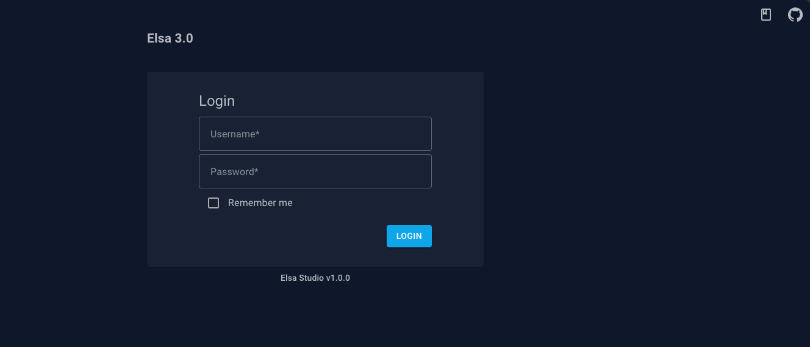

# ELSA 3.0


[](https://github.com/elsa-workflows/elsa-core/actions/workflows/packages.yml)
[](https://www.nuget.org/packages/Elsa/)
[](https://f.feedz.io/elsa-workflows/elsa-3/nuget/index.json)
[](https://www.npmjs.com/package/@elsa-workflows/elsa-workflows-studio)
[](https://f.feedz.io/elsa-workflows/elsa-3/packages/%40elsa-workflows%2Felsa-studio-wasm/latest/download)
[](https://hub.docker.com/repository/docker/elsaworkflows/elsa-v3)
[](https://discord.gg/hhChk5H472)
[]( http://stackoverflow.com/questions/tagged/elsa-workflows )
[](https://www.reddit.com/r/elsaworkflows/)

### [For Elsa 2 Click Here](https://github.com/elsa-workflows/elsa-core/tree/2.x)

## Introduction
Elsa is a powerful workflow library that enables workflow execution within any .NET application. Elsa allows you to define workflows in various ways, including:

- Writing C# code
- Using a visual designer
- Specifying workflows in JSON


### Try with Docker

To give the Elsa Studio + Elsa Server a quick spin, you can run the following command to start the Elsa Docker container:

```shell
docker pull elsaworkflows/elsa-v3:latest
docker run -t -i -e ASPNETCORE_ENVIRONMENT='Development' -e HTTP_PORTS=8080 -p 13000:8080 elsaworkflows/elsa-v3:latest
```

> This Docker image is based on a reference ASP.NET application that hosts both the workflow server and designer and is not intended for production use.

By default, you can access http://localhost:13000 and log in with:

```
  Username: admin
  Password: password
```

## Table of Contents

- [Documentation](#documentation)
- [Known Issues and Limitations](#known-issues-and-limitations)
- [Features](#features)
- [Roadmap](#roadmap)
- [Use Cases](#use-cases)
- [Console Example](#console-example)
- [ASP.NET Example](#aspnet-example)
- [Elsa Server + Elsa Studio](#elsa-server--elsa-studio)
- [Building from Source](#building-from-source)

## Documentation

For comprehensive documentation and to get started with Elsa, please visit the [Elsa Documentation Website](https://v3.elsaworkflows.io/).

## Known Issues and Limitations

Elsa is continually evolving, and while it offers powerful capabilities, there are some known limitations and ongoing work:

- Documentation is still a work in progress.
- The designer is not yet fully embeddable in other applications; this feature is planned for a future release.
- C# and Python expressions are not yet fully tested.
- Bulk Dispatch Workflows is a new activity and not yet fully tested.
- Input/Output is not yet implemented in the Workflow Instance Viewer.
- Starting workflows from the designer is currently supported only for workflows that do not require input and do not start with a trigger; this is planned for a future release.
- The designer currently only supports Flowchart activities. Support for Sequence and StateMachine activities is planned for a future release.
- UI input validation is not yet implemented.

## Features

Elsa offers a wide range of features for building and executing workflows, including:

- Execution of workflows in any .NET application with support for .NET 6 and beyond.
- Support for both short-running and long-running workflows.
- A programming model loosely inspired by Windows Workflow Foundation.
- A web-based drag & drop designer with support for custom activities.
- Native support for activity composition, including activities like `Sequence`, `Flowchart`, and `ForEach`.
- Parallel execution of activities.
- Built-in activities for common scenarios, such as sending emails, making HTTP calls, scheduling tasks, sending and receiving messages, and more.
- Workflow versioning and migration via API.
- Easy integration with external applications via HTTP, message queues, and more.
- Actor model for increased workflow throughput.
- Dynamic expressions with support for C#, JavaScript, Python, and Liquid.
- Persistence agnostic, with support for Entity Framework Core, MongoDB, and Dapper out of the box.
- [Elsa Studio](https://github.com/elsa-workflows/elsa-studio): a modular Blazor dashboard app for managing and designing workflows.

## Roadmap

The following features are planned for future releases of Elsa:

- [ ] Multi-tenancy
- [ ] State Machine activity
- [ ] Designer support for Sequence activity & StateMachine activity
- [ ] BPMN 2.0 support
- [ ] DMN support
- [ ] Workflow migration to new versions via UI
- [ ] Capsules ("hot" deployable workflow packages containing activities and configuration)

## Use Cases

Elsa can be used in a variety of scenarios, including:

- Long-running workflows such as order fulfillment and product approval.
- Short-running workflows such as sending emails and generating PDFs.
- Scheduled workflows such as sending daily reports.
- Event-driven workflows such as sending welcome emails when a user signs up.

## Console Example

Let's explore a simple example demonstrating how to create and run a workflow in a console application. In this example, we'll create a workflow that writes "Hello World!" to the console.

First, create a new console application and add the following NuGet packages:

```shell
dotnet new console -n "ElsaConsole" -f net8.0
cd ElsaConsole
dotnet add package Elsa
```

Open Program.cs and replace its contents with the following code:

```csharp
using Elsa.Extensions;
using Elsa.Workflows.Core.Activities;
using Elsa.Workflows.Core.Contracts;
using Microsoft.Extensions.DependencyInjection;

// Set up the service container.
var services = new ServiceCollection();

// Add Elsa services.
services.AddElsa();

// Build the service container.
var serviceProvider = services.BuildServiceProvider();

// Create a workflow.
var workflow = new WriteLine("Hello World!");

// Resolve a workflow runner to run the workflow.
var workflowRunner = serviceProvider.GetRequiredService<IWorkflowRunner>();

// Run the workflow.
await workflowRunner.RunAsync(workflow);
```

Run the application using the following command:

```shell
dotnet run
```

The application should output the following text:

```shell
Hello World!
```

You can also create more complex workflows. For example, the following demonstrates how to create a workflow that writes two messages to the console:

```csharp
var workflow = new Sequence
{
    Activities =
    {
        new WriteLine("Hello World!"), 
        new WriteLine("Goodbye cruel world...")
    }
};
```

Which will output the following text:

```shell
Hello World!
Goodbye cruel world...
```

# ASP.NET Example

When working with workflows that involve timers, messages and other events, running a simple Console application is not enough.
In this case, we need a proper host that can run the workflows in the background and handle events.

ASP.NET Core is a great host for this purpose. The following example demonstrates how to create a simple ASP.NET Core application that acts as a workflow server.

First, create a new ASP.NET Core application and add the following NuGet packages:

```shell
dotnet new web -n "ElsaWeb" -f net8.0
cd ElsaWeb
dotnet add package Elsa --prerelease
dotnet add package Elsa.Http --prerelease
```

```csharp
using Elsa.Extensions;

var builder = WebApplication.CreateBuilder(args);
var services = builder.Services;

// Add Elsa services.
services.AddElsa(elsa => elsa
    
    // Add workflows from this program.
    .AddWorkflowsFrom<Program>()
        
    // Enable Elsa HTTP module for HTTP related activities. 
    .UseHttp()
);

// Configure ASP.NET's middleware pipeline.
var app = builder.Build();

if (app.Environment.IsDevelopment())
    app.UseDeveloperExceptionPage();

// Add Elsa HTTP middleware to handle requests mapped to HTTP Endpoint activities.
app.UseWorkflows();

// Start accepting requests.
app.Run();
```

The above example demonstrates how to:

- Add workflows from the current program.
- Enable the HTTP module to handle HTTP related activities.

Next, let's define a workflow that handles HTTP requests.

### HTTP Workflow

Create a new file called `HelloWorldHttpWorkflow.cs` and add the following code:

```csharp
using System.Net;
using Elsa.Http;
using Elsa.Workflows.Core;
using Elsa.Workflows.Core.Activities;
using Elsa.Workflows.Core.Contracts;

namespace ElsaWeb;

public class HelloWorldHttpWorkflow : WorkflowBase
{
    protected override void Build(IWorkflowBuilder builder)
    {
        builder.Root = new Sequence
        {
            Activities =
            {
                new HttpEndpoint
                {
                    Path = new("/hello-world"),
                    SupportedMethods = new(new[] { HttpMethods.Get }),
                    CanStartWorkflow = true
                },
                new WriteHttpResponse
                {
                    StatusCode = new(HttpStatusCode.OK),
                    Content = new("Hello world!")
                }
            }
        };
    }
}
```

The above example demonstrates how to:

- Create an HTTP endpoint that listens for GET requests on the `/workflows/hello-world` path.
- Respond to the request with a `200 OK` status code and a `Hello world!` message.
- The `CanStartWorkflow` property is set to `true` to indicate that this endpoint can start a workflow.
- The `HttpEndpoint` activity is followed by a `WriteHttpResponse` activity that writes the response to the client.

Run the application using the following command:

```shell
dotnet run
```

The application should now be accessible at https://localhost:5001/workflows/hello-world. The port number might vary based on your configuration.
The response should look like this:

```shell
Hello world!
```

> The prefix `/workflows` is added by the Elsa HTTP module. This prefix can be configured via the `ElsaOptions.Http` property. For example:
> `elsa.UseHttp(http => http.ConfigureHttpOptions = options => options.BasePath = "/my-workflows");`

### Timer

Let's take a look at another workflow that automatically executes every 5 seconds.

First, add the following package:

```shell
dotnet add package Elsa.Scheduling --prerelease
```

Then update the `Program.cs` file as follows by adding the `UseScheduling()` method inside the `AddElsa()` method:

```csharp
// Enable timer based activities.
.UseScheduling()
```

Next, create a new file called `HeartbeatWorkflow.cs` and add the following code:

```csharp
using Elsa.Common.Contracts;
using Elsa.Workflows.Core;
using Elsa.Workflows.Core.Activities;
using Elsa.Workflows.Core.Contracts;

namespace ElsaWeb;

public class HeartbeatWorkflow : WorkflowBase
{
    protected override void Build(IWorkflowBuilder builder)
    {
        builder.Root = new Sequence
        {
            Activities =
            {
                new Elsa.Scheduling.Activities.Timer(TimeSpan.FromSeconds(5))
                {
                    CanStartWorkflow = true
                },
                new WriteLine(context => $"Heartbeat at {context.GetRequiredService<ISystemClock>().UtcNow}"),
            }
        };
    }
}
```

Run the application using the following command:

```shell
dotnet run
```

You should see the output similar to the following:

```shell
Heartbeat at 2021-10-10 12:00:00Z
Heartbeat at 2021-10-10 12:00:05Z
Heartbeat at 2021-10-10 12:00:10Z
...
``` 

The above example demonstrates how to:

- Create a timer that executes every 5 seconds.
- The `CanStartWorkflow` property is set to `true` to indicate that this timer can start a workflow.
- The `Timer` activity is followed by a `WriteLine` activity that writes the current time to the console.
- The `ISystemClock` service is used to get the current time.
- The `context` parameter is used to access the service.

## Elsa Server + Elsa Studio

While we've explored how to run workflows using simple Console and ASP.NET Core applications, these applications don't provide a way to design workflows. To bridge this gap, we introduce:

Elsa Server: An ASP.NET Core application that exposes API endpoints for designing workflows.
Elsa Studio: A Blazor application tailored for designing workflows with ease.
To set up a simple Elsa Server application, follow these step-by-step instructions:

1. Create a new ASP.NET Core application.
2. Add the necessary packages
3. Make the necessary changes in Program.cs

Let's go through the above steps in detail.

### Create Elsa Server

Create a new ASP.NET Core application using the following command:

```shell
dotnet new web -n "ElsaServer" -f net8.0
cd ElsaServer
dotnet add package Elsa --prerelease
dotnet add package Elsa.EntityFrameworkCore --prerelease
dotnet add package Elsa.EntityFrameworkCore.Sqlite --prerelease
dotnet add package Elsa.Identity --prerelease
dotnet add package Elsa.Scheduling --prerelease
dotnet add package Elsa.Workflows.Api --prerelease
dotnet add package Elsa.CSharp --prerelease
```

Next, open Program.cs file and replace its contents with the following code:

```csharp
using Elsa.EntityFrameworkCore.Modules.Management;
using Elsa.EntityFrameworkCore.Modules.Runtime;
using Elsa.Extensions;

var builder = WebApplication.CreateBuilder(args);
builder.Services.AddElsa(elsa =>
{
    // Configure Management layer to use EF Core.
    elsa.UseWorkflowManagement(management => management.UseEntityFrameworkCore());

    // Configure Runtime layer to use EF Core.
    elsa.UseWorkflowRuntime(runtime => runtime.UseEntityFrameworkCore());
    
    // Default Identity features for authentication/authorization.
    elsa.UseIdentity(identity =>
    {
        identity.TokenOptions = options => options.SigningKey = "sufficiently-large-secret-signing-key"; //This key needs to be at least 256 bits long.
        identity.UseAdminUserProvider();
    });
    
    // Configure ASP.NET authentication/authorization.
    elsa.UseDefaultAuthentication(auth => auth.UseAdminApiKey());
    
    // Expose Elsa API endpoints.
    elsa.UseWorkflowsApi();
    
    // Setup a SignalR hub for real-time updates from the server.
    elsa.UseRealTimeWorkflows();
    
    // Enable C# workflow expressions
    elsa.UseCSharp();
    
    // Enable HTTP activities.
    elsa.UseHttp();
    
    // Use timer activities.
    elsa.UseScheduling();
    
    // Register custom activities from the application, if any.
    elsa.AddActivitiesFrom<Program>();
    
    // Register custom workflows from the application, if any.
    elsa.AddWorkflowsFrom<Program>();
});

// Configure CORS to allow designer app hosted on a different origin to invoke the APIs.
builder.Services.AddCors(cors => cors
    .AddDefaultPolicy(policy => policy
        .AllowAnyOrigin() // For demo purposes only. Use a specific origin instead.
        .AllowAnyHeader()
        .AllowAnyMethod()
        .WithExposedHeaders("x-elsa-workflow-instance-id"))); // Required for Elsa Studio in order to support running workflows from the designer. Alternatively, you can use the `*` wildcard to expose all headers.

// Add Health Checks.
builder.Services.AddHealthChecks();

// Build the web application.
var app = builder.Build();

// Configure web application's middleware pipeline.
app.UseCors();
app.UseRouting(); // Required for SignalR.
app.UseAuthentication();
app.UseAuthorization();
app.UseWorkflowsApi(); // Use Elsa API endpoints.
app.UseWorkflows(); // Use Elsa middleware to handle HTTP requests mapped to HTTP Endpoint activities.
app.UseWorkflowsSignalRHubs(); // Optional SignalR integration. Elsa Studio uses SignalR to receive real-time updates from the server. 

app.Run();
```

To run the application on port 5001, execute the following command:

```shell
dotnet run --urls "https://localhost:5001"
```

The above example demonstrates how to:

- Configure Elsa to use Entity Framework Core for persistence.
- Configure Elsa to use ASP.NET Core Identity for authentication/authorization.
- Configure Elsa to use ASP.NET Core authentication/authorization.
- Expose Elsa API endpoints.
- Setup a SignalR hub for real-time updates from the server.
- Enable C# workflow expressions.
- Enable HTTP activities.
- Enable timer activities.
- Register custom activities from the application, if any.
- Register custom workflows from the application, if any.
- Configure CORS to allow designer app hosted on a different origin to invoke the APIs.
- Add Health Checks.
- Configure ASP.NET's middleware pipeline.
- Use Elsa API endpoints.
- Use Elsa middleware to handle HTTP requests mapped to HTTP Endpoint activities.
- Use SignalR integration. Elsa Studio uses SignalR to receive real-time updates from the server.
- Run the application on port 5001.

Now that we have an Elsa Server running, let's create an Elsa Studio application.

### Create Elsa Studio

Create a new Blazor WebAssembly application using the following command:

```shell
dotnet new blazorwasm-empty -n "ElsaStudio" -f net8.0
cd ElsaStudio
dotnet add package Elsa.Studio --prerelease
dotnet add package Elsa.Studio.Core.BlazorWasm --prerelease
dotnet add package Elsa.Studio.Login.BlazorWasm --prerelease
```

Next, open Program.cs file and replace its contents with the following code:

```csharp
using Elsa.Studio.Dashboard.Extensions;
using Elsa.Studio.Shell;
using Elsa.Studio.Shell.Extensions;
using Elsa.Studio.Workflows.Extensions;
using Elsa.Studio.Contracts;
using Elsa.Studio.Core.BlazorWasm.Extensions;
using Elsa.Studio.Extensions;
using Elsa.Studio.Login.BlazorWasm.Extensions;
using Elsa.Studio.Login.HttpMessageHandlers;
using Elsa.Studio.Workflows.Designer.Extensions;
using Microsoft.AspNetCore.Components.Web;
using Microsoft.AspNetCore.Components.WebAssembly.Hosting;

// Build the host.
var builder = WebAssemblyHostBuilder.CreateDefault(args);

// Register root components.
builder.RootComponents.Add<App>("#app");
builder.RootComponents.Add<HeadOutlet>("head::after");
builder.RootComponents.RegisterCustomElsaStudioElements();

// Register shell services and modules.
builder.Services.AddCore();
builder.Services.AddShell();
builder.Services.AddRemoteBackend(
    options => configuration.GetSection("Backend").Bind(options),
    configureElsaClientBuilderOptions: elsaClient => elsaClient.ConfigureHttpClientBuilder = httpClientBuilder => httpClientBuilder.AddHttpMessageHandler<AuthenticatingApiHttpMessageHandler>());
builder.Services.AddLoginModule();
builder.Services.AddDashboardModule();
builder.Services.AddWorkflowsModule();

// Build the application.
var app = builder.Build();

// Run each startup task.
var startupTaskRunner = app.Services.GetRequiredService<IStartupTaskRunner>();
await startupTaskRunner.RunStartupTasksAsync();

// Run the application.
await app.RunAsync();
```

For a cleaner project structure, delete the following directories and files:

- wwwroot/css
- Pages
- App.razor
- MainLayout.razor

Within the wwwroot directory, create a new appsettings.json file and populate it with the subsequent content:

```json
{
  "Backend": {
    "Url": "https://localhost:5001/elsa/api"
  }
}
```

Finally, open the wwwroot/index.html file and replace its content with the code showcased below:

```html
<!DOCTYPE html>
<html>

<head>
    <meta charset="utf-8"/>
    <meta name="viewport" content="width=device-width, initial-scale=1.0, maximum-scale=1.0, user-scalable=no"/>
    <title>MyApplication</title>
    <base href="/"/>
    <link rel="apple-touch-icon" sizes="180x180" href="_content/Elsa.Studio.Shell/apple-touch-icon.png">
    <link rel="icon" type="image/png" sizes="32x32" href="_content/Elsa.Studio.Shell/favicon-32x32.png">
    <link rel="icon" type="image/png" sizes="16x16" href="_content/Elsa.Studio.Shell/favicon-16x16.png">
    <link rel="manifest" href="_content/Elsa.Studio.Shell/site.webmanifest">
    <link rel="preconnect" href="https://fonts.googleapis.com">
    <link rel="preconnect" href="https://fonts.gstatic.com" crossorigin>
    <link href="https://fonts.googleapis.com/css?family=Roboto:300,400,500,700&display=swap" rel="stylesheet" />
    <link href="https://fonts.googleapis.com/css2?family=Ubuntu:wght@300;400;500;700&display=swap" rel="stylesheet">
    <link href="https://fonts.googleapis.com/css2?family=Montserrat:wght@400;500;600;700&display=swap" rel="stylesheet">
    <link href="https://fonts.googleapis.com/css2?family=Grandstander:wght@100&display=swap" rel="stylesheet">
    <link href="_content/MudBlazor/MudBlazor.min.css" rel="stylesheet" />
    <link href="_content/CodeBeam.MudBlazor.Extensions/MudExtensions.min.css" rel="stylesheet" />
    <link href="_content/Radzen.Blazor/css/material-base.css" rel="stylesheet" >
    <link href="_content/Elsa.Studio.Shell/css/shell.css" rel="stylesheet">
    <link href="Elsa.Studio.Host.Wasm.styles.css" rel="stylesheet">
</head>

<body>
<div id="app">
    <div class="loading-splash mud-container mud-container-maxwidth-false">
        <h5 class="mud-typography mud-typography-h5 mud-primary-text my-6">Loading...</h5>
    </div>
</div>

<div id="blazor-error-ui">
    An unhandled error has occurred.
    <a href="" class="reload">Reload</a>
    <a class="dismiss">🗙</a>
</div>
<script src="_content/BlazorMonaco/jsInterop.js"></script>
<script src="_content/BlazorMonaco/lib/monaco-editor/min/vs/loader.js"></script>
<script src="_content/BlazorMonaco/lib/monaco-editor/min/vs/editor/editor.main.js"></script>
<script src="_content/MudBlazor/MudBlazor.min.js"></script>
<script src="_content/CodeBeam.MudBlazor.Extensions/MudExtensions.min.js"></script>
<script src="_content/Radzen.Blazor/Radzen.Blazor.js"></script>
<script src="_framework/blazor.webassembly.js"></script>
</body>

</html>
```

Run the following command to start the application on port 6001:

```shell
dotnet run --urls "https://localhost:6001"
```

Your application should now be accessible at https://localhost:6001.



By default, you can log in using:

```
Username: admin
Password: password
```

In the above example, we have:

- Created and configured an Elsa Studio Blazor WebAssembly application.
- Configured the backend URL to point to the Elsa Server application.
- Configured the application to use the `AuthenticatingApiHttpMessageHandler` to authenticate requests to the backend.
- Configured the application to use the `Elsa.Studio.Login.BlazorWasm` module for authentication.
- Configured the application to use the `Elsa.Studio.Dashboard` module for the dashboard.
- Configured the application to use the `Elsa.Studio.Workflows` module for workflows.
- Run the application on port 6001.

## Building from Source

To build Elsa from source, you'll need:

- .NET 6 SDK or later

To build the solution, run the following command:

```shell
dotnet build Elsa.sln
```

To run the tests, run the following command:

```shell
dotnet test Elsa.sln
```

To run the Elsa.AllInOne.Web project, run the following command:

```shell
dotnet run --project src/Elsa.AllInOne.Web/Elsa.AllInOne.Web.csproj
```

The AllInOne project is a sample application that demonstrates how to use Elsa Server + Elsa Studio in a single application.