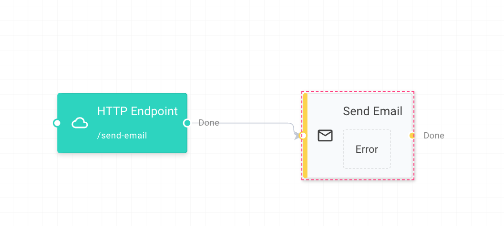

# ELSA 3


[](https://github.com/elsa-workflows/elsa-core/actions/workflows/packages.yml)
[](https://www.nuget.org/packages/Elsa/)
[](https://f.feedz.io/elsa-workflows/elsa-3/nuget/index.json)
[](https://hub.docker.com/repository/docker/elsaworkflows/elsa-v3)
[](https://discord.gg/hhChk5H472)
[]( http://stackoverflow.com/questions/tagged/elsa-workflows )
[](https://gurubase.io/g/elsa)
[![DeepWiki](https://img.shields.io/badge/DeepWiki-elsa--workflows%2Felsa--core-blue.svg?logo=data:image/png;base64,iVBORw0KGgoAAAANSUhEUgAAACwAAAAyCAYAAAAnWDnqAAAAAXNSR0IArs4c6QAAA05JREFUaEPtmUtyEzEQhtWTQyQLHNak2AB7ZnyXZMEjXMGeK/AIi+QuHrMnbChYY7MIh8g01fJoopFb0uhhEqqcbWTp06/uv1saEDv4O3n3dV60RfP947Mm9/SQc0ICFQgzfc4CYZoTPAswgSJCCUJUnAAoRHOAUOcATwbmVLWdGoH//PB8mnKqScAhsD0kYP3j/Yt5LPQe2KvcXmGvRHcDnpxfL2zOYJ1mFwrryWTz0advv1Ut4CJgf5uhDuDj5eUcAUoahrdY/56ebRWeraTjMt/00Sh3UDtjgHtQNHwcRGOC98BJEAEymycmYcWwOprTgcB6VZ5JK5TAJ+fXGLBm3FDAmn6oPPjR4rKCAoJCal2eAiQp2x0vxTPB3ALO2CRkwmDy5WohzBDwSEFKRwPbknEggCPB/imwrycgxX2NzoMCHhPkDwqYMr9tRcP5qNrMZHkVnOjRMWwLCcr8ohBVb1OMjxLwGCvjTikrsBOiA6fNyCrm8V1rP93iVPpwaE+gO0SsWmPiXB+jikdf6SizrT5qKasx5j8ABbHpFTx+vFXp9EnYQmLx02h1QTTrl6eDqxLnGjporxl3NL3agEvXdT0WmEost648sQOYAeJS9Q7bfUVoMGnjo4AZdUMQku50McDcMWcBPvr0SzbTAFDfvJqwLzgxwATnCgnp4wDl6Aa+Ax283gghmj+vj7feE2KBBRMW3FzOpLOADl0Isb5587h/U4gGvkt5v60Z1VLG8BhYjbzRwyQZemwAd6cCR5/XFWLYZRIMpX39AR0tjaGGiGzLVyhse5C9RKC6ai42ppWPKiBagOvaYk8lO7DajerabOZP46Lby5wKjw1HCRx7p9sVMOWGzb/vA1hwiWc6jm3MvQDTogQkiqIhJV0nBQBTU+3okKCFDy9WwferkHjtxib7t3xIUQtHxnIwtx4mpg26/HfwVNVDb4oI9RHmx5WGelRVlrtiw43zboCLaxv46AZeB3IlTkwouebTr1y2NjSpHz68WNFjHvupy3q8TFn3Hos2IAk4Ju5dCo8B3wP7VPr/FGaKiG+T+v+TQqIrOqMTL1VdWV1DdmcbO8KXBz6esmYWYKPwDL5b5FA1a0hwapHiom0r/cKaoqr+27/XcrS5UwSMbQAAAABJRU5ErkJggg==)](https://deepwiki.com/elsa-workflows/elsa-core)
<!-- DeepWiki badge generated by https://deepwiki.ryoppippi.com/ -->

### [For Elsa 2, Click Here](https://github.com/elsa-workflows/elsa-core/tree/2.x)

## Introduction
Elsa is a powerful workflow library that enables workflow execution within any .NET application. Elsa allows you to define workflows in various ways, including:

- Writing C# code
- Using a visual designer
- Specifying workflows in JSON


### Try with Docker

To give the Elsa Studio + Elsa Server a quick spin, you can run the following command to start the Elsa Docker container:

```shell
docker pull elsaworkflows/elsa-server-and-studio-v3:latest
docker run -t -i -e ASPNETCORE_ENVIRONMENT='Development' -e HTTP_PORTS=8080 -e HTTP__BASEURL=http://localhost:13000 -p 13000:8080 elsaworkflows/elsa-server-and-studio-v3:latest
```

> This Docker image is based on a reference ASP.NET application that hosts both the workflow server and designer and is not intended for production use.

By default, you can access http://localhost:13000 and log in with:

```
  Username: admin
  Password: password
```

### TLS and custom certificate authorities

All Elsa Docker images now ship with the operating system's certificate authority bundle baked in at build time. This means you can call public HTTPS endpoints such as `https://example.com` without any additional configuration.

If you need to trust a private or corporate CA, mount the certificate bundle into the container and reference it via `EXTRA_CA_CERT`:

```bash
docker run \
  -v /path/to/company-ca.crt:/certs/company-ca.crt:ro \
  -e EXTRA_CA_CERT=/certs/company-ca.crt \
  elsaworkflows/elsa-server-and-studio-v3:latest
```

On startup, the container copies the certificate into `/usr/local/share/ca-certificates` and runs `update-ca-certificates`, making the trust available to .NET, OpenSSL, curl, and other system components. Multiple certificates can be provided by pointing `EXTRA_CA_CERT` at a directory containing `.crt` or `.pem` files.

In highly restricted environments where you cannot modify the system trust store, you can instead rely on the standard `SSL_CERT_FILE` or `SSL_CERT_DIR` environment variables:

```bash
docker run \
  -v /path/to/company-ca-bundle.pem:/certs/custom.pem:ro \
  -e SSL_CERT_FILE=/certs/custom.pem \
  elsaworkflows/elsa-server-and-studio-v3:latest
```

> ℹ️ Installing the CA bundle adds roughly 300KB to the Debian-based images. No package managers run at container startup; all trust updates happen immutably at build time or via the mounted certificates shown above.

## Table of Contents

- [Documentation](#documentation)
- [Known Issues and Limitations](#known-issues-and-limitations)
- [Features](#features)
- [Roadmap](#roadmap)
- [Use Cases](#use-cases)
- [Coding Workflows](#coding-workflows)
- [Designed Workflows](#designed-workflows)
- [Contributing](#contributing)
- [Support](#support)
  - [Community Support](#community-support)
  - [Enterprise Support](#enterprise-support)

## Documentation

[Elsa Documentation Website](https://docs.elsaworkflows.io/).

## Known Issues and Limitations

Elsa is continually evolving, and while it offers powerful capabilities, there are some known limitations and ongoing work:

- Documentation is still a work in progress.
- Input/Output is not yet implemented in the Workflow Instance Viewer.
- Starting workflows from the designer is currently supported only for workflows that do not require input and do not start with a trigger; this is planned for a future release.
- The designer currently only supports Flowchart activities. Support for Sequence and StateMachine activities is planned for a future release.
- UI input validation is not yet implemented.

## Features

Elsa offers a wide range of features for building and executing workflows, including:

- Execution of workflows in any .NET application with support for .NET 6 and beyond.
- Support for both short-running and long-running workflows.
- A programming model loosely inspired by Windows Workflow Foundation.
- A web-based drag & drop designer with support for custom activities.
- Native support for activity composition, including activities like `Sequence`, `Flowchart`, and `ForEach`.
- Parallel execution of activities.
- Built-in activities for common scenarios, such as sending emails, making HTTP calls, scheduling tasks, sending and receiving messages, and more.
- Workflow versioning and migration via API.
- Easy integration with external applications via HTTP, message queues, and more.
- Actor model for increased workflow throughput.
- Dynamic expressions with support for C#, JavaScript, Python, and Liquid.
- Persistence agnostic, with support for Entity Framework Core, MongoDB, and Dapper out of the box.
- [Elsa Studio](https://github.com/elsa-workflows/elsa-studio): a modular Blazor dashboard app for managing and designing workflows.

## Roadmap

See #3232

## Use Cases

Elsa can be used in a variety of scenarios, including:

- Long-running workflows such as order fulfillment and product approval.
- Short-running workflows such as sending emails and generating PDFs.
- Scheduled workflows such as sending daily reports.
- Event-driven workflows such as sending welcome emails when a user signs up.

## Coding Workflows

Elsa allows you to define workflows in code using C#. The following example shows how to receive HTTP requests and send an email in response:

```csharp
public class SendEmailWorkflow : WorkflowBase
{
    protected override void Build(IWorkflowBuilder builder)
    {
        builder.Root = new Sequence
        {
            Activities =
            {
                new HttpEndpoint
                {
                    Path = new("/send-email"),
                    SupportedMethods = new(new[] { HttpMethods.Post }),
                    CanStartWorkflow = true
                },
                new SendEmail
                {
                    From = new("alic@acme.com"),
                    To = new(new[]{ "bob@acme.com" }),
                    Subject = new("Your workflow has been triggered!"),
                    Body = new("Hello!")
                }
            }
        };
    }
}
```

## Designing Workflows

Elsa allows you to define workflows using a visual designer. The following example shows how to receive HTTP requests and send an email in response:



## Contributing

We welcome contributions from the community and are pleased that you are interested in helping to improve the Elsa Workflow project! Here are the steps to contribute to our project:

### 1. Fork and Clone the Repo
To get started, you'll need to fork the repository to your own GitHub account. You can do this by navigating to the [Elsa Workflow GitHub repository](https://github.com/elsa-workflows/elsa-core) and clicking the "Fork" button in the top-right corner of the page. Once you have forked the repo, you can clone it to your local machine using the following command:

```bash
git clone https://github.com/YOUR_USERNAME/elsa-core.git
```
Replace `YOUR_USERNAME` with your GitHub username. For more information on forking a repo, check out the GitHub documentation [here](https://docs.github.com/en/github/getting-started-with-github/fork-a-repo).

Incorporating the details about the "apps" folder and its projects into the second point about opening the `Elsa.sln` using your favorite IDE, we can expand the instructions to guide developers on where to start and what projects they might want to explore first. Here's an updated version of that section with the additional information:

### 2. Open `Elsa.sln` Using Your Favorite IDE
After cloning the repository, navigate to the cloned directory and open the `Elsa.sln` solution file with your preferred IDE that supports .NET development, such as Visual Studio, JetBrains Rider, or Visual Studio Code with the appropriate extensions.

Within the solution, you will find an "apps" folder containing three projects designed to help you get started and explore the capabilities of Elsa Workflow:

- **Elsa.Server.Web**: This project is a reference ASP.NET Core application that acts as a workflow server. It's a great starting point if you want to understand how Elsa functions as a server-side workflow engine.

- **Elsa.ServerAndStudio.Web**: This project serves a dual purpose. Like `Elsa.Server.Web`, it acts as a workflow server. Additionally, it hosts the Elsa Studio Blazor WebAssembly app. This is the perfect project to run if you want to see the full capabilities of Elsa, including both the server aspects and the client-side studio experience in one application.

- **Elsa.Studio.Web**: This project is a reference Blazor WebAssembly application that solely hosts the Elsa Studio Blazor WebAssembly app. It requires a running Elsa server application to connect to. Use this project if you're interested in focusing on the Elsa Studio UI and its interactions with an Elsa workflow server.

### 3. Submit a PR with Your Changes
Once you have made your changes, commit them and push them back to your fork. Then, navigate to the original Elsa Workflow repository and create a new Pull Request. Ensure your PR description clearly describes the changes and any relevant information that will help the reviewers understand your contributions. For a detailed guide on creating a pull request, visit [Creating a pull request from a fork](https://docs.github.com/en/github/collaborating-with-issues-and-pull-requests/creating-a-pull-request-from-a-fork).

### 4. Open an Issue First
Before you start working on your changes or submit a pull request, please open an issue to discuss what you would like to do. This step is crucial as it ensures you don't spend time working on something that might not align with the project's goals or might already be under development by someone else. You can open an issue [here](https://github.com/elsa-workflows/elsa-core/issues).

This approach helps us streamline contributions and ensures that your efforts are aligned with the project's needs and priorities. We look forward to your contributions and are here to support you throughout the process. Thank you for contributing to the Elsa Workflow project!

## Support

There are various ways to get support for Elsa Workflows, ranging from community-driven channels to enterprise-level services.

### Community Support

Elsa has an active and helpful community where you can find support through multiple channels:
- [GitHub Issues](https://github.com/elsa-workflows/elsa-core/issues) for bug reports and feature requests.
- [GitHub Discussions](https://github.com/elsa-workflows/elsa-core/discussions) for open-ended conversations, questions, and community-driven support.
- [Discord](https://discord.gg/hhChk5H472) for real-time support and interaction with the Elsa community.
- [StackOverflow](https://stackoverflow.com/questions/tagged/elsa-workflows) for searching or asking technical questions.

### Enterprise Support
For organizations requiring professional support and long-term commitment, [ELSA-X](https://elsa-x.io) offers enterprise-level services and ensures continuity and future development of the Elsa framework, provides custom solutions, and develops commercial extensions tailored to enterprise needs.
