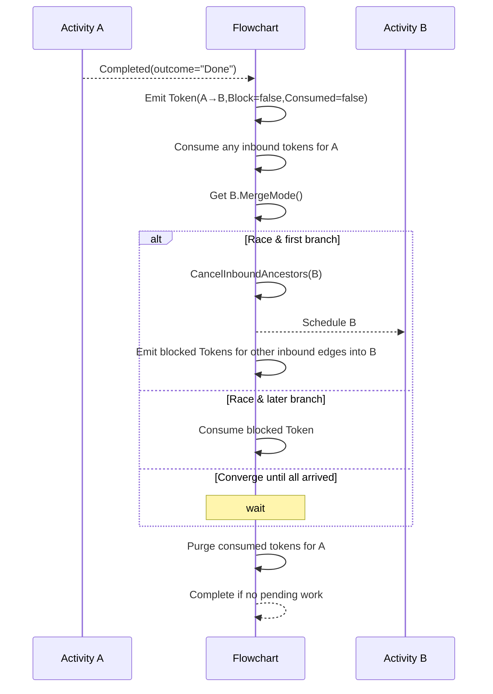

# 5. Token-Centric Flowchart Execution Model

Date: 2025-05-06

## Status

Accepted

## Context

Elsa Workflows’ original flowchart used execution-count heuristics to drive joins, which fails in loops, XOR splits and resumable activities:

- Loop-back edges never emit a “forward” token, stalling AND-joins.
- Counting executions across iterations causes premature or missed firings.
- Resumable activities (e.g. `Delay`) clear join state on resume.
- Users cannot declaratively control join semantics without deep framework hacks.

We need a model that:

1. Handles loops, forks, XORs and resumable activities reliably.
2. Lets designers choose per-activity join behavior.
3. Cleans up state to avoid memory leaks.
4. Supports cancellation of in-flight branches.

## Decision

Adopt a **token-centric** execution model with explicit **MergeMode** and **blocking**:

1. **Tokens**
   - On each activity completion, for each active outbound connection, emit a `Token` with:
      - `FromActivityId`, `Outcome`, `ToActivityId`,
      - Flags: `Consumed = false`, `Blocked = false`.
   - Persist the list in `ActivityExecutionContext.Properties["Flowchart.Tokens"]`.

2. **MergeMode**
   - Query each target activity’s `MergeMode` via `GetMergeModeAsync(...)`. Supported values:
      - **Race**: “first wins”
      - **Stream**: “first wins, but don’t cancel ancestors”
      - **Converge** (default): “wait for all”
   - **Race**
      1. Cancel inbound ancestors (`CancelInboundAncestorsAsync`).
      2. If no existing blocked token for this inbound connection, schedule the target and then block all other inbound branches by emitting `Token.Block()` for each.
      3. Subsequent branches see their blocked token and simply consume it.
   - **Stream**
      - Same as Race except you do _not_ cancel inbound ancestors.
   - **Converge**
      - Wait until _every_ inbound connection for the target has at least one unblocked, unconsumed token. Then schedule once.

3. **Scheduling Loop**  
   On each child completion:
   - _Emit_ tokens for its outbound edges.
   - _Consume_ any tokens whose `ToActivityId` matches the completed activity.
   - _For each_ active outbound connection, inspect its target’s `MergeMode` and apply the rules above to decide whether to schedule it.

4. **State Cleanup**
   - After scheduling (or skipping) a target, remove any _consumed_ tokens whose `ToActivityId` equals the completed activity.
   - When the flow has no pending work (`HasPendingWork()` is false), clear the entire token list and complete the flowchart.
   - On activity cancellation (`OnTokenFlowActivityCanceledAsync`), remove _all_ tokens from or to that activity, then re-check for completion.

## Sequence Diagram

