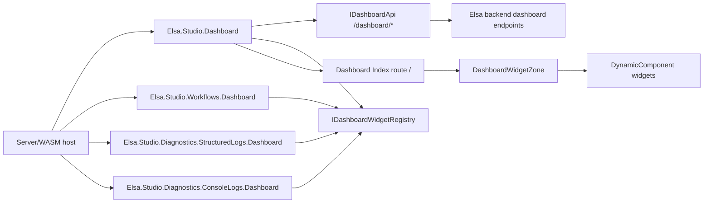
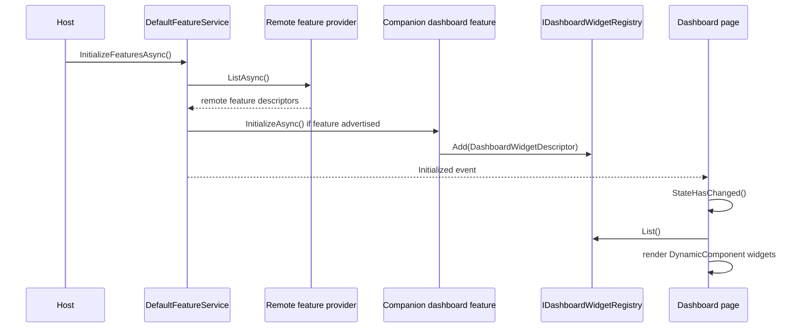

# Dashboard Module Architecture Blueprint

Generated: 2026-06-23

Scope: `src/modules/Elsa.Studio.Dashboard`, its dashboard widget contracts, and the current companion widget modules:

- `src/modules/Elsa.Studio.Workflows.Dashboard`
- `src/modules/Elsa.Studio.Diagnostics.StructuredLogs.Dashboard`
- `src/modules/Elsa.Studio.Diagnostics.ConsoleLogs.Dashboard`

## Architecture Detection

The dashboard is a modular Blazor/.NET Studio feature. It uses a layered client-side architecture:

- **Shell module**: owns the root dashboard route, menu item, backend snapshot loading, shared DTOs, rendering zones, and reusable dashboard components.
- **Widget registry**: exposes a small contribution contract based on `DashboardWidgetDescriptor`.
- **Companion dashboard modules**: register dashboard widgets from feature-specific assemblies when their backend feature is available.
- **Backend API client**: uses Refit-style remote API registration through `IBackendApiClientProvider` and `IDashboardApi`.
- **Feature gating**: companion modules use `RemoteFeatureAttribute`; `DefaultFeatureService` initializes only features advertised by the backend.

The primary architectural pattern is modular feature composition with a registry-based extension point. The dashboard shell is deliberately decoupled from workflow and diagnostics owner modules. Companion modules depend on the dashboard shell, not the other way around.

## High-Level Overview



The shell module is installed with `AddDashboardModule(backendApiConfig)`. It registers:

- `Feature`
- `DashboardMenu`
- `IDashboardService`
- `IDashboardWidgetRegistry`
- remote `IDashboardApi`

Companion modules register only an `IFeature`. During feature initialization, each companion feature adds one or more `DashboardWidgetDescriptor` instances to the registry.

## Module Boundaries

### Dashboard Shell

Relevant files:

- `src/modules/Elsa.Studio.Dashboard/Extensions/ServiceCollectionExtensions.cs`
- `src/modules/Elsa.Studio.Dashboard/Pages/Index.razor`
- `src/modules/Elsa.Studio.Dashboard/Pages/Index.razor.cs`
- `src/modules/Elsa.Studio.Dashboard/Widgets/DashboardWidgetDescriptor.cs`
- `src/modules/Elsa.Studio.Dashboard/Components/DashboardWidgetZone.razor`
- `src/modules/Elsa.Studio.Dashboard/Services/DashboardService.cs`
- `src/modules/Elsa.Studio.Dashboard/Client/IDashboardApi.cs`
- `src/modules/Elsa.Studio.Dashboard/Models/DashboardModels.cs`

Responsibilities:

- Provide the dashboard route at `/`.
- Provide the dashboard menu item.
- Load dashboard data from the selected backend.
- Normalize time ranges and select default trend granularity.
- Hold the current `DashboardSnapshot`, load status, selected range, last refresh timestamp, and refresh callback.
- Render named widget zones using Blazor `DynamicComponent`.
- Provide shared display components and formatting helpers.

The dashboard project references only `Elsa.Studio.Shared`. It must not reference workflow or diagnostics owner modules.

### Widget Companion Modules

Current companions:

- `Elsa.Studio.Workflows.Dashboard`
- `Elsa.Studio.Diagnostics.StructuredLogs.Dashboard`
- `Elsa.Studio.Diagnostics.ConsoleLogs.Dashboard`

Responsibilities:

- Reference the dashboard shell and their owner feature module.
- Declare a backend shell feature name with `RemoteFeatureAttribute`.
- Register widget descriptors during `Feature.InitializeAsync`.
- Render data from `DashboardWidgetContext.Snapshot`.

The owner modules (`Elsa.Studio.Workflows`, `Elsa.Studio.Diagnostics.StructuredLogs`, `Elsa.Studio.Diagnostics.ConsoleLogs`) do not reference the dashboard module. The dashboard-specific companion projects are the adapter layer between owner modules and the dashboard shell.

## Widget System

### Descriptor Contract

`DashboardWidgetDescriptor` is the central extension contract:

```csharp
public record DashboardWidgetDescriptor(
    string Id,
    string Zone,
    int Order,
    Type ComponentType,
    string? Title = null,
    string? RequiredBackendCapability = null,
    string? PayloadKind = null);
```

Descriptor fields:

- `Id`: stable unique key. Duplicate IDs overwrite previous registry entries.
- `Zone`: semantic placement, one of the constants in `DashboardWidgetZones`.
- `Order`: deterministic ordering within a zone.
- `ComponentType`: Blazor component rendered dynamically.
- `Title`: optional metadata.
- `RequiredBackendCapability`: metadata for the backend capability a widget expects. The current shell does not enforce this field.
- `PayloadKind`: metadata documenting which snapshot payload the widget consumes.

### Registry Pattern

`DashboardWidgetRegistry` is a singleton, thread-safe in-memory registry. It stores descriptors by ID and returns a copy of the current descriptor list. This keeps feature initialization simple and avoids a direct compile-time dependency from the dashboard shell to contributor modules.

There are two registration paths:

- DI descriptors through `AddDashboardWidget<TComponent>()`.
- Runtime descriptors through companion `Feature.InitializeAsync()`.

The dashboard page merges both sources:

```csharp
Widgets
    .Concat(WidgetRegistry.List())
    .DistinctBy(x => x.Id)
    .Where(x => x.Zone == zone && x.IsVisible(WidgetContext))
    .OrderBy(x => x.Order)
    .ThenBy(x => x.Id, StringComparer.Ordinal)
```

`IsVisible` currently requires only a non-null snapshot. Capability-specific empty or unavailable states belong inside each widget component.

### Zones

Supported zones:

- `metrics`: top KPI band.
- `findings`: prioritized attention panel.
- `primary-panels`: wide operational panels such as trend and recent activity.
- `secondary-panels`: supporting panels such as hotspots.
- `diagnostics-status`: diagnostics status cards.

`DashboardWidgetZone` renders each descriptor as a `DynamicComponent` and supplies two parameters:

- `Context`
- `Descriptor`

Widget components should declare both parameters even when they only use `Context`.

## Feature Initialization Flow



Remote-gated companion features:

- Workflows dashboard: `Elsa.Workflows.Runtime.Dashboard.ShellFeatures.WorkflowRuntimeDashboard`
- Structured logs dashboard: `Elsa.Diagnostics.StructuredLogs.Dashboard.ShellFeatures.StructuredLogsDashboard`
- Console logs dashboard: `Elsa.Diagnostics.ConsoleLogs.Dashboard.ShellFeatures.ConsoleLogsDashboard`

The dashboard page subscribes to `IFeatureService.Initialized` after first render so late widget registration can trigger a UI refresh.

## Data Architecture

The shell uses immutable record DTOs in `DashboardModels.cs`. The main aggregate is:

```csharp
public record DashboardSnapshot(
    DashboardOverview Overview,
    DashboardNeedsAttentionResponse NeedsAttention,
    DashboardTrendResponse Trend,
    DashboardRecentActivityResponse RecentActivity,
    DashboardWorkflowHotspotsResponse? Hotspots);
```

The snapshot is frontend state only. There is no local persistence, caching layer, or client-side domain model separate from backend DTOs.

Snapshot payload responsibilities:

- `Overview`: backend identity, environment, runtime status, workflow instance metrics, diagnostics summaries.
- `NeedsAttention`: prioritized findings and capability status.
- `Trend`: time-series workflow execution buckets.
- `RecentActivity`: recent workflow instance activity rows.
- `Hotspots`: optional workflow hotspot data. A backend 404 for hotspots degrades to `null`.

Time range handling is centralized in `DashboardRangeMapper`:

- `1h` uses minute granularity.
- `24h` uses hour granularity.
- `7d` uses day granularity.
- invalid or missing values normalize to `24h`.

## Backend Communication

`IDashboardApi` defines the backend surface:

- `GET /dashboard/overview`
- `POST /dashboard/workflow-trends`
- `GET /dashboard/needs-attention`
- `GET /dashboard/recent-activity`
- `POST /dashboard/workflow-hotspots`

`DashboardService.LoadAsync` requests overview, needs attention, trends, recent activity, and hotspots concurrently with `Task.WhenAll`. It maps transport errors to `DashboardLoadResult`:

- `404`: dashboard unavailable.
- `401` or `403`: unauthorized.
- `HttpRequestException`: backend disconnected.
- timeout without caller cancellation: backend disconnected.
- caller cancellation: propagated through the load flow and ignored by the page when replacing requests.

The page owns cancellation. Range changes and manual refreshes cancel the previous load before starting the next one.

## UI Composition

The route component is split into markup and code-behind:

- `Index.razor`: dashboard layout, skeleton states, empty state, zone placement.
- `Index.razor.cs`: state management, refresh lifecycle, range changes, widget filtering.

Shared UI primitives include:

- `DashboardMetricCard`
- `DashboardNeedsAttention`
- `DashboardRecentActivityTable`
- `DashboardTrendChart`
- `DashboardWorkflowHotspotsPanel`
- `DashboardRuntimeChip`
- `DashboardDiagnosticsValue`

The shell uses MudBlazor for layout, chips, tables, charts, buttons, alerts, and skeletons. Widgets use dashboard services such as `DashboardMetricFormatter`, `DashboardUiMapper`, and `DashboardNavigationTargetMapper` for consistent display and links.

## Current Widget Inventory

| Widget ID | Module | Zone | Order | Payload |
| --- | --- | --- | ---: | --- |
| `dashboard.workflow.metrics` | Workflows dashboard | `metrics` | 100 | `WorkflowInstances` |
| `dashboard.needs-attention` | Workflows dashboard | `findings` | 100 | n/a |
| `dashboard.workflow.trend` | Workflows dashboard | `primary-panels` | 100 | `WorkflowTrends` |
| `dashboard.workflow.recent-activity` | Workflows dashboard | `primary-panels` | 200 | `RecentActivity` |
| `dashboard.workflow.hotspots` | Workflows dashboard | `secondary-panels` | 100 | `WorkflowHotspots` |
| `diagnostics.structured-logs` | Structured logs dashboard | `diagnostics-status` | 100 | `Diagnostics.StructuredLogs` |
| `diagnostics.console-logs` | Console logs dashboard | `diagnostics-status` | 200 | `Diagnostics.ConsoleLogs` |

## Cross-Cutting Concerns

### Authorization and Capability Awareness

Studio does not enforce dashboard authorization client-side. Authorization failures come from the backend and are mapped by `DashboardService`.

Remote feature gating controls whether companion widget features initialize. Per-widget `RequiredBackendCapability` is metadata today; widgets render their own capability chips or empty states based on snapshot data.

### Error Handling and Resilience

The page distinguishes unavailable, unauthorized, disconnected, failed, loading, and loaded states. It keeps an existing snapshot visible during refreshes and only replaces it when a new snapshot is loaded.

Hotspots are optional: only that API call treats `404` as a missing payload instead of failing the whole snapshot.

### Validation

Input validation is minimal and focused:

- time ranges normalize to supported keys;
- trend granularity is derived from normalized range;
- navigation targets URL-escape workflow instance IDs.

### Configuration

Host projects register dashboard services with the configured backend API settings. Server and WASM hosts both install the dashboard shell and companion dashboard modules.

## Testing Architecture

Dashboard tests are focused unit and contract tests:

- `DashboardWidgetRegistrationTests`: descriptor registration, deterministic order, module boundary rules, expected companion widget inventory, remote feature names.
- `DashboardRangeMapperTests`: range normalization, granularity, UTC range calculation.
- `DashboardMetricFormatterTests`: count and duration formatting.
- `DashboardNavigationTargetMapperTests`: route generation.
- `DashboardUiMapperTests`: UI color, label, severity, and capability mapping.

The most important architectural tests are the boundary checks:

- dashboard shell project must not reference workflows or diagnostics modules;
- owner workflow/diagnostics projects must not reference dashboard;
- only companion dashboard projects bridge those concerns.

## Deployment and Packaging

The dashboard module targets browser-supported Razor/.NET and is installed by both host types:

- `src/hosts/Elsa.Studio.Host.Server/Program.cs`
- `src/hosts/Elsa.Studio.Host.Wasm/Program.cs`

The bundle project includes the shell and companion modules:

- `src/bundles/Elsa.Studio/Elsa.Studio.csproj`

Runtime behavior depends on backend feature availability:

- The dashboard shell route/menu is present when the shell module is installed.
- Companion widgets appear after remote feature initialization if the backend advertises their feature.
- Missing backend dashboard endpoints render unavailable state instead of breaking app startup.

## Extension Blueprint

### Add a New Dashboard Widget for an Existing Domain

1. Create a companion dashboard project if one does not already exist, for example `Elsa.Studio.Example.Dashboard`.
2. Reference `Elsa.Studio.Dashboard` and the owner module.
3. Add an extension method that registers the companion `IFeature`.
4. Add a `Feature` class with `[RemoteFeature(RemoteFeatureName)]`.
5. In `InitializeAsync`, add one or more `DashboardWidgetDescriptor` records to `IDashboardWidgetRegistry`.
6. Implement widget components that accept `DashboardWidgetContext Context` and `DashboardWidgetDescriptor Descriptor`.
7. Use an existing zone and deterministic order. Add a new zone only when the shell layout needs a new semantic placement.
8. Add tests for descriptor registration, remote feature name, and any formatter/navigation helper behavior.
9. Register the companion module in host and bundle projects only when it should ship with the default Studio distribution.

### Add a New Snapshot Payload

1. Add request/response records to `DashboardModels.cs`.
2. Add the endpoint to `IDashboardApi`.
3. Extend `DashboardSnapshot`.
4. Update `DashboardService.LoadAsync` to request the payload.
5. Decide whether a missing endpoint fails the whole dashboard or degrades to a null/empty optional payload.
6. Update widgets to consume the new payload through `Context.Snapshot`.
7. Cover happy-path mapping and degraded behavior in tests.

### Add Capability-Aware Visibility

`RequiredBackendCapability` exists but is not enforced by the shell. If the shell needs capability-based visibility, implement it centrally in `DashboardWidgetDescriptor.IsVisible` or page filtering, and preserve widget-level unavailable states for payload-specific failures.

## Governance Rules

- Keep the dashboard shell independent from workflow and diagnostics owner modules.
- Put cross-domain dashboard contributions in companion `*.Dashboard` modules.
- Use `RemoteFeatureAttribute` for backend-dependent widgets.
- Treat `PayloadKind` and `RequiredBackendCapability` as stable metadata; changing them may affect tests, diagnostics, and future shell behavior.
- Keep dashboard DTOs provider-neutral and backend-owned; do not introduce browser-to-provider calls.
- Prefer shared helpers for formatting, colors, and navigation links.
- Preserve cancellation-aware refresh behavior for all new loading paths.

## Common Pitfalls

- Do not register domain widgets directly from the dashboard shell.
- Do not make owner modules reference `Elsa.Studio.Dashboard`; use companion modules.
- Do not assume `Context.Snapshot` or optional payloads are present.
- Do not rely on `RequiredBackendCapability` for visibility until shell enforcement exists.
- Do not add ad hoc navigation route strings inside widgets when `DashboardNavigationTargetMapper` should own them.
- Do not turn a single widget into a data loader; the shell owns dashboard snapshot loading.
