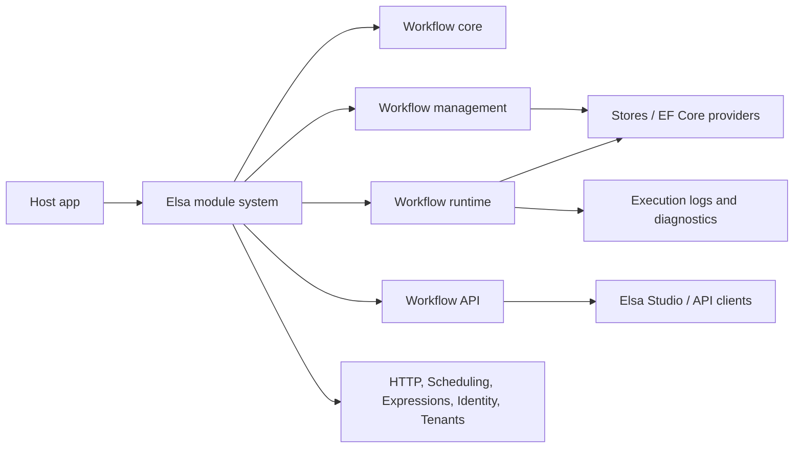

# Elsa Core Wiki

This wiki is a repo-local, code-grounded map of Elsa Core. It is intended for contributors who need the same kind of fast orientation that a DeepWiki-style generated wiki gives: what the system is, where the important code lives, how the pieces connect, and how to safely extend or test them.

The source of truth is still the code, specs, ADRs, and tests. Each page links back to the relevant files so you can jump from explanation to implementation.

## Start Here

Elsa Core is a modular .NET workflow engine. The main solution is [Elsa.sln](../../Elsa.sln). Production code lives under [src](../../src), tests under [test](../../test), specifications under [specs](../../specs), and architecture decisions under [doc/adr](../adr).

The shortest mental model:

1. An application calls `services.AddElsa(...)`.
2. Elsa builds an `IModule` and configures feature objects.
3. Features register services, activities, API endpoints, middleware, hosted services, and persistence stores.
4. Workflow definitions are created by code, JSON, imported files, or providers.
5. The runtime starts, resumes, dispatches, and persists workflow instances.
6. APIs, SignalR hubs, HTTP endpoint activities, diagnostics, and persistence packages layer around that core.

## Page Map

| Page | Use it for |
| --- | --- |
| [Repository Map](repository-map.md) | Top-level folders, projects, and where to look first. |
| [Architecture](architecture.md) | The main system layers and request/execution flow. |
| [Module System](module-system.md) | How `IModule`, `FeatureBase`, feature dependencies, and shell features work. |
| [Workflow Core](workflow-core.md) | Activities, execution contexts, pipelines, variables, bookmarks, graphs, and flowchart execution. |
| [Workflow Management](workflow-management.md) | Workflow definitions, instances, import/export, materializers, validation, and activity descriptors. |
| [Workflow Runtime](workflow-runtime.md) | Dispatch, triggers, bookmarks, queues, background activity scheduling, graceful shutdown, and recovery. |
| [Workflow API](workflow-api.md) | FastEndpoints, route prefixing, API categories, SignalR, and client-facing contracts. |
| [Activities And Authoring](activities-and-authoring.md) | How workflows are authored in C#, JSON, ElsaScript, and host methods. |
| [Expressions And Scripting](expressions-and-scripting.md) | Expression evaluators and language feature packages. |
| [HTTP, Scheduling, And Resilience](http-scheduling-resilience.md) | Inbound HTTP workflows, outbound HTTP, scheduled triggers, and resilience strategies. |
| [Persistence](persistence.md) | In-memory stores, EF Core stores, provider packages, migrations, and multi-provider rules. |
| [Diagnostics Structured Logs](diagnostics-structured-logs.md) | `ILogger` capture, live feed, REST/SignalR surface, redaction, and SQLite persistence. |
| [Diagnostics Console Logs](diagnostics-console-logs.md) | Raw stdout/stderr capture, live feed, REST/SignalR surface, and redaction. |
| [Identity, Tenancy, And Security](identity-tenancy-security.md) | Users, applications, roles, API keys, tenant resolution, and authorization touch points. |
| [Testing Guide](testing-guide.md) | Test project layout, fixture choices, and targeted commands. |
| [Extension Guide](extension-guide.md) | How to add features, activities, expression providers, stores, endpoints, and ingress sources. |
| [Specs And ADRs](specs-and-adrs.md) | How current specs and ADRs explain design intent. |
| [Build, Run, And Operate](build-run-operate.md) | Build commands, sample hosts, runtime knobs, Docker notes, and operational endpoints. |

## Source Landmarks

- Main public entry: [src/modules/Elsa/Extensions/DependencyInjectionExtensions.cs](../../src/modules/Elsa/Extensions/DependencyInjectionExtensions.cs)
- Default umbrella feature: [src/modules/Elsa/Features/ElsaFeature.cs](../../src/modules/Elsa/Features/ElsaFeature.cs)
- Module implementation: [src/common/Elsa.Features/Implementations/Module.cs](../../src/common/Elsa.Features/Implementations/Module.cs)
- Core workflow feature: [src/modules/Elsa.Workflows.Core/Features/WorkflowsFeature.cs](../../src/modules/Elsa.Workflows.Core/Features/WorkflowsFeature.cs)
- Management feature: [src/modules/Elsa.Workflows.Management/Features/WorkflowManagementFeature.cs](../../src/modules/Elsa.Workflows.Management/Features/WorkflowManagementFeature.cs)
- Runtime feature: [src/modules/Elsa.Workflows.Runtime/Features/WorkflowRuntimeFeature.cs](../../src/modules/Elsa.Workflows.Runtime/Features/WorkflowRuntimeFeature.cs)
- API feature: [src/modules/Elsa.Workflows.Api/Features/WorkflowsApiFeature.cs](../../src/modules/Elsa.Workflows.Api/Features/WorkflowsApiFeature.cs)
- Reference server: [src/apps/Elsa.Server.Web/Program.cs](../../src/apps/Elsa.Server.Web/Program.cs)
- Structured-log persistence design: [specs/005-structured-log-persistence/plan.md](../../specs/005-structured-log-persistence/plan.md)

## Contributor Workflow

Use targeted reads first, then targeted tests. For most changes, start with the relevant module page, inspect the linked feature class and contracts, add or update tests in the matching `test/unit`, `test/integration`, or `test/component` project, and run the narrowest `dotnet test` command that proves the behavior.

When changing public behavior, update the related README, spec quickstart, or wiki page in the same PR. This repository is strongly modular, so the best changes keep ownership boundaries clear.
