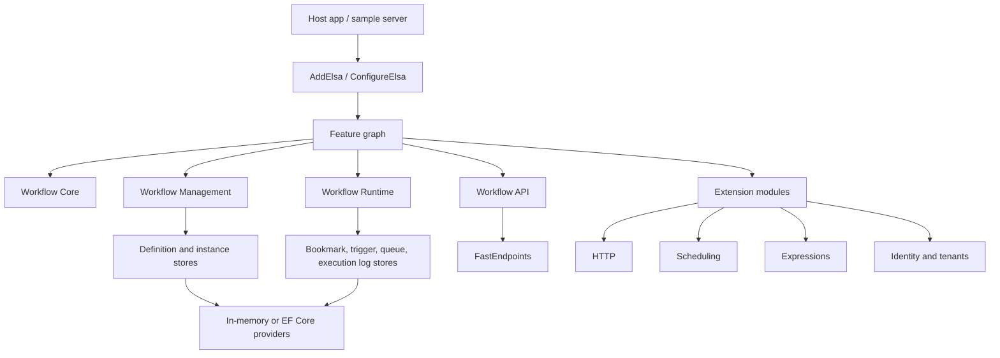
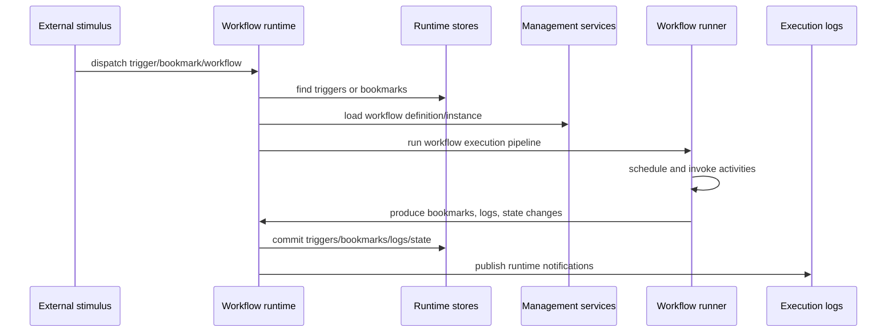

# Architecture

Elsa Core is a modular workflow platform. The core engine is intentionally small compared with the full host surface: features add management stores, runtime dispatch, APIs, HTTP activities, expression languages, persistence, identity, tenants, diagnostics, and shell integration.

## Layered View

The important boundary is that workflow execution concepts live in core, while persisted definitions and runtime orchestration live in management and runtime. API and transport packages are layered on top.

## Default Feature Composition

The default umbrella feature is [ElsaFeature](../../src/modules/Elsa/Features/ElsaFeature.cs). It depends on:

- `MediatorFeature`
- `WorkflowsFeature`
- `FlowchartFeature`
- `DefaultWorkflowRuntimeFeature`
- `WorkflowManagementFeature`

When installed, it configures default workflow and activity execution pipelines and registers built-in core activities through workflow management. The public entry point is [AddElsa](../../src/modules/Elsa/Extensions/DependencyInjectionExtensions.cs).

## Main Runtime Flow

## Definitions Versus Instances

- A workflow definition describes what can run. It may originate from C# workflow types, JSON files, imported payloads, blob storage providers, or DSL compilation.
- A workflow instance is a running or historical execution, including workflow state, variables, activity execution state, incidents, status, and logs.
- Management owns definition and instance stores. Runtime owns trigger/bookmark queues and execution.

## Activities And Control Flow

Activities are the unit of work. Core activity types live under [Elsa.Workflows.Core/Activities](../../src/modules/Elsa.Workflows.Core/Activities). Control flow includes `Sequence`, `If`, `Switch`, `Fork`, `For`, `ForEach`, `While`, `Parallel`, `Flowchart`, and flowchart node activities.

Flowchart execution has a token-centric model documented in [ADR 0005](../adr/0005-token-centric-flowchart-execution-model.md), with explicit join behavior documented in [ADR 0007](../adr/0007-adoption-of-explicit-merge-modes-for-flowchart-joins.md).

## Management Layer

[WorkflowManagementFeature](../../src/modules/Elsa.Workflows.Management/Features/WorkflowManagementFeature.cs) wires:

- workflow definition and instance stores
- workflow serializers and materializers
- workflow definition manager, publisher, importer, exporter, validator
- activity and expression descriptor providers
- host method activities and workflow definition activities
- workflow reference graph services
- default variable type descriptors

The management layer is what Studio and API endpoints use to list, save, publish, import, export, and validate workflows.

## Runtime Layer

[WorkflowRuntimeFeature](../../src/modules/Elsa.Workflows.Runtime/Features/WorkflowRuntimeFeature.cs) wires:

- local runtime and dispatchers
- trigger and bookmark stores
- bookmark queue worker and queue store
- workflow and activity execution log stores
- workflow matcher, starter, invoker, resumer, canceller
- background dispatch and task dispatch services
- graceful shutdown services such as quiescence signal, ingress source registry, and drain orchestrator
- recurring startup and maintenance tasks

The runtime can use in-memory stores by default or EF Core stores when persistence features are installed.

## API Layer

[WorkflowsApiFeature](../../src/modules/Elsa.Workflows.Api/Features/WorkflowsApiFeature.cs) registers FastEndpoints from the module and depends on workflow management, workflow instances, workflow runtime, and SAS tokens. The default route prefix is `elsa/api`, defined in [ApiEndpointOptions](../../src/modules/Elsa.Workflows.Api/Options/ApiEndpointOptions.cs) and applied by [UseWorkflowsApi](../../src/common/Elsa.Api.Common/Extensions/WebApplicationExtensions.cs).

Real-time workflow updates are in [RealTimeWorkflowUpdatesFeature](../../src/modules/Elsa.Workflows.Api/Features/RealTimeWorkflowUpdatesFeature.cs) and [WorkflowInstanceHub](../../src/modules/Elsa.Workflows.Api/RealTime/Hubs/WorkflowInstanceHub.cs).

## Persistence Layer

In-memory stores are the default for many features. EF Core provider packages replace store delegates in feature configuration:

- management stores through `WorkflowManagementFeature`
- runtime stores through `WorkflowRuntimeFeature`
- identity, tenants, labels, alterations, and key values through their own feature hooks

Provider-specific packages such as SQLite, SQL Server, PostgreSQL, MySQL, and Oracle depend on the shared EF Core module and provide database-specific setup.

## Diagnostics Layer

[Elsa.Diagnostics.StructuredLogs](../../src/modules/Elsa.Diagnostics.StructuredLogs) captures semantic `ILogger` events, redacts them, keeps recent events, exposes REST endpoints, and streams live events through SignalR. The default store is in-memory; the active `005-structured-log-persistence` work adds SQLite persistence through a shared relational package.

See [Diagnostics Structured Logs](diagnostics-structured-logs.md).
