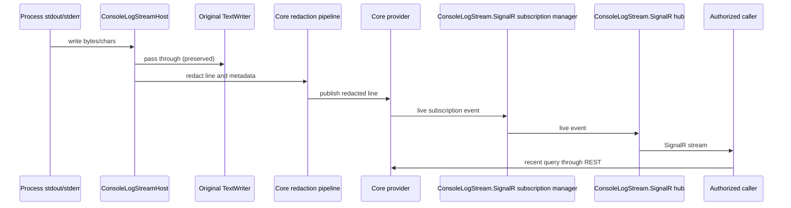

# Diagnostics Console Logs

`Elsa.Diagnostics.ConsoleLogs` is an opt-in module that hosts `ConsoleLogStream.Core`, adds Elsa workflow metadata, and streams recent plus live console output to authorized callers over REST and SignalR. It is intentionally separate from `Elsa.Diagnostics.StructuredLogs`; the two modules cover different diagnostic surfaces.

Start in [src/modules/Elsa.Diagnostics.ConsoleLogs](../../src/modules/Elsa.Diagnostics.ConsoleLogs).

## Scope

This module captures raw process console output only. It does not parse `ILogger` records, write to durable audit storage, call orchestrator log APIs, or implement trace or metric exploration. For semantic `ILogger` capture see [Diagnostics Structured Logs](diagnostics-structured-logs.md).

## Feature Wiring

[ConsoleLogsFeature](../../src/modules/Elsa.Diagnostics.ConsoleLogs/Features/ConsoleLogsFeature.cs):

- registers FastEndpoints assembly
- calls `AddConsoleLogsServices`
- adds FastEndpoints from the module

[AddConsoleLogsServices](../../src/modules/Elsa.Diagnostics.ConsoleLogs/Extensions/ServiceCollectionExtensions.cs) registers:

- SignalR
- `ConsoleLogStream.Core.Options.ConsoleLogOptions`
- host-owned `ConsoleLogStream.Core` provider, source registry, redaction pipeline, formatter, capture services, and hosted service
- `ConsoleLogContextAccessor` for ambient workflow metadata
- subscription manager

The core hosted service initializes the process-wide `ConsoleLogStream.Core.ConsoleLogStreamHost`. Original stdout and stderr destinations are preserved by the core capture hook.

## Core Contracts

| Contract | Purpose |
| --- | --- |
| `ConsoleLogStream.Core.IConsoleLogCapture` | Capture pipeline entry point. |
| `ConsoleLogStream.Core.IConsoleLogProvider` | Provider used by endpoints and subscription manager. |
| `ConsoleLogStream.Core.IConsoleLogSourceRegistry` | Tracks source metadata and health. |
| `ConsoleLogStream.Core.IConsoleLogRedactionPipeline` | Runs registered redactors before buffering and streaming. |
| `ConsoleLogStream.Core.IConsoleLogDroppedLineReporter` | Reports dropped-line counts when buffers overflow. |

## Event Flow

Captured console writes pass through redaction before reaching any consumer:



## REST And SignalR Surface

REST endpoints:

- `POST /elsa/api/diagnostics/console-logs/recent`
- `GET /elsa/api/diagnostics/console-logs/sources`

Endpoint code is under [Endpoints/ConsoleLogs](../../src/modules/Elsa.Diagnostics.ConsoleLogs/Endpoints/ConsoleLogs).

SignalR:

- Hub: `ConsoleLogStream.SignalR.ConsoleLogsHub`
- Route: `/elsa/hubs/diagnostics/console-logs`
- Mapping: [MapConsoleLogsHub](../../src/modules/Elsa.Diagnostics.ConsoleLogs/Extensions/EndpointRouteBuilderExtensions.cs)
- App extension: [UseConsoleLogs](../../src/modules/Elsa.Diagnostics.ConsoleLogs/Extensions/ApplicationBuilderExtensions.cs)

## Authorization

All endpoints and the SignalR hub require `read:diagnostics:console-logs`, defined in [ConsoleLogsPermissions](../../src/modules/Elsa.Diagnostics.ConsoleLogs/Permissions/ConsoleLogsPermissions.cs).

## Safety Boundaries

- Redaction runs in `ConsoleLogStream.Core` before recent buffering, live streaming, and endpoint responses.
- ANSI escape sequences are preserved by default; set `PreserveAnsi = false` to strip them server-side.
- Partial writes (no trailing newline) are buffered until the line completes, reaches the maximum line length, or an idle flush occurs.
- Lines longer than `MaxLineLength` are truncated to one event and marked as truncated.
- Dropped-line counts are reported through `ConsoleLogStream.Core.IConsoleLogDroppedLineReporter` when buffers or subscriber queues overflow.

## Configuration

```csharp
services.AddElsa(elsa =>
{
    elsa.UseConsoleLogs(options =>
    {
        options.RecentCapacity = 5_000;
        options.SubscriberCapacity = 1_000;
        options.MaxRecentQuerySize = 1_000;
        options.MaxLineLength = 16_384;
        options.PreserveAnsi = true;
    });
});
```

Map the live hub after routing is configured:

```csharp
app.UseConsoleLogs();
```

## Design Spec

[specs/006-diagnostics-console-logs/spec.md](../../specs/006-diagnostics-console-logs/spec.md) defines requirements for capture, buffering, endpoints, SignalR, permissions, source identity, and redaction.

## Tests

- [test/unit/Elsa.Diagnostics.ConsoleLogs.UnitTests](../../test/unit/Elsa.Diagnostics.ConsoleLogs.UnitTests): module registration and naming.
- [test/integration/Elsa.Diagnostics.ConsoleLogs.IntegrationTests](../../test/integration/Elsa.Diagnostics.ConsoleLogs.IntegrationTests): module registration, endpoint authorization, SignalR hub behavior, and recent query endpoint.
- `ConsoleLogStream.Core` tests cover capture, filtering, redaction, buffering, source registry, and providers.
