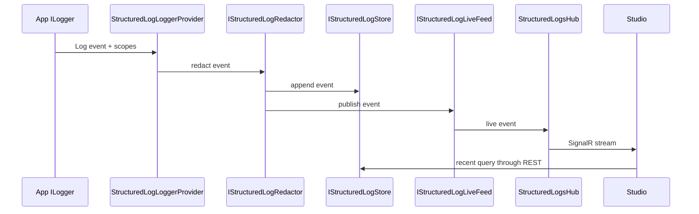

# Diagnostics Structured Logs

`Elsa.Diagnostics.StructuredLogs` captures semantic `ILogger` events from an Elsa host, redacts sensitive data, keeps a recent queryable buffer, exposes REST endpoints, and streams live events to Studio over SignalR.

Start in [src/modules/Elsa.Diagnostics.StructuredLogs](../../src/modules/Elsa.Diagnostics.StructuredLogs).

## Scope

This module captures structured `ILogger` records only. It does not capture raw stdout/stderr console streams, traces, metrics, or OpenTelemetry spans. Raw console output is covered by the sibling [Elsa.Diagnostics.ConsoleLogs](../../src/modules/Elsa.Diagnostics.ConsoleLogs) module — see [Diagnostics Console Logs](diagnostics-console-logs.md).

## Feature Wiring

[StructuredLogsFeature](../../src/modules/Elsa.Diagnostics.StructuredLogs/Features/StructuredLogsFeature.cs):

- registers FastEndpoints assembly
- calls `AddStructuredLogsServices`
- adds FastEndpoints from the module

[AddStructuredLogsServices](../../src/modules/Elsa.Diagnostics.StructuredLogs/Extensions/ServiceCollectionExtensions.cs) registers:

- SignalR
- `StructuredLogsOptions`
- source registry
- redactor
- in-memory store
- in-memory live feed
- default provider facade
- subscription manager
- `StructuredLogLoggerProvider` as an `ILoggerProvider`

## Core Contracts

| Contract | Purpose |
| --- | --- |
| [IStructuredLogProvider](../../src/modules/Elsa.Diagnostics.StructuredLogs/Contracts/IStructuredLogProvider.cs) | REST/SignalR facade used by endpoints and clients. |
| [IStructuredLogStore](../../src/modules/Elsa.Diagnostics.StructuredLogs/Contracts/IStructuredLogStore.cs) | Queryable storage abstraction. |
| [IStructuredLogLiveFeed](../../src/modules/Elsa.Diagnostics.StructuredLogs/Contracts/IStructuredLogLiveFeed.cs) | Live event publication/subscription abstraction. |
| [IStructuredLogSink](../../src/modules/Elsa.Diagnostics.StructuredLogs/Contracts/IStructuredLogSink.cs) | Event ingestion boundary. |
| [IStructuredLogRedactor](../../src/modules/Elsa.Diagnostics.StructuredLogs/Contracts/IStructuredLogRedactor.cs) | Redacts properties and text before storage/live delivery. |
| [IStructuredLogSourceRegistry](../../src/modules/Elsa.Diagnostics.StructuredLogs/Contracts/IStructuredLogSourceRegistry.cs) | Tracks source metadata and health. |
| [IStructuredLogStorageDiagnostics](../../src/modules/Elsa.Diagnostics.StructuredLogs/Contracts/IStructuredLogStorageDiagnostics.cs) | Provider-neutral diagnostics such as dropped durable writes. |

## Event Flow



## In-Memory Provider

The default provider keeps recent logs in process:

- [InMemoryStructuredLogStore](../../src/modules/Elsa.Diagnostics.StructuredLogs/Providers/InMemory/InMemoryStructuredLogStore.cs)
- [InMemoryStructuredLogLiveFeed](../../src/modules/Elsa.Diagnostics.StructuredLogs/Providers/InMemory/InMemoryStructuredLogLiveFeed.cs)
- [RingBuffer](../../src/modules/Elsa.Diagnostics.StructuredLogs/Providers/InMemory/RingBuffer.cs)

This is bounded and process-local. In clustered deployments, each node has its own source identity and in-memory history unless durable/shared persistence is configured.

## REST And SignalR Surface

REST endpoints:

- `GET|POST /elsa/api/diagnostics/structured-logs/recent`
- `GET /elsa/api/diagnostics/structured-logs/sources`
- `GET /elsa/api/diagnostics/structured-logs/storage`

Endpoint code is under [Endpoints/StructuredLogs](../../src/modules/Elsa.Diagnostics.StructuredLogs/Endpoints/StructuredLogs).

SignalR:

- Hub: [StructuredLogsHub](../../src/modules/Elsa.Diagnostics.StructuredLogs/RealTime/StructuredLogsHub.cs)
- Client contract: [IStructuredLogsClient](../../src/modules/Elsa.Diagnostics.StructuredLogs/RealTime/IStructuredLogsClient.cs)
- Mapping: [MapStructuredLogsHub](../../src/modules/Elsa.Diagnostics.StructuredLogs/Extensions/EndpointRouteBuilderExtensions.cs)
- App extension: [UseStructuredLogs](../../src/modules/Elsa.Diagnostics.StructuredLogs/Extensions/ApplicationBuilderExtensions.cs)

The README states the hub is mapped at `/elsa/hubs/diagnostics/structured-logs`.

## Authorization

The endpoints require `read:diagnostics:structured-logs`, defined in [StructuredLogsPermissions](../../src/modules/Elsa.Diagnostics.StructuredLogs/Permissions/StructuredLogsPermissions.cs). The SignalR hub requires an authenticated user.

## Redaction

Events pass through `IStructuredLogRedactor` before buffering or streaming. Configuration lives in [StructuredLogsOptions](../../src/modules/Elsa.Diagnostics.StructuredLogs/Options/StructuredLogsOptions.cs). Extend sensitive property names and text patterns there.

## SQLite Persistence

Durable SQLite storage is available through the relational and SQLite packages:

- design plan: [specs/005-structured-log-persistence/plan.md](../../specs/005-structured-log-persistence/plan.md)
- quickstart: [specs/005-structured-log-persistence/quickstart.md](../../specs/005-structured-log-persistence/quickstart.md)
- relational package: [Elsa.Diagnostics.StructuredLogs.Persistence.Relational](../../src/modules/Elsa.Diagnostics.StructuredLogs.Persistence.Relational)
- SQLite package: [Elsa.Diagnostics.StructuredLogs.Persistence.Sqlite](../../src/modules/Elsa.Diagnostics.StructuredLogs.Persistence.Sqlite)

Configuration example from the SQLite README:

```csharp
services.AddElsa(elsa =>
{
    elsa.UseStructuredLogs(structuredLogs =>
    {
        structuredLogs.UseSqliteStorage("Data Source=elsa-structured-logs.db", sqlite =>
        {
            sqlite.RunMigrationsOnStartup = true;
            sqlite.Relational.WriteQueue.Capacity = 10_000;
            sqlite.Relational.WriteQueue.BatchSize = 100;
        });
    });
});
```

## Relational Persistence Design

[AddRelationalStructuredLogPersistence](../../src/modules/Elsa.Diagnostics.StructuredLogs.Persistence.Relational/Extensions/RelationalStructuredLogsServiceCollectionExtensions.cs) registers:

- `RelationalStructuredLogMapper`
- `RelationalStructuredLogSqlBuilder`
- `RelationalStructuredLogStore`
- `StructuredLogWriteBuffer`
- `StructuredLogRetentionService`
- `IStructuredLogStore` as the write buffer
- `IStructuredLogWriteBuffer`
- `IStructuredLogStorageDiagnostics`
- hosted service for the write buffer

The write buffer uses a bounded queue. If the queue is full, newest events are dropped and the dropped-write count is reported through storage diagnostics.

## SQLite Provider Boundary

[AddSqliteStructuredLogPersistence](../../src/modules/Elsa.Diagnostics.StructuredLogs.Persistence.Sqlite/Extensions/SqliteStructuredLogsModuleExtensions.cs) supplies provider-specific services:

- `IRelationalStructuredLogConnectionFactory`
- `IRelationalStructuredLogDialect`
- `IStructuredLogSchemaMigrator`
- startup migration/cleanup hosted service

The core structured logs package must remain unaware of SQLite. Future relational providers should copy this boundary: provider package supplies connection factory, dialect, migrator, and option binding; relational package supplies shared store behavior.

## Tests

Relevant tests:

- [test/unit/Elsa.Diagnostics.StructuredLogs.UnitTests](../../test/unit/Elsa.Diagnostics.StructuredLogs.UnitTests)
- [test/integration/Elsa.Diagnostics.StructuredLogs.IntegrationTests](../../test/integration/Elsa.Diagnostics.StructuredLogs.IntegrationTests)
- [test/unit/Elsa.Diagnostics.StructuredLogs.Persistence.Relational.UnitTests](../../test/unit/Elsa.Diagnostics.StructuredLogs.Persistence.Relational.UnitTests)
- [test/integration/Elsa.Diagnostics.StructuredLogs.Persistence.Sqlite.IntegrationTests](../../test/integration/Elsa.Diagnostics.StructuredLogs.Persistence.Sqlite.IntegrationTests)

Run targeted structured-log tests before broader builds when touching this area.
