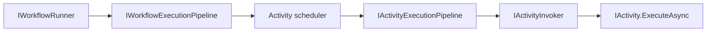

# Workflow Core

Workflow core is the engine layer. It defines activities, execution contexts, scheduling primitives, inputs and outputs, variables, bookmarks, serialization, execution pipelines, flowchart behavior, and the core runner.

Start in [src/modules/Elsa.Workflows.Core](../../src/modules/Elsa.Workflows.Core).

## Feature Wiring

[WorkflowsFeature](../../src/modules/Elsa.Workflows.Core/Features/WorkflowsFeature.cs) registers the core services:

- `IActivityInvoker`
- `IWorkflowRunner`
- `IActivityTestRunner`
- `IActivityVisitor`
- `IWorkflowGraphBuilder`
- `IWorkflowStateExtractor`
- `IActivitySchedulerFactory`
- workflow and activity execution pipelines
- activity registry, descriptor, factory, and lookup services
- storage drivers
- serializers
- incident strategies
- UI hint handlers
- identity and hashing services

The feature also configures default workflow and activity pipelines. The umbrella [ElsaFeature](../../src/modules/Elsa/Features/ElsaFeature.cs) calls `WithDefaultWorkflowExecutionPipeline()` and `WithDefaultActivityExecutionPipeline()`.

## Activities

Core activity abstractions live in [Abstractions](../../src/modules/Elsa.Workflows.Core/Abstractions):

- `Activity`
- `Activity<T>`
- `CodeActivity`
- `WorkflowBase`
- `Behavior`
- `Trigger`

Built-in activities live in [Activities](../../src/modules/Elsa.Workflows.Core/Activities). Important families:

- Primitive control: `Sequence`, `If`, `Switch`, `For`, `ForEach`, `While`, `Parallel`, `Fork`, `Break`, `End`, `Finish`, `Complete`, `Fault`.
- Data and runtime helpers: `SetVariable`, `SetName`, `Correlate`, `WriteLine`, `ReadLine`.
- Dynamic and missing activity handling: `DynamicActivity`, `NotFoundActivity`.
- Flowchart: [Activities/Flowchart](../../src/modules/Elsa.Workflows.Core/Activities/Flowchart/Activities).
- State machine: [Activities/StateMachine](../../src/modules/Elsa.Workflows.Core/Activities/StateMachine/Activities). Named states with trigger-driven transitions. See [Activities And Authoring](activities-and-authoring.md) for the execution model.

Activities are described by `IActivityDescriber` and registered in `IActivityRegistry`. Workflow management adds activities to the available designer/API surface.

## Execution Contexts And State

Core execution state lives under [State](../../src/modules/Elsa.Workflows.Core/State) and [Models](../../src/modules/Elsa.Workflows.Core/Models). Important concepts:

- `WorkflowState`: serializable workflow execution state.
- `ActivityExecutionContextState`: serializable activity execution context state.
- `ActivityWorkItemState`: queued work item state.
- `WorkflowExecutionState`: high-level status and state model.
- `ActivityIncident`: fault or incident details.
- `WorkflowInput`: input passed into a workflow run.
- `ActivityOutputs` and `ActivityOutputRecord`: activity output capture.

Execution context extension tests live under [test/unit/Elsa.Workflows.Core.UnitTests/Extensions/ActivityExecutionContextExtensions](../../test/unit/Elsa.Workflows.Core.UnitTests/Extensions/ActivityExecutionContextExtensions).

## Inputs, Outputs, And Expressions

Inputs and outputs are modeled through:

- `Input<T>` and `Input`
- `Output<T>` and `Output`
- `InputDefinition`
- `OutputDefinition`
- `InputDescriptor`
- `OutputDescriptor`
- `Argument` and `ArgumentDefinition`

Expression handling bridges core workflows with language providers through [Expressions](../../src/modules/Elsa.Workflows.Core/Expressions) and the separate expression modules. `DefaultActivityInputEvaluator` evaluates inputs before activity execution.

## Scheduling Inside A Workflow

Core scheduling is about which activity work item runs next. Key services:

- [QueueBasedActivityScheduler](../../src/modules/Elsa.Workflows.Core/Services/QueueBasedActivityScheduler.cs)
- [StackBasedActivityScheduler](../../src/modules/Elsa.Workflows.Core/Services/StackBasedActivityScheduler.cs)
- [ActivitySchedulerFactory](../../src/modules/Elsa.Workflows.Core/Services/ActivitySchedulerFactory.cs)
- [WorkflowExecutionContextSchedulerStrategy](../../src/modules/Elsa.Workflows.Core/Services/WorkflowExecutionContextSchedulerStrategy.cs)
- [ActivityExecutionContextSchedulerStrategy](../../src/modules/Elsa.Workflows.Core/Services/ActivityExecutionContextSchedulerStrategy.cs)

Runtime scheduling and external dispatch are separate and live in `Elsa.Workflows.Runtime`.

## Bookmarks And Triggers

Core models define bookmark concepts:

- [Bookmark](../../src/modules/Elsa.Workflows.Core/Models/Bookmark.cs)
- [BookmarkInfo](../../src/modules/Elsa.Workflows.Core/Models/BookmarkInfo.cs)
- [CreateBookmarkArgs](../../src/modules/Elsa.Workflows.Core/Models/CreateBookmarkArgs.cs)
- [TriggerType](../../src/modules/Elsa.Workflows.Core/Models/TriggerType.cs)

The runtime persists and indexes bookmarks/triggers. Core activities create bookmarks and signals; runtime services decide how they are stored and resumed.

## Flowchart Execution

Flowchart support is split between:

- [FlowchartFeature](../../src/modules/Elsa.Workflows.Core/Features/FlowchartFeature.cs)
- [Flowchart activities](../../src/modules/Elsa.Workflows.Core/Activities/Flowchart/Activities)
- flowchart extension methods in [Activities/Flowchart/Extensions](../../src/modules/Elsa.Workflows.Core/Activities/Flowchart/Extensions)

Relevant ADRs:

- [ADR 0005: Token-Centric Flowchart Execution Model](../adr/0005-token-centric-flowchart-execution-model.md)
- [ADR 0007: Explicit Merge Modes For Flowchart Joins](../adr/0007-adoption-of-explicit-merge-modes-for-flowchart-joins.md)

## Pipelines

Core has separate workflow and activity execution pipelines:

Pipeline extension methods live under [Extensions](../../src/modules/Elsa.Workflows.Core/Extensions) and middleware under [Middleware](../../src/modules/Elsa.Workflows.Core/Middleware). Pipelines are configured by `WorkflowsFeature`.

## Commit Strategies

Commit strategies determine persistence boundaries. Related files:

- [CommitStrategiesFeature](../../src/modules/Elsa.Workflows.Core/CommitStates/CommitStrategiesFeature.cs)
- [CommitStrategies](../../src/modules/Elsa.Workflows.Core/CommitStates)
- workflow sample configuration in [Elsa.Server.Web/Program.cs](../../src/apps/Elsa.Server.Web/Program.cs)

Runtime replaces the default no-op commit handler with an execution-cycle-aware handler so state changes are persisted at runtime boundaries.

## Serialization

Core serializers live under [Serialization](../../src/modules/Elsa.Workflows.Core/Serialization), including:

- `JsonWorkflowStateSerializer`
- `JsonPayloadSerializer`
- `JsonActivitySerializer`
- `ApiSerializer`
- `SafeSerializer`
- `StandardJsonSerializer`

Custom constructor and additional converter configurators are registered by `WorkflowsFeature`.

### Workflow JSON Type Identifiers

Workflow JSON type resolution uses `IWorkflowJsonTypeRegistry`, not expression type aliases. Register workflow-serializable payload types through `WorkflowJsonTypeOptions`; keep `ExpressionOptions` for expression/type metadata only.

New workflow JSON writes preferred aliases when a type is registered. Compatibility reads also accept explicitly registered legacy names, including selected CLR names from older persisted workflow JSON. Unknown CLR names are rejected rather than loaded dynamically. Polymorphic object reads also reject abstract, interface, open generic, and unsupported collection targets unless the resolver can map a known collection interface to a concrete collection type.

Public API payloads that expose workflow JSON type identifiers should emit values from `IWorkflowJsonTypeRegistry`. For example, incident strategy descriptors return the alias that workflow JSON accepts, while registered legacy CLR names remain readable during the compatibility window.

## When To Change This Layer

Change workflow core only when you are changing engine semantics, activity contracts, execution state, serialization, core activity behavior, or flowchart behavior. If the change is about persisted definitions, API DTOs, background dispatch, or a module-specific transport, start in management, API, runtime, or the extension module instead.
