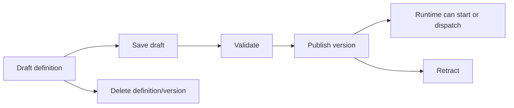

# Workflow Management

Workflow management owns workflow definitions and workflow instances as manageable resources. It is the layer used by Studio, import/export, validation, activity descriptors, workflow reference graphs, and many API endpoints.

Start in [src/modules/Elsa.Workflows.Management](../../src/modules/Elsa.Workflows.Management).

## Feature Wiring

[WorkflowManagementFeature](../../src/modules/Elsa.Workflows.Management/Features/WorkflowManagementFeature.cs) registers:

- memory stores for `WorkflowDefinition` and `WorkflowInstance`
- activity providers and descriptor providers
- workflow definition and instance managers
- serializer, importer, exporter, publisher, validator
- materializers for CLR, JSON, and typed workflows
- activity registry population
- workflow reference graph services
- host method activities
- workflow definition activities
- variable descriptors and expression descriptors
- read-only mode and default log persistence mode

It depends on workflow core, caching, mediator, string compression, system clock, workflow definitions, and workflow instances.

## Key Entities

| Entity | File | Meaning |
| --- | --- | --- |
| `WorkflowDefinition` | [Entities/WorkflowDefinition.cs](../../src/modules/Elsa.Workflows.Management/Entities/WorkflowDefinition.cs) | Persisted definition version and metadata. |
| `WorkflowInstance` | [Entities/WorkflowInstance.cs](../../src/modules/Elsa.Workflows.Management/Entities/WorkflowInstance.cs) | Persisted execution instance and workflow state. |

Management entities are separate from core execution models. Core can run workflows; management stores definitions and instances.

## Stores

Contracts:

- [IWorkflowDefinitionStore](../../src/modules/Elsa.Workflows.Management/Contracts/IWorkflowDefinitionStore.cs)
- [IWorkflowInstanceStore](../../src/modules/Elsa.Workflows.Management/Contracts/IWorkflowInstanceStore.cs)

Defaults:

- [MemoryWorkflowDefinitionStore](../../src/modules/Elsa.Workflows.Management/Stores/MemoryWorkflowDefinitionStore.cs)
- [MemoryWorkflowInstanceStore](../../src/modules/Elsa.Workflows.Management/Stores/MemoryWorkflowInstanceStore.cs)
- [CachingWorkflowDefinitionStore](../../src/modules/Elsa.Workflows.Management/Stores/CachingWorkflowDefinitionStore.cs)

EF Core persistence replaces these stores through [Elsa.Persistence.EFCore/Modules/Management](../../src/modules/Elsa.Persistence.EFCore/Modules/Management).

## Definition Lifecycle

Important services:

- [WorkflowDefinitionManager](../../src/modules/Elsa.Workflows.Management/Services/WorkflowDefinitionManager.cs)
- [WorkflowDefinitionPublisher](../../src/modules/Elsa.Workflows.Management/Services/WorkflowDefinitionPublisher.cs)
- [WorkflowDefinitionService](../../src/modules/Elsa.Workflows.Management/Services/WorkflowDefinitionService.cs)
- [CachingWorkflowDefinitionService](../../src/modules/Elsa.Workflows.Management/Services/CachingWorkflowDefinitionService.cs)
- [WorkflowValidator](../../src/modules/Elsa.Workflows.Management/Services/WorkflowValidator.cs)

Notifications under [Notifications](../../src/modules/Elsa.Workflows.Management/Notifications) allow cache eviction, validation, reference updates, and cascading behavior.

## Materializers

Materializers convert persisted or typed representations into executable workflows:

- [ClrWorkflowMaterializer](../../src/modules/Elsa.Workflows.Management/Materializers/ClrWorkflowMaterializer.cs)
- [JsonWorkflowMaterializer](../../src/modules/Elsa.Workflows.Management/Materializers/JsonWorkflowMaterializer.cs)
- [TypedWorkflowMaterializer](../../src/modules/Elsa.Workflows.Management/Materializers/TypedWorkflowMaterializer.cs)

The materializer registry is [MaterializerRegistry](../../src/modules/Elsa.Workflows.Management/Services/MaterializerRegistry.cs), with the contract [IMaterializerRegistry](../../src/modules/Elsa.Workflows.Management/Contracts/IMaterializerRegistry.cs).

## Import, Export, And Serialization

Management uses:

- [WorkflowSerializer](../../src/modules/Elsa.Workflows.Management/Services/WorkflowSerializer.cs)
- [WorkflowDefinitionImporter](../../src/modules/Elsa.Workflows.Management/Services/WorkflowDefinitionImporter.cs)
- [WorkflowDefinitionExporter](../../src/modules/Elsa.Workflows.Management/Services/WorkflowDefinitionExporter.cs)

These services are used by API endpoints for workflow definition import/export and by tests that load JSON workflow definitions.

## Activity And Variable Descriptors

Designer and API clients need metadata about available activities, inputs, outputs, UI hints, variable types, and expressions. Management provides:

- [TypedActivityProvider](../../src/modules/Elsa.Workflows.Management/Providers/TypedActivityProvider.cs)
- [DefaultExpressionDescriptorProvider](../../src/modules/Elsa.Workflows.Management/Providers/DefaultExpressionDescriptorProvider.cs)
- [ActivityRegistryPopulator](../../src/modules/Elsa.Workflows.Management/Services/ActivityRegistryPopulator.cs)
- [ExpressionDescriptorRegistry](../../src/modules/Elsa.Workflows.Management/Services/ExpressionDescriptorRegistry.cs)

Modules add activities by calling `Module.UseWorkflowManagement(management => management.AddActivitiesFrom<TMarker>())` or equivalent helpers.

## Host Method Activities

Host method activities expose methods from registered host classes as activities. Relevant files:

- [HostMethodActivity](../../src/modules/Elsa.Workflows.Management/Activities/HostMethod/HostMethodActivity.cs)
- [HostMethodActivityProvider](../../src/modules/Elsa.Workflows.Management/Activities/HostMethod/HostMethodActivityProvider.cs)
- [HostMethodActivitiesOptions](../../src/modules/Elsa.Workflows.Management/Options/HostMethodActivitiesOptions.cs)

The reference server registers an activity host with `AddActivityHost<Penguin>()` in [Program.cs](../../src/apps/Elsa.Server.Web/Program.cs).

## Workflow Definition Activity

The workflow definition activity allows one workflow to reference another workflow definition:

- [WorkflowDefinitionActivity](../../src/modules/Elsa.Workflows.Management/Activities/WorkflowDefinitionActivity/WorkflowDefinitionActivity.cs)
- [WorkflowDefinitionActivityProvider](../../src/modules/Elsa.Workflows.Management/Activities/WorkflowDefinitionActivity/WorkflowDefinitionActivityProvider.cs)
- [WorkflowReferenceGraphBuilder](../../src/modules/Elsa.Workflows.Management/Services/WorkflowReferenceGraphBuilder.cs)
- [WorkflowReferenceUpdater](../../src/modules/Elsa.Workflows.Management/Services/WorkflowReferenceUpdater.cs)

Component tests under [WorkflowReferenceGraph](../../test/component/Elsa.Workflows.ComponentTests/Scenarios/WorkflowReferenceGraph) exercise this behavior.

## Read-Only Mode

`WorkflowManagementFeature.UseReadOnlyMode(bool)` affects mutable workflow definition operations. API authorization uses [NotReadOnlyRequirement](../../src/modules/Elsa.Workflows.Api/Requirements/NotReadOnlyRequirement.cs) and the `NotReadOnlyPolicy` in workflow API.

## When To Change This Layer

Change management when the work is about workflow definitions, workflow instances as persisted records, import/export formats, activity metadata, variable metadata, validation, read-only behavior, reference graphs, or workflow store replacement. Do not put runtime dispatch or transport-specific behavior here unless management contracts need to expose it.
