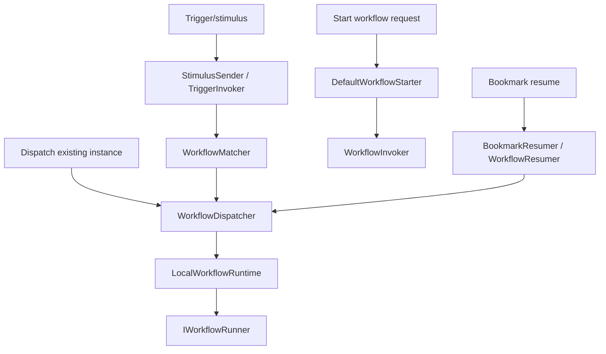

# Workflow Runtime

Workflow runtime owns starting, dispatching, resuming, cancelling, logging, and recovering workflow executions. It is the layer that turns definitions into running instances and responds to triggers, bookmarks, background work, and admin operations.

Start in [src/modules/Elsa.Workflows.Runtime](../../src/modules/Elsa.Workflows.Runtime).

## Feature Wiring

[WorkflowRuntimeFeature](../../src/modules/Elsa.Workflows.Runtime/Features/WorkflowRuntimeFeature.cs) registers and configures:

- `IWorkflowRuntime`
- `IWorkflowDispatcher`
- `IStimulusDispatcher`
- `IWorkflowCancellationDispatcher`
- bookmark, bookmark queue, trigger, workflow execution log, and activity execution stores
- workflow matcher, starter, invoker, resumer, canceller, restarter
- trigger indexer and bookmark manager
- background workflow, stimulus, task, and activity dispatch
- bookmark queue worker and queue purger
- distributed lock provider
- execution cycle registry
- graceful shutdown machinery
- runtime startup and recurring tasks

It also configures `WorkflowsFeature` to use the runtime commit state handler.

## Runtime Stores

Important runtime entities:

- [StoredTrigger](../../src/modules/Elsa.Workflows.Runtime/Entities/StoredTrigger.cs)
- [StoredBookmark](../../src/modules/Elsa.Workflows.Runtime/Entities/StoredBookmark.cs)
- [BookmarkQueueItem](../../src/modules/Elsa.Workflows.Runtime/Entities/BookmarkQueueItem.cs)
- [WorkflowExecutionLogRecord](../../src/modules/Elsa.Workflows.Runtime/Entities/WorkflowExecutionLogRecord.cs)
- [ActivityExecutionRecord](../../src/modules/Elsa.Workflows.Runtime/Entities/ActivityExecutionRecord.cs)
- [WorkflowInboxMessage](../../src/modules/Elsa.Workflows.Runtime/Entities/WorkflowInboxMessage.cs)

The default runtime feature uses memory stores. EF Core runtime persistence is wired by [EFCoreWorkflowRuntimePersistenceFeature](../../src/modules/Elsa.Persistence.EFCore/Modules/Runtime/WorkflowRuntimePersistenceFeature.cs), which replaces runtime store factories on `WorkflowRuntimeFeature`.

## Dispatch Paths

Key files:

- [LocalWorkflowRuntime](../../src/modules/Elsa.Workflows.Runtime/Services/LocalWorkflowRuntime.cs)
- [WorkflowDispatcher](../../src/modules/Elsa.Workflows.Runtime/Services/BackgroundWorkflowDispatcher.cs)
- [ValidatingWorkflowDispatcher](../../src/modules/Elsa.Workflows.Runtime/Services/ValidatingWorkflowDispatcher.cs)
- [WorkflowInvoker](../../src/modules/Elsa.Workflows.Runtime/Services/WorkflowInvoker.cs)
- [DefaultWorkflowStarter](../../src/modules/Elsa.Workflows.Runtime/Services/DefaultWorkflowStarter.cs)
- [WorkflowResumer](../../src/modules/Elsa.Workflows.Runtime/Services/WorkflowResumer.cs)
- [BookmarkResumer](../../src/modules/Elsa.Workflows.Runtime/Services/BookmarkResumer.cs)
- [TriggerInvoker](../../src/modules/Elsa.Workflows.Runtime/Services/TriggerInvoker.cs)

## Triggers And Bookmarks

Triggers start workflows. Bookmarks resume suspended workflow instances. Runtime indexes and queries them through:

- [TriggerIndexer](../../src/modules/Elsa.Workflows.Runtime/Services/TriggerIndexer.cs)
- [DefaultBookmarkManager](../../src/modules/Elsa.Workflows.Runtime/Services/DefaultBookmarkManager.cs)
- [BookmarkPersister](../../src/modules/Elsa.Workflows.Runtime/Services/BookmarkPersister.cs)
- [BookmarkUpdater](../../src/modules/Elsa.Workflows.Runtime/Services/BookmarkUpdater.cs)
- [BookmarkBoundWorkflowService](../../src/modules/Elsa.Workflows.Runtime/Services/BookmarkBoundWorkflowService.cs)
- [TriggerBoundWorkflowService](../../src/modules/Elsa.Workflows.Runtime/Services/TriggerBoundWorkflowService.cs)

Bookmark queue processing is handled by:

- [StoreBookmarkQueue](../../src/modules/Elsa.Workflows.Runtime/Services/StoreBookmarkQueue.cs)
- [BookmarkQueueProcessor](../../src/modules/Elsa.Workflows.Runtime/Services/BookmarkQueueProcessor.cs)
- [BookmarkQueueWorker](../../src/modules/Elsa.Workflows.Runtime/Services/BookmarkQueueWorker.cs)
- [BookmarkQueueSignaler](../../src/modules/Elsa.Workflows.Runtime/Services/BookmarkQueueSignaler.cs)

## Execution Logs

Workflow and activity execution logs flow through sinks and stores:

- [StoreWorkflowExecutionLogSink](../../src/modules/Elsa.Workflows.Runtime/Services/StoreWorkflowExecutionLogSink.cs)
- [StoreActivityExecutionLogSink](../../src/modules/Elsa.Workflows.Runtime/Services/StoreActivityExecutionLogSink.cs)
- [WorkflowExecutionLogRecordExtractor](../../src/modules/Elsa.Workflows.Runtime/Services/WorkflowExecutionLogRecordExtractor.cs)
- [DefaultActivityExecutionMapper](../../src/modules/Elsa.Workflows.Runtime/Services/DefaultActivityExecutionMapper.cs)

API endpoints under `WorkflowInstances/Journal`, `ActivityExecutions`, and `ActivityExecutionSummaries` expose this data.

## Background Work

Runtime has several background paths:

- `BackgroundWorkflowDispatcher` for workflow dispatch.
- `BackgroundStimulusDispatcher` for stimulus dispatch.
- `BackgroundTaskDispatcher` for `RunTask`.
- `LocalBackgroundActivityScheduler` for background activity execution.
- `BackgroundActivityInvoker` for executing background activity work.

These paths matter for tests: a workflow may return before background activity or bookmark work has completed.

## Graceful Shutdown And Recovery

Recent graceful shutdown work added node-local quiescence and drain concepts. Source landmarks:

- [QuiescenceSignal](../../src/modules/Elsa.Workflows.Runtime/Services/QuiescenceSignal.cs)
- [IngressSourceRegistry](../../src/modules/Elsa.Workflows.Runtime/Services/IngressSourceRegistry.cs)
- [DrainOrchestrator](../../src/modules/Elsa.Workflows.Runtime/Services/DrainOrchestrator.cs)
- [DrainOrchestratorHostedService](../../src/modules/Elsa.Workflows.Runtime/HostedServices/DrainOrchestratorHostedService.cs)
- [InterruptedRecoveryScanner](../../src/modules/Elsa.Workflows.Runtime/Services/InterruptedRecoveryScanner.cs)
- [RecoverInterruptedWorkflowsStartupTask](../../src/modules/Elsa.Workflows.Runtime/StartupTasks/RecoverInterruptedWorkflowsStartupTask.cs)

The design intent is captured in [specs/002-graceful-shutdown/plan.md](../../specs/002-graceful-shutdown/plan.md).

Ingress source adapters are currently registered by modules such as HTTP and Scheduling so the runtime can pause external event intake during drain.

## Runtime Admin

The workflow API includes runtime admin endpoints:

- `GET /elsa/api/admin/workflow-runtime/status`
- `POST /elsa/api/admin/workflow-runtime/pause`
- `POST /elsa/api/admin/workflow-runtime/resume`
- `POST /elsa/api/admin/workflow-runtime/force-drain`

Endpoint code lives under [Workflow.Api/Endpoints/RuntimeAdmin](../../src/modules/Elsa.Workflows.Api/Endpoints/RuntimeAdmin). The service behind these endpoints is [WorkflowRuntimeAdminService](../../src/modules/Elsa.Workflows.Runtime/Services/WorkflowRuntimeAdminService.cs).

## Distributed Runtime

Distributed runtime support lives in [Elsa.Workflows.Runtime.Distributed](../../src/modules/Elsa.Workflows.Runtime.Distributed). It layers distributed coordination and resilience support on top of the base runtime. When making runtime changes, check whether the distributed project has a parallel worker or dispatcher that must honor the same semantics.

## When To Change This Layer

Change runtime for dispatch semantics, trigger/bookmark indexing, background work, execution logs, recovery, cancellation, graceful shutdown, or runtime stores. If a change only affects how definitions are saved or described, it belongs in management. If it only changes HTTP endpoint activity behavior, start in `Elsa.Http`.
