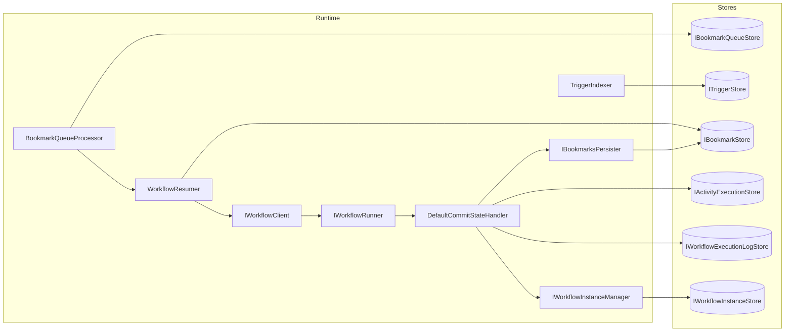
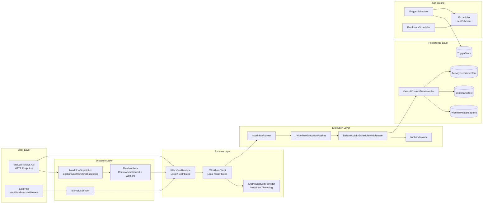
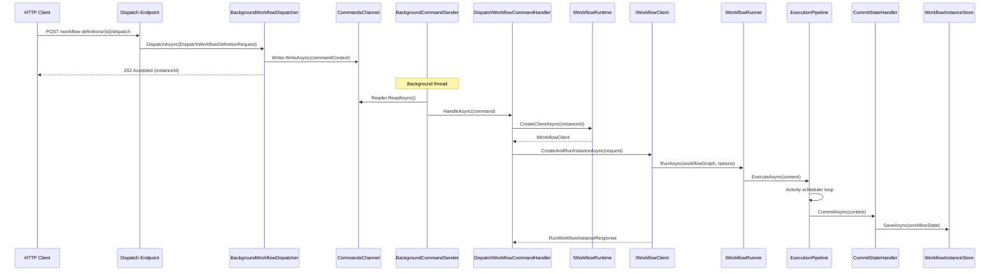
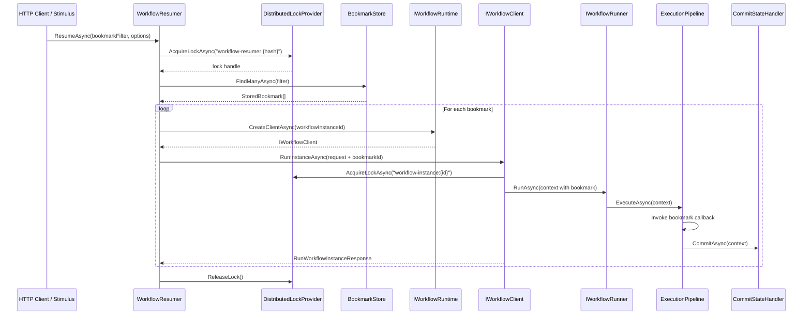

# Elsa Workflows Runtime Architecture Inventory

> **Purpose:** High-fidelity inventory of the current Elsa Workflows v3 runtime architecture, focusing on execution, concurrency, distribution, persistence, timers, triggers/bookmarks, and observability.
> **Audience:** Actor-runtime design agent (follow-up task).
> **Date:** 2026-02-22
> **Repository:** `elsa-workflows/elsa-core` (branch `main`)

---

## 1. Executive Overview

Elsa Workflows v3 is a modular .NET workflow engine organized into ~104 projects. The runtime follows a **client–runtime–runner** layered architecture:

1. **Entry layer** – HTTP endpoints (`Elsa.Workflows.Api`), HTTP middleware (`Elsa.Http`), and background dispatch.
2. **Dispatch layer** – `IWorkflowDispatcher` sends commands to a background channel (`Elsa.Mediator`) for async processing, or executes synchronously.
3. **Runtime layer** – `IWorkflowRuntime` creates an `IWorkflowClient` bound to a workflow instance. The client creates/runs/resumes/cancels instances.
4. **Execution layer** – `IWorkflowRunner` drives the `IWorkflowExecutionPipeline` (middleware chain), which in turn schedules and invokes activities through `IActivityInvoker`.
5. **Persistence layer** – Stores (instances, bookmarks, triggers, logs) abstracted behind interfaces; default in-memory, with EF Core providers for SQL databases.

**Key architectural facts:**
- Execution within a workflow instance is **single-threaded** (sequential work-item loop in `DefaultActivitySchedulerMiddleware`).
- Cross-instance concurrency is controlled via **distributed locks** (`Medallion.Threading`), not optimistic concurrency.
- There is **no message bus** (no MassTransit, RabbitMQ, etc.). Inter-node coordination is purely database + distributed locks.
- Scheduling uses a **custom in-process scheduler** (`LocalScheduler`) backed by `System.Timers.Timer` and `Cronos` for CRON parsing — **not** Quartz or Hangfire.
- Tenant context flows via `AsyncLocal<Tenant?>` and is propagated through mediator command headers.
- State is a **JSON-serialized snapshot** (`WorkflowState`), not event-sourced.
- Observability is basic: OpenTelemetry packages are referenced for ASP.NET Core auto-instrumentation, but there is **no custom `ActivitySource`** emitting workflow-specific spans. Execution journals (`ActivityExecutionRecord`, `WorkflowExecutionLogRecord`) provide an audit trail.

---

## 2. Runtime Entry Points

### 2.1 Synchronous Execution via HTTP

| Endpoint | File | Key Service |
|----------|------|-------------|
| `POST /workflow-definitions/{definitionId}/execute` | `src/modules/Elsa.Workflows.Api/Endpoints/WorkflowDefinitions/Execute/PostEndpoint.cs` | `IWorkflowRuntime`, `IWorkflowStarter` |
| `GET  /workflow-definitions/{definitionId}/execute` | `src/modules/Elsa.Workflows.Api/Endpoints/WorkflowDefinitions/Execute/GetEndpoint.cs` | Same |

**Call chain (POST):**
```
PostEndpoint.HandleAsync()
  → IWorkflowRuntime.CreateClientAsync()                      // LocalWorkflowRuntime or Distributed
  → IWorkflowClient.CreateAndRunInstanceAsync(request)         // LocalWorkflowClient
    → creates WorkflowInstance, builds WorkflowGraph
    → IWorkflowRunner.RunAsync(workflowGraph, options)
      → IWorkflowExecutionPipeline.ExecuteAsync(context)
        → ExceptionHandlingMiddleware → DefaultActivitySchedulerMiddleware
          → scheduler loop: IActivityInvoker.InvokeAsync() per work item
      → IWorkflowStateExtractor.Extract(context)
  → returns RunWorkflowInstanceResponse (status, bookmarks, incidents)
```

### 2.2 Asynchronous Dispatch via HTTP

| Endpoint | File |
|----------|------|
| `POST /workflow-definitions/{definitionId}/dispatch` | `src/modules/Elsa.Workflows.Api/Endpoints/WorkflowDefinitions/Dispatch/Endpoint.cs` |
| `POST /workflow-definitions/{id}/bulk-dispatch` | `src/modules/Elsa.Workflows.Api/Endpoints/WorkflowDefinitions/BulkDispatch/Endpoint.cs` |

**Call chain:**
```
Endpoint.HandleAsync()
  → IWorkflowDispatcher.DispatchAsync(DispatchWorkflowDefinitionRequest)
    → BackgroundWorkflowDispatcher.DispatchAsync()
      → captures tenant ID via ITenantAccessor
      → publishes WorkflowDefinitionDispatching notification
      → ICommandSender.SendAsync(DispatchWorkflowDefinitionCommand, Background)
        → CommandsChannel.Writer.WriteAsync(commandContext)
      → publishes WorkflowDefinitionDispatched notification
      → returns DispatchWorkflowResponse.Success()

[Background – BackgroundCommandSenderHostedService]
  → round-robin distributes command to worker channel
  → worker resolves ICommandSender from fresh IServiceScope
  → DispatchWorkflowCommandHandler.HandleAsync()
    → IWorkflowRuntime.CreateClientAsync(instanceId)
    → client.CreateAndRunInstanceAsync(request)
```

### 2.3 Bookmark Resumption via HTTP

| Endpoint | File |
|----------|------|
| `POST /bookmarks/resume` | `src/modules/Elsa.Workflows.Api/Endpoints/Bookmarks/Resume/Endpoint.cs` |

**Call chain:**
```
Resume.HandleAsync()
  → ITokenService.TryDecryptToken<BookmarkTokenPayload>(t)
  → IWorkflowResumer.ResumeAsync(bookmarkId, input)
    → acquires distributed lock: "workflow-resumer:{filter-hash}"
    → IBookmarkStore.FindManyAsync(filter)
    → for each bookmark:
      → IWorkflowRuntime.CreateClientAsync(bookmark.WorkflowInstanceId)
      → client.RunInstanceAsync(RunWorkflowInstanceRequest)
```

### 2.4 HTTP Workflow Middleware (Trigger-Based)

**File:** `src/modules/Elsa.Http/Middleware/HttpWorkflowsMiddleware.cs`

```
HTTP Request (any method/path)
  → HttpWorkflowsMiddleware.InvokeAsync()
  → IHttpWorkflowLookupService.FindWorkflowAsync(bookmarkHash)
  → if bookmark found → IWorkflowResumer.ResumeAsync()
  → else if trigger found → IWorkflowStarter.StartWorkflowAsync()
  → or: IStimulusSender.SendAsync()
```

### 2.5 Stimulus-Based (Event-Driven)

**File:** `src/modules/Elsa.Workflows.Runtime/Services/StimulusSender.cs`

`IStimulusSender.SendAsync(activityTypeName, stimulus, metadata)`:
1. Hash stimulus via `IStimulusHasher`.
2. Find trigger-bound workflows via `ITriggerBoundWorkflowService`.
3. Start new workflows (`IWorkflowStarter`) **or** resume existing ones (`IWorkflowResumer`).
4. Optionally queue to `IBookmarkQueue` for async processing.

### 2.6 Background Services

| Service | File | Purpose |
|---------|------|---------|
| `BackgroundCommandSenderHostedService` | `src/common/Elsa.Mediator/HostedServices/BackgroundCommandSenderHostedService.cs` | Round-robin dispatch of background commands to N workers |
| `BackgroundEventPublisherHostedService` | `src/common/Elsa.Mediator/HostedServices/BackgroundEventPublisherHostedService.cs` | Background notification/event publishing |
| `BookmarkQueueWorker` | `src/modules/Elsa.Workflows.Runtime/Services/BookmarkQueueWorker.cs` | Throttled (500ms) bookmark queue processing |
| `CreateSchedulesBackgroundTask` | `src/modules/Elsa.Scheduling/HostedServices/CreateSchedulesBackgroundTask.cs` | Rehydrates timers/cron/schedules on startup |
| `RestartInterruptedWorkflowsTask` | `src/modules/Elsa.Workflows.Runtime/Tasks/RestartInterruptedWorkflowsTask.cs` | Restarts workflows whose heartbeat expired (5-min interval) |
| `InstanceHeartbeatMonitorService` | `src/modules/Elsa.Hosting.Management/HostedServices/InstanceHeartbeatMonitorService.cs` | Monitors workflow heartbeats via distributed lock |
| `PopulateRegistriesStartupTask` | `src/modules/Elsa.Workflows.Runtime/Tasks/PopulateRegistriesStartupTask.cs` | Builds activity/trigger registries on startup |
| `RunMigrationsHostedService<T>` | `src/modules/Elsa.Persistence.EFCore.Common/RunMigrationsHostedService.cs` | Auto-applies EF Core migrations |

### 2.7 Tenant Resolution

Tenant context is stored in `AsyncLocal<Tenant?>` (`DefaultTenantAccessor` in `src/modules/Elsa.Common/Multitenancy/Implementations/DefaultTenantAccessor.cs`). During background dispatch:
1. `BackgroundWorkflowDispatcher` captures tenant ID via `ITenantAccessor.Tenant?.Id` and embeds it in command headers (`TenantHeaders.CreateHeaders()`).
2. `TenantPropagatingMiddleware` (`src/modules/Elsa.Tenants/Mediator/Middleware/TenantPropagatingMiddleware.cs`) extracts the tenant ID from the command headers and establishes a tenant scope before the handler executes.

### 2.8 Correlation ID

`CorrelationId` is a `string?` property on `WorkflowInstance`, `WorkflowExecutionContext`, `WorkflowState`, and `StoredBookmark`. It is set at workflow creation time (passed via `RunWorkflowOptions`, dispatch requests, or HTTP selectors) and propagated throughout execution and bookmark storage. HTTP correlation ID selection is extensible via `IHttpCorrelationIdSelector` (`src/modules/Elsa.Http/Contracts/IHttpCorrelationIdSelector.cs`) with built-in query-string and header selectors.

### 2.9 Command / Request Objects

| Object | File |
|--------|------|
| `DispatchWorkflowDefinitionCommand` | `src/modules/Elsa.Workflows.Runtime/Commands/DispatchWorkflowDefinitionCommand.cs` |
| `DispatchWorkflowInstanceCommand` | `src/modules/Elsa.Workflows.Runtime/Commands/DispatchWorkflowInstanceCommand.cs` |
| `DispatchTriggerWorkflowsCommand` | `src/modules/Elsa.Workflows.Runtime/Commands/DispatchTriggerWorkflowsCommand.cs` |
| `DispatchResumeWorkflowsCommand` | `src/modules/Elsa.Workflows.Runtime/Commands/DispatchResumeWorkflowsCommand.cs` |
| `DispatchStimulusCommand` | `src/modules/Elsa.Workflows.Runtime/Commands/DispatchStimulusCommand.cs` |
| `DispatchWorkflowDefinitionRequest` | `src/modules/Elsa.Workflows.Runtime/Requests/DispatchWorkflowDefinitionRequest.cs` |
| `DispatchWorkflowInstanceRequest` | `src/modules/Elsa.Workflows.Runtime/Requests/DispatchWorkflowInstanceRequest.cs` |
| `StartWorkflowRequest` | `src/modules/Elsa.Workflows.Runtime/Requests/StartWorkflowRequest.cs` |
| `ResumeBookmarkRequest` | `src/modules/Elsa.Workflows.Runtime/Requests/ResumeBookmarkRequest.cs` |
| `CreateAndRunWorkflowInstanceRequest` | `src/modules/Elsa.Workflows.Runtime/Requests/CreateAndRunWorkflowInstanceRequest.cs` |

---

## 3. Execution Pipeline & State

### 3.1 Workflow Execution Pipeline

**File:** `src/modules/Elsa.Workflows.Core/Pipelines/WorkflowExecution/WorkflowExecutionPipeline.cs`
**Namespace:** `Elsa.Workflows.Pipelines.WorkflowExecution`

The pipeline is a middleware chain. Default setup:
```
ExceptionHandlingMiddleware → DefaultActivitySchedulerMiddleware
```

Runtime-added middleware (when `WorkflowRuntimeFeature` is enabled):
- `WorkflowHeartbeatMiddleware` — starts/stops heartbeat timer
- `PersistentVariablesMiddleware` — loads/saves persistent variables
- `EngineExceptionHandlingMiddleware` — outer exception handling

### 3.2 DefaultActivitySchedulerMiddleware

**File:** `src/modules/Elsa.Workflows.Core/Middleware/Workflows/DefaultActivitySchedulerMiddleware.cs`

Core execution loop:
```csharp
context.TransitionTo(WorkflowSubStatus.Executing);
await ConditionallyCommitStateAsync(context, WorkflowLifetimeEvent.WorkflowExecuting);

while (scheduler.HasAny)
{
    if (context.CancellationToken.IsCancellationRequested) break;
    var currentWorkItem = scheduler.Take();   // FIFO dequeue
    await ExecuteWorkItemAsync(context, currentWorkItem);
}
// → transitions to Finished or Suspended based on remaining bookmarks
```

This is the **single-threaded execution guarantee**: one work item at a time within a workflow instance. Activities may schedule child work items onto the same scheduler, but they are processed sequentially.

### 3.3 WorkflowExecutionContext

**File:** `src/modules/Elsa.Workflows.Core/Contexts/WorkflowExecutionContext.cs`

Key state held in-memory during execution:

| Property | Type | Purpose |
|----------|------|---------|
| `Id` | `string` | Workflow instance ID |
| `CorrelationId` | `string?` | Application-level correlation |
| `WorkflowGraph` | `WorkflowGraph` | Compiled workflow + node lookups |
| `Status` | `WorkflowStatus` | Running / Finished / etc. |
| `SubStatus` | `WorkflowSubStatus` | Pending / Executing / Suspended / Finished |
| `IsExecuting` | `bool` | Crash-recovery flag |
| `Bookmarks` | `ICollection<Bookmark>` | Current resumption points |
| `OriginalBookmarks` | `ICollection<Bookmark>` | Bookmarks at last restore (for diff) |
| `BookmarksDiff` | `Diff<Bookmark>` | Added/removed bookmarks |
| `Scheduler` | `IActivityScheduler` | FIFO work-item queue |
| `MemoryRegister` | `MemoryRegister` | Root variable storage |
| `ExecutionLog` | `ICollection<WorkflowExecutionLogEntry>` | Event journal |
| `Incidents` | `ICollection<ActivityIncident>` | Faults/errors |
| `Input` / `Output` | `IDictionary<string, object>` | Workflow parameters / results |
| `Properties` | `IDictionary<string, object>` | Execution metadata |
| `TransientProperties` | `IDictionary<object, object>` | Non-serialized per-run data |

Factory: `WorkflowExecutionContext.CreateAsync(...)` — 4 overloads for new or resumed execution.
State commit: `CommitAsync()` delegates to `ICommitStateHandler`.

### 3.4 ActivityExecutionContext

**File:** `src/modules/Elsa.Workflows.Core/Contexts/ActivityExecutionContext.cs`

Represents one activity's execution. Key properties:

| Property | Type | Purpose |
|----------|------|---------|
| `Activity` | `IActivity` | The activity being executed |
| `Status` | `ActivityStatus` | Pending / Running / Completed / Canceled / Faulted |
| `IsExecuting` | `bool` | Currently running (crash recovery) |
| `ActivityState` | `ChangeTrackingDictionary<string, object>` | Activity-local state |
| `Bookmarks` | `IEnumerable<Bookmark>` | Bookmarks created by this activity |

Key methods:
- `CreateBookmark(...)` — creates a resumption point
- `CompleteActivityAsync()` — triggers completion callbacks
- `ScheduleActivity(IActivity)` — adds child to scheduler

### 3.5 Bookmark Lifecycle

**Bookmark model:** `src/modules/Elsa.Workflows.Core/Models/Bookmark.cs`

```csharp
public class Bookmark(
    string id, string name, string hash, object? payload,
    string activityId, string activityNodeId, string? activityInstanceId,
    DateTimeOffset createdAt, bool autoBurn = true,
    string? callbackMethodName = null, bool autoComplete = true,
    IDictionary<string, string>? metadata = null)
```

**StoredBookmark entity:** `src/modules/Elsa.Workflows.Runtime/Entities/StoredBookmark.cs` — adds `WorkflowInstanceId`, `CorrelationId`.

**Flow:**
1. Activity calls `ActivityExecutionContext.CreateBookmark()` → added to `WorkflowExecutionContext.Bookmarks`.
2. `BookmarksDiff` computes added/removed relative to `OriginalBookmarks`.
3. On commit: `IBookmarksPersister.PersistBookmarksAsync(UpdateBookmarksRequest)` → `IBookmarkStore.SaveManyAsync()` / `DeleteAsync()`.
4. On resume: `IWorkflowResumer` queries `IBookmarkStore` by filter/hash, then runs the instance.
5. If `autoBurn == true`, the bookmark is removed after resume.

### 3.6 Trigger Indexing

**ITriggerIndexer:** `src/modules/Elsa.Workflows.Runtime/Contracts/ITriggerIndexer.cs`
**TriggerIndexer:** `src/modules/Elsa.Workflows.Runtime/Services/TriggerIndexer.cs`

Triggers are activities that can start a workflow (e.g., `HttpEndpoint`, `Timer`, `Cron`). When a workflow definition is published:
1. `TriggerIndexer.IndexTriggersAsync(workflow)` acquires a distributed lock.
2. Visits all activities via `IActivityVisitor`, collecting trigger activities.
3. Evaluates stimulus expressions via `IExpressionEvaluator`.
4. Stores `StoredTrigger` records in `ITriggerStore`.

**StoredTrigger entity:** `src/modules/Elsa.Workflows.Runtime/Entities/StoredTrigger.cs` — `WorkflowDefinitionId`, `WorkflowDefinitionVersionId`, `Name`, `ActivityId`, `Hash`, `Payload`.

### 3.7 State Extraction & Persistence

**IWorkflowStateExtractor:** `src/modules/Elsa.Workflows.Core/Contracts/IWorkflowStateExtractor.cs`

```csharp
WorkflowState Extract(WorkflowExecutionContext context);
Task<WorkflowExecutionContext> ApplyAsync(WorkflowExecutionContext context, WorkflowState state);
```

**WorkflowState:** `src/modules/Elsa.Workflows.Core/State/WorkflowState.cs` — serializable snapshot containing `Id`, `DefinitionId`, `DefinitionVersionId`, `Status`, `SubStatus`, `IsExecuting`, `Bookmarks`, `Incidents`, `CompletionCallbacks`, `ScheduledActivities`, `ActivityExecutionContexts`, `Input`, `Output`, `Properties`, timestamps.

**WorkflowInstance entity:** `src/modules/Elsa.Workflows.Management/Entities/WorkflowInstance.cs` — wraps `WorkflowState` with denormalized fields (`Status`, `SubStatus`, `IsExecuting`, `CorrelationId`, `IncidentCount`) for efficient querying.

### 3.8 Commit State Handler

**ICommitStateHandler:** `src/modules/Elsa.Workflows.Core/CommitStates/Contracts/ICommitStateHandler.cs`
**DefaultCommitStateHandler:** `src/modules/Elsa.Workflows.Runtime/Services/DefaultCommitStateHandler.cs`

Atomic commit sequence:
1. `IBookmarksPersister.PersistBookmarksAsync()` → `IBookmarkStore`
2. `activityExecutionLogRecordSink.PersistExecutionLogsAsync()` → `IActivityExecutionStore`
3. `workflowExecutionLogRecordSink.PersistExecutionLogsAsync()` → `IWorkflowExecutionLogStore`
4. `variablePersistenceManager.SaveVariablesAsync()` → variable stores
5. `IWorkflowInstanceManager.SaveAsync(state)` → `IWorkflowInstanceStore`
6. Cleanup: clear execution log, completed contexts
7. Execute deferred tasks
8. Publish `WorkflowStateCommitted` notification

### 3.9 Commit Strategies

**IWorkflowCommitStrategy:** `src/modules/Elsa.Workflows.Core/CommitStates/Contracts/IWorkflowCommitStrategy.cs`

Determines **when** `CommitAsync()` is called during the scheduler loop. Strategies:

| Strategy | Commits When | File |
|----------|-------------|------|
| `WorkflowExecutingWorkflowStrategy` | Workflow starts executing | `CommitStates/Strategies/` |
| `WorkflowExecutedWorkflowStrategy` | Workflow finishes execution | `CommitStates/Strategies/` |
| `ActivityExecutingWorkflowStrategy` | Before each activity | `CommitStates/Strategies/` |
| `ActivityExecutedWorkflowStrategy` | After each activity | `CommitStates/Strategies/` |
| `PeriodicWorkflowStrategy` | After time interval elapses | `CommitStates/Strategies/` |

The default strategy is configurable via `CommitStateOptions.DefaultWorkflowCommitStrategy`. Individual workflows can override via `workflow.Options.CommitStrategyName`.

### 3.10 Versioning

- `WorkflowState` stores `DefinitionVersionId` and `DefinitionVersion`.
- `WorkflowGraph` provides lookups by activity node ID and hash: `FindNodeById()`, `FindNodeByHash()` (`src/modules/Elsa.Workflows.Core/Models/WorkflowGraph.cs`).
- During resumption, `SetWorkflowGraphAsync()` binds the workflow execution context to the (possibly newer) workflow graph.

---

## 4. Distribution, Clustering, and Ownership

### 4.1 Current Distribution Model

Elsa uses a **database + distributed-lock** model. There is **no message bus**, **no leader election**, and **no partitioning**.

**DistributedWorkflowRuntime:** `src/modules/Elsa.Workflows.Runtime.Distributed/Services/DistributedWorkflowRuntime.cs`
- Implements `IWorkflowRuntime`, creates `DistributedWorkflowClient` instances.
- Enabled via `DistributedRuntimeFeature` (`src/modules/Elsa.Workflows.Runtime.Distributed/Features/DistributedRuntimeFeature.cs`), which replaces the `LocalWorkflowRuntime` registration.

**DistributedWorkflowClient:** `src/modules/Elsa.Workflows.Runtime.Distributed/Services/DistributedWorkflowClient.cs`
- Wraps `LocalWorkflowClient` with distributed locks.
- Lock key: `workflow-instance:{WorkflowInstanceId}`.
- Locked operations: `RunInstanceAsync()`, `CreateAndRunInstanceAsync()`, `DeleteAsync()`.

### 4.2 Ownership

There is **no concept of node ownership** for workflow instances. Any node can execute any instance — the distributed lock ensures mutual exclusion. The lock is held only for the duration of execution, not persistently assigned.

### 4.3 Distributed Lock Provider

**Interface:** `Medallion.Threading.IDistributedLockProvider` (NuGet package).

**Default:** `FileDistributedSynchronizationProvider` (filesystem-based locks, single-node only — configured in `WorkflowRuntimeFeature.cs` line ~335).

**No-op fallback:** `NoopDistributedSynchronizationProvider` (`src/modules/Elsa.Common/DistributedHosting/DistributedLocks/NoopDistributedSynchronizationProvider.cs`).

**Configuration:** `DistributedLockingOptions.LockAcquisitionTimeout` default 10 minutes (`src/modules/Elsa.Common/DistributedHosting/DistributedLockingOptions.cs`).

For real multi-node, users must configure a distributed lock provider (e.g., Redis, SQL-based via Medallion.Threading).

### 4.4 Single-Node Tasks

**`[SingleNodeTask]` attribute:** `src/modules/Elsa.Common/RecurringTasks/SingleNodeTaskAttribute.cs`
- Marks background tasks that must run on only one node.
- `TaskExecutor` (`src/modules/Elsa.Common/Multitenancy/TaskExecutor.cs`) acquires a lock keyed by the task's `AssemblyQualifiedName` before executing.

Tasks marked `[SingleNodeTask]`:
- `PopulateRegistriesStartupTask`
- `RestartInterruptedWorkflowsTask`
- `RunMigrationsStartupTask`

### 4.5 Bookmark Queue Distribution

`DistributedBookmarkQueueWorker` (`src/modules/Elsa.Workflows.Runtime.Distributed/Services/DistributedBookmarkQueueWorker.cs`):
- Acquires lock `nameof(DistributedBookmarkQueueWorker)` with `TimeSpan.Zero` (fail-fast).
- If lock acquired → processes queue.
- If not → logs informational message and returns.
- Ensures only one node processes the bookmark queue.

### 4.6 What Breaks in Multi-Node Without Distributed Feature

| Component | Issue |
|-----------|-------|
| `LocalWorkflowClient` | No locking — concurrent execution of same instance |
| `BookmarkQueueWorker` | All nodes process same queue — duplicate work |
| `LocalScheduler` | In-memory timers — each node fires independently |
| Memory stores (all) | No shared state — data lost on restart, inconsistent across nodes |
| `InstanceHeartbeatMonitorService` | All nodes run monitor — redundant work |

### 4.7 Retry & Resilience

**File:** `src/modules/Elsa.Resilience.Core/`
- `ITransientExceptionDetector` / `TransientExceptionDetector` — detects HttpRequestException, TimeoutException, IOException, DbException, etc.
- `DistributedWorkflowClient` uses Polly-style retry: 3 attempts, 500ms exponential backoff with jitter.

### 4.8 Idempotency

- No explicit idempotency keys or deduplication tokens.
- Bookmark queue: if matching bookmarks exist when an item is enqueued, they are resumed immediately and the item is not stored.
- No outbox pattern.

---

## 5. Concurrency & Reliability Semantics

| Semantic | Current Behavior | Code Evidence |
|----------|-----------------|---------------|
| **Per-instance single-threading** | Yes — sequential work-item loop | `DefaultActivitySchedulerMiddleware.InvokeAsync()` (`src/modules/Elsa.Workflows.Core/Middleware/Workflows/DefaultActivitySchedulerMiddleware.cs`) |
| **Cross-instance mutual exclusion** | Distributed lock `workflow-instance:{id}` | `DistributedWorkflowClient.WithLockAsync()` (`src/modules/Elsa.Workflows.Runtime.Distributed/Services/DistributedWorkflowClient.cs`) |
| **Resume mutual exclusion** | Distributed lock `workflow-resumer:{filter-hash}` | `WorkflowResumer.ResumeAsync()` (`src/modules/Elsa.Workflows.Runtime/Services/WorkflowResumer.cs`) |
| **Delivery guarantee** | At-least-once (bookmark queue; items retry if no match) | `BookmarkQueueProcessor.ProcessAsync()` (`src/modules/Elsa.Workflows.Runtime/Services/BookmarkQueueProcessor.cs`) |
| **Ordering guarantee** | FIFO within a single instance's scheduler | `scheduler.Take()` in `DefaultActivitySchedulerMiddleware` |
| **Optimistic concurrency** | Not used — pessimistic locks only | No concurrency tokens on `WorkflowInstance` entity |
| **Crash recovery** | `IsExecuting` flag + heartbeat + restart task | `WorkflowInstance.IsExecuting` (`src/modules/Elsa.Workflows.Management/Entities/WorkflowInstance.cs`), `RestartInterruptedWorkflowsTask` |
| **Heartbeat** | Timer updates `UpdatedAt` at 60% of inactivity threshold | `HeartbeatGenerator` (`src/modules/Elsa.Workflows.Runtime/Services/HeartbeatGenerator.cs`), `WorkflowHeartbeatMiddleware` |
| **Poison messages / DLQ** | None — failed bookmarks remain in queue | `BookmarkQueueProcessor` does not remove failed items |
| **Compensation** | Not built-in as a first-class pattern | No compensation activity found |
| **Activation strategy** | Configurable: AllowAlways, Singleton, CorrelatedSingleton | `IWorkflowActivationStrategy` implementations in `src/modules/Elsa.Workflows.Runtime/ActivationValidators/` |

---

## 6. Timers & Scheduling

### 6.1 Scheduling Module

**Path:** `src/modules/Elsa.Scheduling/`

### 6.2 Scheduler Stack

| Layer | Interface | Implementation | File |
|-------|-----------|----------------|------|
| High-level workflow | `IWorkflowScheduler` | `DefaultWorkflowScheduler` | `Services/DefaultWorkflowScheduler.cs` |
| Trigger scheduling | `ITriggerScheduler` | `DefaultTriggerScheduler` | `Services/DefaultTriggerScheduler.cs` |
| Bookmark scheduling | `IBookmarkScheduler` | `DefaultBookmarkScheduler` | `Services/DefaultBookmarkScheduler.cs` |
| Low-level scheduler | `IScheduler` | `LocalScheduler` | `Services/LocalScheduler.cs` |
| CRON parser | `ICronParser` | `CronosCronParser` | `Services/CronosCronParser.cs` |

### 6.3 Timer Representation

| Activity | File | Trigger Type | Input |
|----------|------|-------------|-------|
| `Delay` | `Activities/Delay.cs` | One-time | `TimeSpan` |
| `StartAt` | `Activities/StartAt.cs` | Specific time | `DateTimeOffset` |
| `Timer` | `Activities/Timer.cs` (extends `TimerBase`) | Recurring interval | `TimeSpan` |
| `Cron` | `Activities/Cron.cs` (extends `EventGenerator`) | CRON | `string (cron expression)` |

### 6.4 How Timers Work

`LocalScheduler` (`src/modules/Elsa.Scheduling/Services/LocalScheduler.cs`):
- In-memory `ConcurrentDictionary<string, IScheduledTask>`.
- Each scheduled task wraps a `System.Timers.Timer`:
  - `ScheduledSpecificInstantTask` — single fire at computed delay.
  - `ScheduledRecurringTask` — re-arms after each tick.
  - `ScheduledCronTask` — uses `ICronParser` (Cronos) to compute next occurrence, re-arms.
- On fire: executes a `RunWorkflowTask` or `ResumeWorkflowTask` (`src/modules/Elsa.Scheduling/Tasks/`).

### 6.5 Persistence & Rehydration

Timers are **not** independently persisted. They are derived from triggers and bookmarks:
- Triggers: `StoredTrigger` records in `ITriggerStore`.
- Bookmarks: `StoredBookmark` records with payloads (`DelayPayload`, `TimerBookmarkPayload`, `CronBookmarkPayload`, `StartAtPayload`).

On startup, `CreateSchedulesBackgroundTask` (`src/modules/Elsa.Scheduling/HostedServices/CreateSchedulesBackgroundTask.cs`):
1. Queries `ITriggerStore` for Timer/StartAt/Cron triggers.
2. Queries `IBookmarkStore` for Delay/Timer/StartAt/Cron bookmarks.
3. Recreates in-memory schedules via `DefaultTriggerScheduler` / `DefaultBookmarkScheduler`.

### 6.6 Behavior Across Restarts and Nodes

- **Restart:** Timers are rehydrated from database. Missed occurrences during downtime are **not** caught up.
- **Multi-node:** Each node creates its own `LocalScheduler` and fires independently → **duplicate execution risk**. No distributed locking for timer firing. Users must implement a custom `IScheduler` (e.g., backed by Quartz.NET or Hangfire) for safe multi-node scheduling.

---

## 7. Persistence & Consistency

### 7.1 Store Interfaces

| Store | Interface | File |
|-------|-----------|------|
| Workflow instances | `IWorkflowInstanceStore` | `src/modules/Elsa.Workflows.Management/Contracts/IWorkflowInstanceStore.cs` |
| Workflow definitions | `IWorkflowDefinitionStore` | `src/modules/Elsa.Workflows.Management/Contracts/IWorkflowDefinitionStore.cs` |
| Bookmarks | `IBookmarkStore` | `src/modules/Elsa.Workflows.Runtime/Contracts/IBookmarkStore.cs` |
| Triggers | `ITriggerStore` | `src/modules/Elsa.Workflows.Runtime/Contracts/ITriggerStore.cs` |
| Activity execution records | `IActivityExecutionStore` | `src/modules/Elsa.Workflows.Runtime/Contracts/IActivityExecutionStore.cs` |
| Workflow execution log | `IWorkflowExecutionLogStore` | `src/modules/Elsa.Workflows.Runtime/Contracts/IWorkflowExecutionLogStore.cs` |
| Bookmark queue | `IBookmarkQueueStore` | `src/modules/Elsa.Workflows.Runtime/Contracts/IBookmarkQueueStore.cs` |
| Key-value | `IKeyValueStore` | `src/modules/Elsa.KeyValues/Contracts/IKeyValueStore.cs` |

### 7.2 Implementations

**Memory (default):**

| Store | Implementation | File |
|-------|----------------|------|
| `IWorkflowInstanceStore` | `MemoryWorkflowInstanceStore` | `src/modules/Elsa.Workflows.Management/Stores/MemoryWorkflowInstanceStore.cs` |
| `IWorkflowDefinitionStore` | `MemoryWorkflowDefinitionStore` | `src/modules/Elsa.Workflows.Management/Stores/MemoryWorkflowDefinitionStore.cs` |
| `IBookmarkStore` | `MemoryBookmarkStore` | `src/modules/Elsa.Workflows.Runtime/Stores/MemoryBookmarkStore.cs` |
| `ITriggerStore` | `MemoryTriggerStore` | `src/modules/Elsa.Workflows.Runtime/Stores/MemoryTriggerStore.cs` |
| `IActivityExecutionStore` | `MemoryActivityExecutionStore` | `src/modules/Elsa.Workflows.Runtime/Stores/MemoryActivityExecutionStore.cs` |
| `IWorkflowExecutionLogStore` | `MemoryWorkflowExecutionLogStore` | `src/modules/Elsa.Workflows.Runtime/Stores/MemoryWorkflowExecutionLogStore.cs` |
| `IBookmarkQueueStore` | `MemoryBookmarkQueueStore` | `src/modules/Elsa.Workflows.Runtime/Stores/MemoryBookmarkQueueStore.cs` |

**EF Core (database):**

| Store | Implementation | File |
|-------|----------------|------|
| `IWorkflowDefinitionStore` | `EFCoreWorkflowDefinitionStore` | `src/modules/Elsa.Persistence.EFCore/Modules/Management/WorkflowDefinitionStore.cs` |
| `IWorkflowInstanceStore` | `EFCoreWorkflowInstanceStore` | `src/modules/Elsa.Persistence.EFCore/Modules/Management/WorkflowInstanceStore.cs` |
| `IBookmarkStore` | `BookmarkStore` | `src/modules/Elsa.Persistence.EFCore/Modules/Runtime/BookmarkStore.cs` |
| `ITriggerStore` | `TriggerStore` | `src/modules/Elsa.Persistence.EFCore/Modules/Runtime/TriggerStore.cs` |
| `IActivityExecutionStore` | `ActivityExecutionLogStore` | `src/modules/Elsa.Persistence.EFCore/Modules/Runtime/ActivityExecutionLogStore.cs` |
| `IWorkflowExecutionLogStore` | `WorkflowExecutionLogStore` | `src/modules/Elsa.Workflows.Runtime/Stores/WorkflowExecutionLogStore.cs` |
| `IBookmarkQueueStore` | `BookmarkQueueStore` | `src/modules/Elsa.Persistence.EFCore/Modules/Runtime/BookmarkQueueStore.cs` |

**Database providers:** SQLite, SQL Server, PostgreSQL, MySQL, Oracle — each in `src/modules/Elsa.Persistence.EFCore.{Provider}/`.

### 7.3 Database Contexts

| Context | Purpose |
|---------|---------|
| `ManagementElsaDbContext` | Workflow definitions & instances |
| `RuntimeElsaDbContext` | Bookmarks, triggers, execution logs |
| `IdentityElsaDbContext` | Users, roles, applications |
| `LabelsElsaDbContext` | Labels & metadata |
| `AlterationsElsaDbContext` | Workflow alterations |
| `TenantsElsaDbContext` | Multi-tenancy |

### 7.4 Transaction Boundaries

- Each store operation creates a **fresh `DbContext`** via `IDbContextFactory<TDbContext>.CreateDbContextAsync()` (`src/modules/Elsa.Persistence.EFCore.Common/Store.cs`).
- Transactions are **implicit** per `SaveChangesAsync()` call — no explicit `TransactionScope` or cross-store transactions.
- A semaphore in `Store.SaveAsync()` serializes upsert operations to prevent race conditions (`src/modules/Elsa.Persistence.EFCore/Store.cs` line ~24).
- Multi-tenancy: `TenantAwareDbContextFactory` (`src/modules/Elsa.Persistence.EFCore.Common/TenantAwareDbContextFactory.cs`) injects tenant context.

### 7.5 Consistency Model

- **Snapshot-based**: `WorkflowState` is serialized as a JSON blob inside `WorkflowInstance`.
- **Not event-sourced**: No event store; state is overwritten on each commit.
- **No outbox pattern**: Notifications are published in-process after state is saved; if the app crashes between save and notification, side effects may be lost.
- **No cross-store transactions**: Bookmark, log, and instance saves happen sequentially in `DefaultCommitStateHandler` without a shared transaction.

### 7.6 Caching

- `CachingWorkflowDefinitionStore` (`src/modules/Elsa.Workflows.Management/Stores/CachingWorkflowDefinitionStore.cs`) — decorator using `ICacheManager`.
- `CachingTriggerStore` (`src/modules/Elsa.Workflows.Runtime/Stores/CachingTriggerStore.cs`) — same pattern.

### 7.7 Component–Store Interaction Diagram



---

## 8. Observability & Correlation

### 8.1 OpenTelemetry

OpenTelemetry packages are referenced in `Directory.Packages.props`:
- `OpenTelemetry` (v1.14.0+)
- `OpenTelemetry.Exporter.Console`
- `OpenTelemetry.Exporter.OpenTelemetryProtocol`
- `OpenTelemetry.Extensions.Hosting`
- `OpenTelemetry.Instrumentation.AspNetCore`
- `OpenTelemetry.Instrumentation.Http`
- `OpenTelemetry.Instrumentation.SqlClient`

Docker support: `docker/docker-compose-datadog+otel-collector.yml` configures OTEL collector and Datadog auto-instrumentation.

### 8.2 Custom Workflow Spans

**No custom `ActivitySource` was found** for emitting workflow-specific spans. Elsa does **not** currently emit spans for:
- Workflow execution start/end
- Activity execution start/end
- Bookmark creation/resume
- Trigger evaluation

OpenTelemetry is used only for **infrastructure auto-instrumentation** (ASP.NET Core, HTTP client, SQL client).

### 8.3 Execution Journal

Two log stores serve as the audit trail:

**ActivityExecutionRecord** (`src/modules/Elsa.Workflows.Runtime/Entities/ActivityExecutionRecord.cs`):
- `WorkflowInstanceId`, `ActivityId`, `ActivityType`, `ActivityState`, `Outputs`, `Metadata`, `Exception`, `StartedAt`, `CompletedAt`, `Status`.

**WorkflowExecutionLogRecord** (`src/modules/Elsa.Workflows.Runtime/Entities/WorkflowExecutionLogRecord.cs`):
- `WorkflowInstanceId`, `ActivityInstanceId`, `ActivityId`, `ActivityType`, `Timestamp`, `Sequence`, `EventName`, `Message`, `Payload`.

### 8.4 Logging Middleware

**Activity execution pipeline middleware:**
- `LoggingMiddleware` (`src/modules/Elsa.Workflows.Core/Middleware/Activities/LoggingMiddleware.cs`) — uses `Stopwatch` for timing.
- `ExecutionLogMiddleware` — captures execution state transitions ("Started", "Resumed", "Suspended", "Faulted").
- `NotificationPublishingMiddleware` — publishes execution notifications.

### 8.5 Logger State Generators

**ActivityLoggerStateGenerator** (`src/modules/Elsa.Workflows.Core/Services/ActivityLoggerStateGenerator.cs`):
- Adds `ActivityInstanceId` to `ILogger` scope state.

**WorkflowLoggerStateGenerator** — similar for workflow context.

### 8.6 Correlation ID Propagation

| Propagation Point | Mechanism |
|-------------------|-----------|
| HTTP → Workflow | `IHttpCorrelationIdSelector` (query-string, header selectors) |
| Dispatch → Background | Embedded in command request objects |
| Workflow → Bookmark | `StoredBookmark.CorrelationId` set from `WorkflowExecutionContext.CorrelationId` |
| Workflow → Child Workflow | Passed via `RunWorkflowOptions.CorrelationId` |

### 8.7 Approximate Spans in a Typical Execution

Since Elsa does not emit custom spans, the top spans come from auto-instrumentation:

| # | Span | Source |
|---|------|--------|
| 1 | HTTP server request | ASP.NET Core auto-instrumentation |
| 2 | HTTP client calls (if workflow calls HTTP) | HTTP client instrumentation |
| 3 | SQL queries (EF Core) | SqlClient instrumentation |

No workflow-specific spans are emitted. This is a significant gap for actor-runtime observability design.

---

## 9. Component Map

### 9.1 Runtime-Relevant Projects

| Project | Path | Role |
|---------|------|------|
| `Elsa.Workflows.Core` | `src/modules/Elsa.Workflows.Core` | Core engine: activities, pipeline, contexts, state |
| `Elsa.Workflows.Runtime` | `src/modules/Elsa.Workflows.Runtime` | Runtime services: dispatcher, resumer, stores, commit |
| `Elsa.Workflows.Runtime.Distributed` | `src/modules/Elsa.Workflows.Runtime.Distributed` | Distributed locks, distributed runtime/client |
| `Elsa.Workflows.Management` | `src/modules/Elsa.Workflows.Management` | Workflow instance/definition management, stores |
| `Elsa.Workflows.Api` | `src/modules/Elsa.Workflows.Api` | REST API endpoints |
| `Elsa.Http` | `src/modules/Elsa.Http` | HTTP trigger middleware |
| `Elsa.Scheduling` | `src/modules/Elsa.Scheduling` | Timer/cron/delay scheduling |
| `Elsa.Mediator` | `src/common/Elsa.Mediator` | Command/notification channels, background workers |
| `Elsa.Common` | `src/modules/Elsa.Common` | Distributed locking, multitenancy, recurring tasks |
| `Elsa.Persistence.EFCore` | `src/modules/Elsa.Persistence.EFCore` | EF Core store implementations |
| `Elsa.Persistence.EFCore.Common` | `src/modules/Elsa.Persistence.EFCore.Common` | Generic EF Core store base classes |
| `Elsa.Resilience.Core` | `src/modules/Elsa.Resilience.Core` | Transient fault detection |
| `Elsa.Hosting.Management` | `src/modules/Elsa.Hosting.Management` | Heartbeat monitoring |
| `Elsa.Tenants` | `src/modules/Elsa.Tenants` | Multi-tenancy middleware |

### 9.2 Runtime Component Interaction Diagram



### 9.3 Sequence Diagram: Start Workflow (Async Dispatch)



### 9.4 Sequence Diagram: Resume from Bookmark



---

## 10. Actor-Runtime Capability Requirements (Extracted)

Based on the inventory above, an actor-runtime abstraction for Elsa must provide the following capabilities:

| # | Capability | Current Evidence |
|---|-----------|-----------------|
| 1 | **Route a command to the correct workflow instance owner** | `IWorkflowRuntime.CreateClientAsync(workflowInstanceId)` creates a client bound to a specific instance. Today any node can serve any instance. |
| 2 | **Ensure single-threaded execution per workflow instance** | `DefaultActivitySchedulerMiddleware` sequential loop + `DistributedWorkflowClient` lock `workflow-instance:{id}`. |
| 3 | **Persist state and reload on activation** | `DefaultCommitStateHandler.CommitAsync()` saves state; `LocalWorkflowClient.RunInstanceAsync()` loads state from `IWorkflowInstanceStore` and applies via `IWorkflowStateExtractor.ApplyAsync()`. |
| 4 | **Provide durable reminders / timers** | `LocalScheduler` + `System.Timers.Timer` are volatile; `CreateSchedulesBackgroundTask` rehydrates from DB. An actor runtime should offer durable reminders natively. |
| 5 | **Support tenant-scoped partitioning** | `ITenantAccessor` (AsyncLocal), `TenantPropagatingMiddleware`. Actor placement should support tenant affinity. |
| 6 | **Propagate tracing context across messages** | Currently minimal (no custom spans). Actor messages should carry `Activity.Current` / W3C trace context. |
| 7 | **Support activation strategies (singleton, correlated singleton)** | `IWorkflowActivationStrategy` implementations check store for existing instances before activation. |
| 8 | **Handle workflow cancellation** | `IWorkflowClient.CancelAsync()` (`LocalWorkflowClient.CancelAsync()`). Actor should support cancellation messages. |
| 9 | **Expose workflow instance lifecycle events** | `WorkflowStateCommitted`, `WorkflowDefinitionDispatching/Dispatched`, `WorkflowExecuting/Executed` notifications. Actor should publish similar events. |
| 10 | **Support bookmark queue (deferred stimulus)** | `IBookmarkQueue` + `BookmarkQueueWorker/Processor`. Actor should handle deferred message delivery. |
| 11 | **Support crash recovery** | `IsExecuting` flag + heartbeat + `RestartInterruptedWorkflowsTask`. Actor framework should provide built-in supervision/restart. |
| 12 | **Support bulk operations** | `BulkDispatch` endpoint dispatches multiple workflows. Actor should support scatter-gather. |
| 13 | **Support workflow state export/import** | `IWorkflowClient.ExportStateAsync()` / `ImportStateAsync()`. Actor should support state snapshot extraction. |
| 14 | **Provide distributed locking (or eliminate need for it)** | Medallion.Threading locks used pervasively. Actor single-threading should eliminate most locks. |
| 15 | **Support child workflow invocation** | `WorkflowState.ParentWorkflowInstanceId` + completion callbacks. Actor should support request-response patterns. |

---

## 11. Coupling Hotspots & Migration Blockers

### 11.1 Where Runtime Concerns Are "Smeared" Across Layers

| Hotspot | Location | Issue |
|---------|----------|-------|
| **Commit handler knows all stores** | `DefaultCommitStateHandler` (`src/modules/Elsa.Workflows.Runtime/Services/DefaultCommitStateHandler.cs`) | Directly calls 5+ stores sequentially. Should be behind a unit-of-work. |
| **Client creates and runs in one method** | `LocalWorkflowClient.CreateAndRunInstanceAsync()` (`src/modules/Elsa.Workflows.Runtime/Services/LocalWorkflowClient.cs`) | Mixes instance creation (management concern) with execution (runtime concern). |
| **Pipeline middleware registered across modules** | `WorkflowRuntimeFeature` configures `IWorkflowExecutionPipeline` middleware from outside `Elsa.Workflows.Core` | Runtime module reaches into core's pipeline builder. |
| **Background dispatch couples mediator to runtime** | `BackgroundWorkflowDispatcher` uses `ICommandSender` from `Elsa.Mediator` | The dispatch transport is hard-wired to in-process channels. |
| **Scheduling tightly coupled to in-process timers** | `LocalScheduler` uses `System.Timers.Timer` | No abstraction for durable/distributed scheduling. |

### 11.2 Missing Abstractions

| Gap | Impact |
|-----|--------|
| No `IWorkflowInstanceOwner` / placement abstraction | Cannot route to a specific node |
| No unit-of-work wrapping commit | Cross-store consistency is manual |
| No outbox pattern | Notifications may be lost on crash |
| No `ActivitySource` for workflow spans | Cannot correlate workflow execution in distributed tracing |
| No idempotency key mechanism | Duplicate messages may cause duplicate work |

### 11.3 Code That Assumes In-Process Execution

| Code | File | Assumption |
|------|------|-----------|
| `LocalScheduler` | `src/modules/Elsa.Scheduling/Services/LocalScheduler.cs` | In-memory `ConcurrentDictionary`; all timers are process-local |
| `MemoryBookmarkQueueStore` | `src/modules/Elsa.Workflows.Runtime/Stores/MemoryBookmarkQueueStore.cs` | Data lost on process restart |
| All Memory* stores | `src/modules/Elsa.Workflows.*/Stores/Memory*.cs` | No cross-process visibility |
| `BackgroundCommandSenderHostedService` | `src/common/Elsa.Mediator/HostedServices/BackgroundCommandSenderHostedService.cs` | In-process `Channel<T>` — messages lost on crash |
| `AsyncLocal<Tenant?>` for tenant context | `src/modules/Elsa.Common/Multitenancy/Implementations/DefaultTenantAccessor.cs` | Thread-local, not serializable across network hops |

### 11.4 Where Actor Identity / Placement Keys Should Exist

| Concept | Current Approach | Actor Equivalent |
|---------|-----------------|-----------------|
| Workflow instance | String `WorkflowInstanceId` | Actor grain/virtual-actor ID |
| Workflow definition | String `DefinitionId` + `DefinitionVersionId` | Stateless worker or cached grain |
| Bookmark queue | Single global queue | Per-instance inbox or partitioned queue |
| Timer/schedule | Global `LocalScheduler` dictionary | Per-actor reminder |
| Trigger index | Global `ITriggerStore` query | Read-model / routing table actor |

---

## 12. Inventory Completeness Checklist

| Item | Status | Notes |
|------|--------|-------|
| Entry points | ✅ Found + documented | HTTP endpoints, middleware, dispatch, stimulus, background services |
| Execution pipeline | ✅ Found + documented | Pipeline middleware chain, scheduler loop, activity invoker |
| Concurrency control | ✅ Found + documented | Distributed locks (Medallion.Threading), sequential scheduler, activation strategies |
| Distribution/ownership | ✅ Found + documented | DistributedWorkflowClient, no leader election, no partitioning, database + locks |
| Timers/scheduling | ✅ Found + documented | LocalScheduler + System.Timers.Timer + Cronos, rehydration from triggers/bookmarks |
| Persistence/stores | ✅ Found + documented | 7+ store interfaces, Memory + EF Core implementations, JSON snapshot model |
| Observability/tracing | ⚠️ Partially found | OTel packages referenced but **no custom ActivitySource** for workflow spans. Execution journal exists. |
| Interaction maps | ✅ Found + documented | Flowchart + 2 sequence diagrams (start workflow, resume bookmark) |
| Actor capability requirements | ✅ Derived | 15 capabilities extracted with code evidence |
| Coupling hotspots | ✅ Found + documented | 5 hotspots, 5 missing abstractions, 5 in-process assumptions |

---

## 13. Hand-off Summary for Actor Runtime Design Agent

### Top 20 Facts

1. **Layered architecture:** Entry → Dispatch → Runtime → Execution → Persistence, with clear interface boundaries at each layer.
2. **`IWorkflowRuntime` / `IWorkflowClient`** is the primary abstraction — the actor runtime should implement these interfaces or a superset.
3. **Single-threaded execution** per workflow instance is enforced by the sequential scheduler loop in `DefaultActivitySchedulerMiddleware`.
4. **Distributed locking** (Medallion.Threading) provides cross-node mutex on `workflow-instance:{id}` and `workflow-resumer:{filter-hash}`.
5. **No message bus** — all communication is in-process channels (`System.Threading.Channels`) or direct database queries.
6. **State is a JSON snapshot** (`WorkflowState`) persisted via `IWorkflowInstanceStore`, not event-sourced.
7. **Commit is multi-step** (5+ stores called sequentially in `DefaultCommitStateHandler`) without cross-store transactions.
8. **No outbox pattern** — notifications after commit may be lost on crash.
9. **Timers use in-process `System.Timers.Timer`** (`LocalScheduler`) — volatile, duplicate-fire risk in multi-node.
10. **Timer rehydration** from triggers/bookmarks happens on startup (`CreateSchedulesBackgroundTask`).
11. **Bookmark queue** provides deferred stimulus delivery with at-least-once semantics.
12. **Crash recovery** uses `IsExecuting` flag + heartbeat timer + `RestartInterruptedWorkflowsTask`.
13. **Tenant context** flows via `AsyncLocal<Tenant?>` and command headers — must be serializable for actor messages.
14. **No custom OTel spans** for workflow execution — major observability gap.
15. **Activation strategies** (Singleton, CorrelatedSingleton, AllowAlways) control whether new instances can be created.
16. **`DistributedRuntimeFeature`** replaces `LocalWorkflowRuntime` + `BookmarkQueueWorker` with distributed variants.
17. **`[SingleNodeTask]` attribute** + distributed lock ensures startup tasks run on one node only.
18. **EF Core stores** use per-operation `DbContext` (factory pattern), no long-lived contexts.
19. **No optimistic concurrency** — no row versions or ETags on entities.
20. **Background dispatch** is fire-and-forget via in-process channels — messages are lost on crash.

### Extracted Capability Requirements (Short Form)

1. Route commands to workflow instance owner (actor placement)
2. Single-threaded execution per instance (actor turn-based concurrency)
3. Persist state on deactivation, reload on activation (actor state management)
4. Durable reminders/timers (actor reminder subsystem)
5. Tenant-scoped partitioning (actor placement strategy)
6. Tracing context propagation (actor message metadata)
7. Activation strategies (actor activation guards)
8. Cancellation support (actor message handling)
9. Lifecycle event publication (actor lifecycle hooks)
10. Deferred message delivery (actor timer/reminder)
11. Crash recovery / supervision (actor supervision tree)
12. Bulk dispatch / scatter-gather (actor fan-out)
13. State export/import (actor state snapshot)
14. Eliminate distributed locks where possible (actor single-threading)
15. Child workflow invocation (actor request-response)

### Top 5 Coupling Hotspots to Address with an Abstraction Boundary

1. **`DefaultCommitStateHandler`** — calls 5+ stores without unit-of-work; should be behind a single `IWorkflowStatePersistence` abstraction that an actor runtime can replace.
2. **`LocalWorkflowClient.CreateAndRunInstanceAsync()`** — mixes creation + execution; actor should separate instance activation from message handling.
3. **`BackgroundWorkflowDispatcher` → `Elsa.Mediator`** — dispatch transport is hard-wired to in-process channels; should be behind `IWorkflowMessageTransport`.
4. **`LocalScheduler`** — in-memory timers are process-scoped; scheduling must be abstracted behind `IDurableScheduler` that actor reminders can implement.
5. **`WorkflowResumer` distributed lock pattern** — explicit lock acquisition for resume; actor turn-based concurrency should eliminate this, but the lock-acquire-query-execute pattern must be refactored into a message-send pattern.
