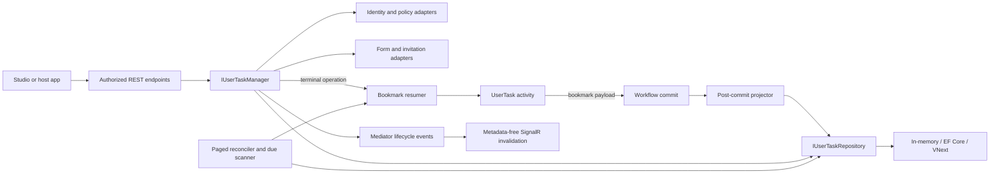

# Implementation Plan: User Tasks

**Feature**: `013-user-tasks` | **Date**: 2026-08-17 | **Specification**: [spec.md](spec.md)

## Summary

Deliver an identity-neutral human-task bounded context in Elsa Core and a reference task workbench in Elsa Studio. A blocking activity creates a materialized bookmark payload; post-commit projection creates a durable task record. Authorized REST commands atomically mutate task state and terminal commands asynchronously resume the bookmark. Reconciliation closes commit gaps. The core package defaults to in-memory persistence and optional provider packages mirror Elsa.Secrets.

## Technical Context

**Language/Version**: C# latest; nullable and implicit usings enabled; Blazor/Razor in Studio  
**Primary Dependencies**: Elsa feature/module and workflow runtime infrastructure, FastEndpoints via Elsa endpoint base types, mediator notifications, SignalR, Microsoft.Extensions.Options/Logging, ASP.NET Core Data Protection/rate limiting, EF Core provider packages  
**Storage**: In-memory development/test repository; module-specific EF Core context and SQLite, SQL Server, PostgreSQL, MySQL, Oracle packages; VNext document-store adapter  
**Testing**: xUnit, existing Elsa testing helpers, SQLite integration fixtures, Studio component/client tests where available  
**Targets**: Core `net8.0;net9.0;net10.0`; existing Studio targets  
**Performance Envelope**: approximately 100,000 open and millions of terminal tasks per tenant; cursor queries avoid protected JSON and page-number offsets  
**Constraints**: no Elsa.Identity dependency; no change to generic RunTask; task/bookmark consistency across failure and cluster races; protected data never disclosed through summary/search/realtime  
**Repositories**: Core worktree plus adjacent Elsa Studio repository; local-only delivery gates while GitHub is unavailable

## Constitution Check

### Pre-design

- Separate Core module, EF persistence, provider packages, and Studio module: PASS.
- Provider-neutral contracts and optional host integrations: PASS.
- Activity uses standard attributes and input/output wrappers: PASS.
- Endpoints remain one class per route and asynchronous: PASS.
- Public behavior and architecture are documented before code: PASS.
- Minimum scoped product: PASS; excluded capabilities are explicit.

### Post-design

- No persistence or identity infrastructure leaks into domain/API contracts: PASS.
- Every durable race has a revision/idempotency rule and test task: PASS.
- Every protected-data path has an authorization/disclosure rule: PASS.
- Multi-provider persistence follows established Elsa.Secrets boundaries: PASS.
- Local build/test/review gates replace only the explicitly skipped GitHub gates: PASS.

## Architecture

## Package and File Shape

### Elsa Core repository

- `src/modules/Elsa.UserTasks`: activity, domain models, contracts, default services, in-memory repository, projection/reconciliation/due workers, permissions, notifications, SignalR hub, endpoints, feature and shell feature.
- `src/modules/Elsa.UserTasks.Persistence.EFCore`: context, configurations, repository, feature.
- `src/modules/Elsa.UserTasks.Persistence.EFCore.{Sqlite,SqlServer,PostgreSql,MySql,Oracle}`: provider configuration, migrations, shell features.
- `src/modules/Elsa.UserTasks.Persistence.VNext`: document-store-backed repository/feature.
- `test/unit/Elsa.UserTasks.UnitTests`: lifecycle, identity, disclosure, form, invitation, idempotency, projection, due, API model tests.
- `test/integration/Elsa.UserTasks.IntegrationTests` where an existing test project pattern supports endpoint/runtime integration.

### Elsa Studio repository

- `src/modules/Elsa.Studio.UserTasks`: remote feature, menu, Refit client, models, queue/detail pages and components, optional extension interfaces, guest page, realtime/polling coordinator.
- Existing workflow designer renders the activity through metadata; custom inputs are added only where generic editing is insufficient.

## Delivery Sequence

1. Land the approved dossier, contracts, terminology, and traceable task ledger.
2. Implement the domain, state machine, activity/bookmark contract, repository, and focused unit tests.
3. Add post-commit projection, asynchronous completion, reconciliation, due processing, and lifecycle notifications.
4. Add authorized REST query/commands and safe DTO mapping.
5. Add invitations, guest sessions, delivery outbox, anonymous defenses, and tests.
6. Add EF Core/VNext persistence and provider migrations/configuration.
7. Add Studio queue/detail/designer/guest integrations.
8. Run targeted then broad local verification, traceability analysis, and up to five self-review passes.

## Verification Strategy

- Unit-test legal and illegal state transitions, exact revision increments, canonical idempotency payloads, claim and terminal races.
- Contract-test query authorization and safe/protected DTO mapping for every relationship.
- Runtime-test task projection after workflow commit, bookmark resume, finalization, and each reconciliation gap.
- SQLite-test durable restart, indexes, tenant isolation, cursor stability, and cleanup.
- Schema-review every provider migration and compile all provider projects.
- Studio-test tab queries, URL state, responsive route behavior, capability actions, conflict refresh, disclosure, realtime fallback, and accessibility semantics.
- Build affected projects first, then both repositories broadly without GitHub-dependent checks.

## Risk Controls

- **Dual-write inconsistency**: bookmark is source evidence; projection happens post-commit and a paged reconciler repairs both directions.
- **Authorization leakage**: repository query accepts an authorization scope compiled by policy; summary DTOs cannot carry protected fields.
- **Terminal duplicate resume**: transitional states, expected revision, canonical operation record, and bookmark-removal finalization.
- **Provider schema drift**: one EF model plus provider-specific migrations and a shared conformance suite.
- **Guest secret exposure**: hash at rest, encrypted transient outbox, generic anonymous surface, short bounded sessions.
- **Scope pressure**: v1 exclusions remain acceptance constraints; standalone tasks, drafts, attachments, comments, bulk actions, and native forms are not implementation tasks.
