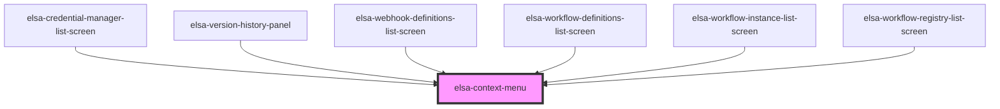

# elsa-context-menu

<!-- Auto Generated Below -->

## Properties

| Property    | Attribute | Description | Type            | Default     |
| ----------- | --------- | ----------- | --------------- | ----------- |
| `history`   | --        |             | `RouterHistory` | `undefined` |
| `menuItems` | --        |             | `MenuItem[]`    | `[]`        |

## Dependencies

### Used by

 - [elsa-credential-manager-list-screen](../../../modules/credential-manager/components)
 - [elsa-version-history-panel](../../screens/workflow-definition-editor/elsa-version-history-panel)
 - [elsa-webhook-definitions-list-screen](../../../modules/elsa-webhooks/components/screens/webhook-definition-list/else-webhook-definitions-screen)
 - [elsa-workflow-definitions-list-screen](../../screens/workflow-definition-list/elsa-workflow-definitions-screen)
 - [elsa-workflow-instance-list-screen](../../screens/workflow-instance-list/elsa-workflow-instance-list-screen)
 - [elsa-workflow-registry-list-screen](../../screens/workflow-registry-list/elsa-workflow-registry-list-screen)

### Graph

----------------------------------------------

*Built with [StencilJS](https://stenciljs.com/)*
