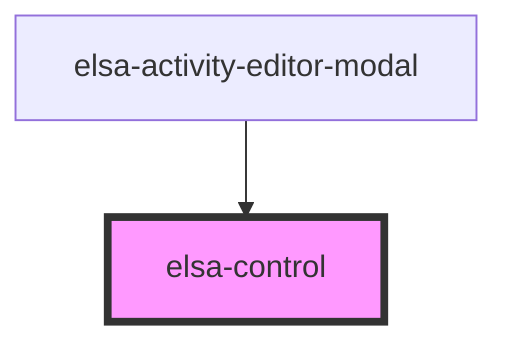

# elsa-control

<!-- Auto Generated Below -->

## Properties

| Property  | Attribute | Description | Type                         | Default     |
| --------- | --------- | ----------- | ---------------------------- | ----------- |
| `content` | `content` |             | `Element \| VNode \| string` | `undefined` |

## Dependencies

### Used by

 - [elsa-activity-editor-modal](../../screens/workflow-definition-editor/elsa-activity-editor-modal)

### Graph

----------------------------------------------

*Built with [StencilJS](https://stenciljs.com/)*
