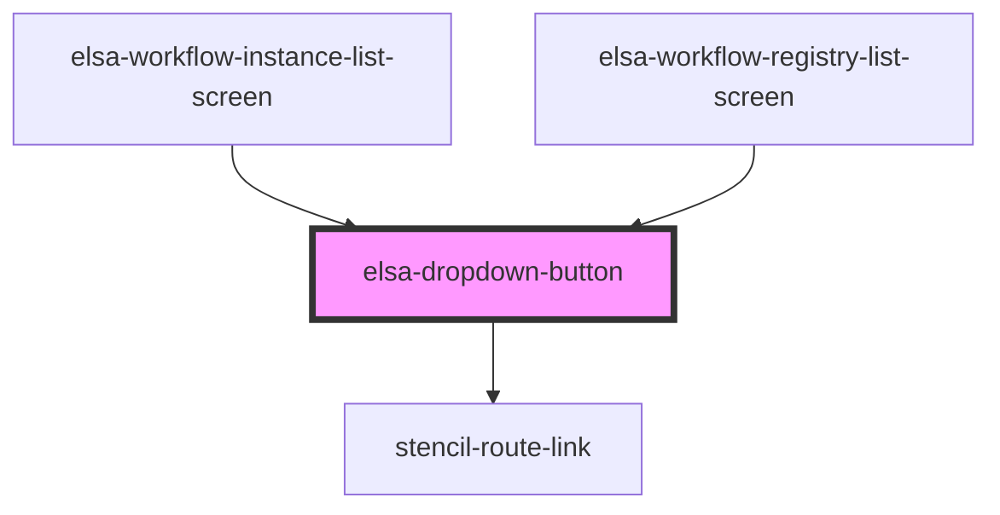

# elsa-dropdown-button

<!-- Auto Generated Below -->

## Properties

| Property | Attribute | Description | Type                                                            | Default                        |
| -------- | --------- | ----------- | --------------------------------------------------------------- | ------------------------------ |
| `icon`   | `icon`    |             | `any`                                                           | `undefined`                    |
| `items`  | --        |             | `DropdownButtonItem[]`                                          | `[]`                           |
| `origin` | `origin`  |             | `DropdownButtonOrigin.TopLeft \| DropdownButtonOrigin.TopRight` | `DropdownButtonOrigin.TopLeft` |
| `text`   | `text`    |             | `string`                                                        | `undefined`                    |

## Events

| Event          | Description | Type                              |
| -------------- | ----------- | --------------------------------- |
| `itemSelected` |             | `CustomEvent<DropdownButtonItem>` |

## Dependencies

### Used by

 - [elsa-workflow-instance-list-screen](../../screens/workflow-instance-list/elsa-workflow-instance-list-screen)
 - [elsa-workflow-registry-list-screen](../../screens/workflow-registry-list/elsa-workflow-registry-list-screen)

### Depends on

- stencil-route-link

### Graph

----------------------------------------------

*Built with [StencilJS](https://stenciljs.com/)*
