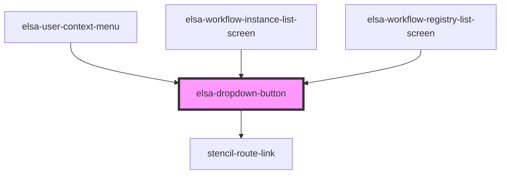

# elsa-dropdown-button

<!-- Auto Generated Below -->

## Properties

| Property   | Attribute   | Description | Type                                                            | Default                                                                                                                                                                                                                                                                                                                    |
| ---------- | ----------- | ----------- | --------------------------------------------------------------- | -------------------------------------------------------------------------------------------------------------------------------------------------------------------------------------------------------------------------------------------------------------------------------------------------------------------------- |
| `btnClass` | `btn-class` |             | `string`                                                        | `" elsa-w-full elsa-bg-white elsa-border elsa-border-gray-300 elsa-rounded-md elsa-shadow-sm elsa-px-4 elsa-py-2 elsa-inline-flex elsa-justify-center elsa-text-sm elsa-font-medium elsa-text-gray-700 hover:elsa-bg-gray-50 focus:elsa-outline-none focus:elsa-ring-2 focus:elsa-ring-offset-2 focus:elsa-ring-blue-500"` |
| `icon`     | `icon`      |             | `any`                                                           | `undefined`                                                                                                                                                                                                                                                                                                                |
| `items`    | --          |             | `DropdownButtonItem[]`                                          | `[]`                                                                                                                                                                                                                                                                                                                       |
| `origin`   | `origin`    |             | `DropdownButtonOrigin.TopLeft \| DropdownButtonOrigin.TopRight` | `DropdownButtonOrigin.TopLeft`                                                                                                                                                                                                                                                                                             |
| `text`     | `text`      |             | `string`                                                        | `undefined`                                                                                                                                                                                                                                                                                                                |

## Events

| Event          | Description | Type                              |
| -------------- | ----------- | --------------------------------- |
| `itemSelected` |             | `CustomEvent<DropdownButtonItem>` |

## Dependencies

### Used by

 - [elsa-user-context-menu](../elsa-user-context-menu)
 - [elsa-workflow-instance-list-screen](../../screens/workflow-instance-list/elsa-workflow-instance-list-screen)
 - [elsa-workflow-registry-list-screen](../../screens/workflow-registry-list/elsa-workflow-registry-list-screen)

### Depends on

- stencil-route-link

### Graph

----------------------------------------------

*Built with [StencilJS](https://stenciljs.com/)*
