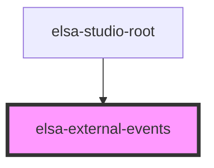

# elsa-external-events

<!-- Auto Generated Below -->

## Events

| Event                     | Description | Type                                                           |
| ------------------------- | ----------- | -------------------------------------------------------------- |
| `httpClientConfigCreated` |             | `CustomEvent<AxiosRequestConfig>`                              |
| `httpClientCreated`       |             | `CustomEvent<{ service: any; axiosInstance: AxiosInstance; }>` |

## Dependencies

### Used by

 - [elsa-studio-root](../../dashboard/pages/elsa-studio-root)

### Graph

----------------------------------------------

*Built with [StencilJS](https://stenciljs.com/)*
