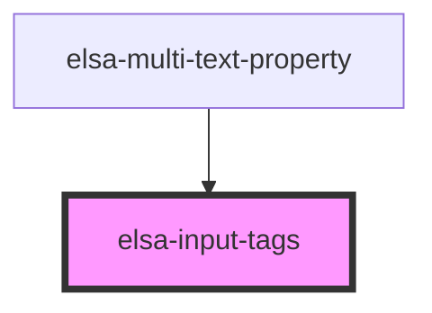

# elsa-input-tags

<!-- Auto Generated Below -->

## Properties

| Property      | Attribute      | Description | Type       | Default     |
| ------------- | -------------- | ----------- | ---------- | ----------- |
| `fieldId`     | `field-id`     |             | `string`   | `undefined` |
| `fieldName`   | `field-name`   |             | `string`   | `undefined` |
| `placeHolder` | `place-holder` |             | `string`   | `'Add tag'` |
| `values`      | --             |             | `string[]` | `[]`        |

## Events

| Event          | Description | Type                    |
| -------------- | ----------- | ----------------------- |
| `valueChanged` |             | `CustomEvent<string[]>` |

## Dependencies

### Used by

 - [elsa-multi-text-property](../../editors/properties/elsa-multi-text-property)

### Graph

----------------------------------------------

*Built with [StencilJS](https://stenciljs.com/)*
