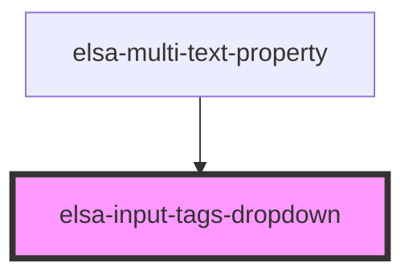

# elsa-input-tags

<!-- Auto Generated Below -->

## Properties

| Property         | Attribute      | Description | Type                           | Default     |
| ---------------- | -------------- | ----------- | ------------------------------ | ----------- |
| `dropdownValues` | --             |             | `SelectListItem[]`             | `[]`        |
| `fieldId`        | `field-id`     |             | `string`                       | `undefined` |
| `fieldName`      | `field-name`   |             | `string`                       | `undefined` |
| `placeHolder`    | `place-holder` |             | `string`                       | `'Add tag'` |
| `values`         | --             |             | `(string \| SelectListItem)[]` | `[]`        |

## Events

| Event          | Description | Type                                        |
| -------------- | ----------- | ------------------------------------------- |
| `valueChanged` |             | `CustomEvent<(string \| SelectListItem)[]>` |

## Dependencies

### Used by

 - [elsa-multi-text-property](../../editors/properties/elsa-multi-text-property)

### Graph

----------------------------------------------

*Built with [StencilJS](https://stenciljs.com/)*
