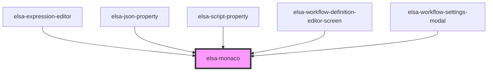

# elsa-modal-dialog

<!-- Auto Generated Below -->

## Properties

| Property         | Attribute         | Description | Type      | Default     |
| ---------------- | ----------------- | ----------- | --------- | ----------- |
| `editorHeight`   | `editor-height`   |             | `string`  | `'5em'`     |
| `language`       | `language`        |             | `string`  | `undefined` |
| `monacoLibPath`  | `monaco-lib-path` |             | `string`  | `undefined` |
| `padding`        | `padding`         |             | `string`  | `undefined` |
| `singleLineMode` | `single-line`     |             | `boolean` | `false`     |
| `value`          | `value`           |             | `string`  | `undefined` |

## Events

| Event          | Description | Type                                  |
| -------------- | ----------- | ------------------------------------- |
| `valueChanged` |             | `CustomEvent<MonacoValueChangedArgs>` |

## Methods

### `addJavaScriptLib(libSource: string, libUri: string) => Promise<void>`

#### Returns

Type: `Promise<void>`

### `setValue(value: string) => Promise<void>`

#### Returns

Type: `Promise<void>`

## Dependencies

### Used by

 - [elsa-expression-editor](../../editors/elsa-expression-editor)
 - [elsa-json-property](../../editors/properties/elsa-json-property)
 - [elsa-script-property](../../editors/properties/elsa-script-property)
 - [elsa-workflow-definition-editor-screen](../../screens/workflow-definition-editor/elsa-workflow-definition-editor-screen)
 - [elsa-workflow-settings-modal](../../screens/workflow-definition-editor/elsa-workflow-settings-modal)

### Graph

----------------------------------------------

*Built with [StencilJS](https://stenciljs.com/)*
