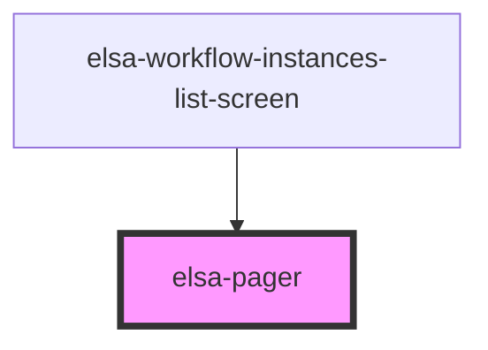

# elsa-pager

<!-- Auto Generated Below -->

## Properties

| Property     | Attribute     | Description | Type               | Default     |
| ------------ | ------------- | ----------- | ------------------ | ----------- |
| `history`    | --            |             | `RouterHistory`    | `undefined` |
| `location`   | --            |             | `LocationSegments` | `undefined` |
| `page`       | `page`        |             | `number`           | `undefined` |
| `pageSize`   | `page-size`   |             | `number`           | `undefined` |
| `totalCount` | `total-count` |             | `number`           | `undefined` |

## Dependencies

### Used by

 - [elsa-workflow-instances-list-screen](../../screens/workflow-instances-list/elsa-workflow-instances-list-screen)

### Graph

----------------------------------------------

*Built with [StencilJS](https://stenciljs.com/)*
