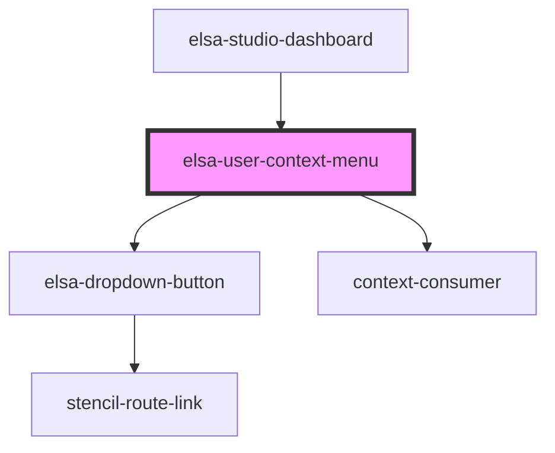

# elsa-context-menu

<!-- Auto Generated Below -->

## Properties

| Property    | Attribute   | Description | Type     | Default     |
| ----------- | ----------- | ----------- | -------- | ----------- |
| `serverUrl` | `serverurl` |             | `string` | `undefined` |

## Dependencies

### Used by

 - [elsa-studio-dashboard](../../dashboard/pages/elsa-studio-dashboard)

### Depends on

- [elsa-dropdown-button](../elsa-dropdown-button)
- context-consumer

### Graph

----------------------------------------------

*Built with [StencilJS](https://stenciljs.com/)*
