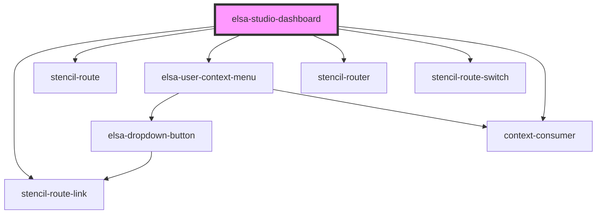

# elsa-studio-dashboard

<!-- Auto Generated Below -->

## Properties

| Property   | Attribute   | Description | Type     | Default     |
| ---------- | ----------- | ----------- | -------- | ----------- |
| `basePath` | `base-path` |             | `string` | `''`        |
| `culture`  | `culture`   |             | `string` | `undefined` |

## Dependencies

### Depends on

- stencil-route-link
- stencil-route
- [elsa-user-context-menu](../../../controls/elsa-user-context-menu)
- stencil-router
- stencil-route-switch
- context-consumer

### Graph

----------------------------------------------

*Built with [StencilJS](https://stenciljs.com/)*
