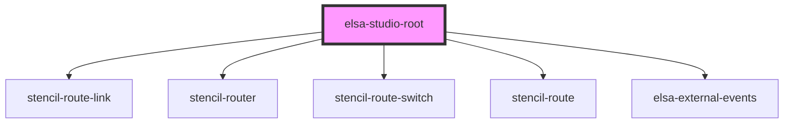

# elsa-studio-root

<!-- Auto Generated Below -->

## Properties

| Property        | Attribute         | Description | Type     | Default     |
| --------------- | ----------------- | ----------- | -------- | ----------- |
| `monacoLibPath` | `monaco-lib-path` |             | `string` | `undefined` |
| `serverUrl`     | `server-url`      |             | `string` | `undefined` |

## Dependencies

### Depends on

- stencil-route-link
- stencil-router
- stencil-route-switch
- stencil-route
- [elsa-external-events](../../../controls/elsa-external-events)

### Graph

----------------------------------------------

*Built with [StencilJS](https://stenciljs.com/)*
