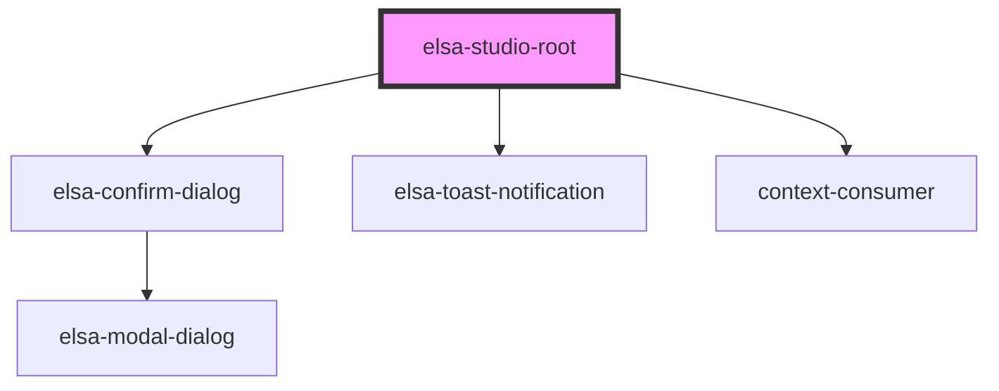

# elsa-studio-root

<!-- Auto Generated Below -->

## Properties

| Property        | Attribute         | Description | Type     | Default     |
| --------------- | ----------------- | ----------- | -------- | ----------- |
| `basePath`      | `base-path`       |             | `string` | `''`        |
| `culture`       | `culture`         |             | `string` | `undefined` |
| `monacoLibPath` | `monaco-lib-path` |             | `string` | `undefined` |
| `serverUrl`     | `server-url`      |             | `string` | `undefined` |

## Events

| Event          | Description | Type                      |
| -------------- | ----------- | ------------------------- |
| `initializing` |             | `CustomEvent<ElsaStudio>` |

## Methods

### `addPlugin(pluginType: any) => Promise<void>`

#### Returns

Type: `Promise<void>`

### `addPlugins(pluginTypes: Array<any>) => Promise<void>`

#### Returns

Type: `Promise<void>`

## Dependencies

### Depends on

- [elsa-confirm-dialog](../../../shared/elsa-confirm-dialog)
- [elsa-toast-notification](../../../shared/elsa-toast-notification)
- context-consumer

### Graph

----------------------------------------------

*Built with [StencilJS](https://stenciljs.com/)*
