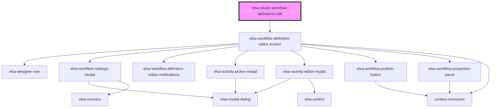

# elsa-studio-workflow-definitions-edit

<!-- Auto Generated Below -->

## Properties

| Property | Attribute | Description | Type           | Default     |
| -------- | --------- | ----------- | -------------- | ----------- |
| `match`  | --        |             | `MatchResults` | `undefined` |

## Dependencies

### Depends on

- [elsa-workflow-definition-editor-screen](../../../screens/workflow-definition-editor/elsa-workflow-definition-editor-screen)

### Graph

----------------------------------------------

*Built with [StencilJS](https://stenciljs.com/)*
