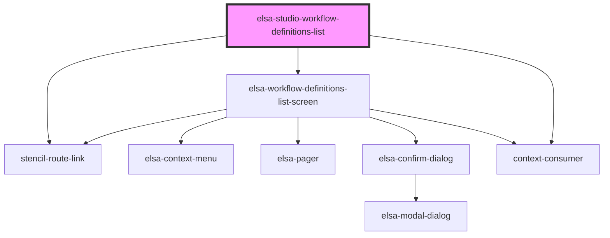

# elsa-studio-workflow-definitions-list

<!-- Auto Generated Below -->

## Properties

| Property    | Attribute    | Description | Type            | Default     |
| ----------- | ------------ | ----------- | --------------- | ----------- |
| `basePath`  | `base-path`  |             | `string`        | `undefined` |
| `culture`   | `culture`    |             | `string`        | `undefined` |
| `history`   | --           |             | `RouterHistory` | `undefined` |
| `serverUrl` | `server-url` |             | `string`        | `undefined` |

## Dependencies

### Depends on

- stencil-route-link
- [elsa-workflow-definitions-list-screen](../../../screens/workflow-definition-list/elsa-workflow-definitions-screen)
- context-consumer

### Graph

----------------------------------------------

*Built with [StencilJS](https://stenciljs.com/)*
