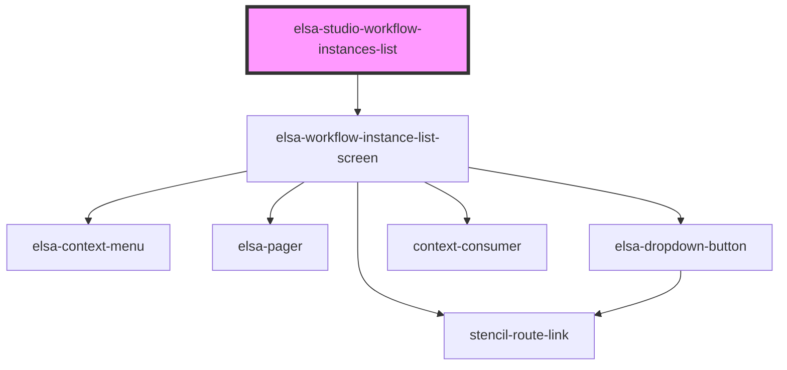

# elsa-studio-workflow-instances-list

<!-- Auto Generated Below -->

## Properties

| Property  | Attribute | Description | Type     | Default     |
| --------- | --------- | ----------- | -------- | ----------- |
| `culture` | `culture` |             | `string` | `undefined` |

## Dependencies

### Depends on

- [elsa-workflow-instance-list-screen](../../../screens/workflow-instance-list/elsa-workflow-instance-list-screen)

### Graph

----------------------------------------------

*Built with [StencilJS](https://stenciljs.com/)*
