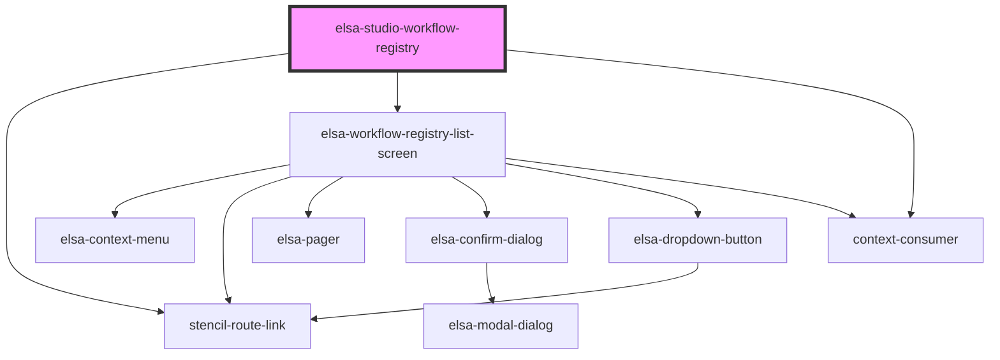

# elsa-studio-workflow-registry

<!-- Auto Generated Below -->

## Properties

| Property   | Attribute   | Description | Type     | Default     |
| ---------- | ----------- | ----------- | -------- | ----------- |
| `basePath` | `base-path` |             | `string` | `undefined` |
| `culture`  | `culture`   |             | `string` | `undefined` |

## Dependencies

### Depends on

- stencil-route-link
- [elsa-workflow-registry-list-screen](../../../screens/workflow-registry-list/elsa-workflow-registry-list-screen)
- context-consumer

### Graph

----------------------------------------------

*Built with [StencilJS](https://stenciljs.com/)*
