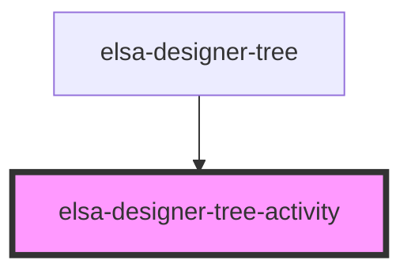

# elsa-designer-tree-activity

<!-- Auto Generated Below -->

## Properties

| Property         | Attribute  | Description | Type                           | Default     |
| ---------------- | ---------- | ----------- | ------------------------------ | ----------- |
| `displayContext` | --         |             | `ActivityDesignDisplayContext` | `undefined` |
| `icon`           | `icon`     |             | `string`                       | `undefined` |
| `isSelected`     | `selected` |             | `boolean`                      | `undefined` |

## Events

| Event             | Description | Type                         |
| ----------------- | ----------- | ---------------------------- |
| `deselected`      |             | `CustomEvent<ActivityModel>` |
| `edit-activity`   |             | `CustomEvent<ActivityModel>` |
| `remove-activity` |             | `CustomEvent<ActivityModel>` |
| `selected`        |             | `CustomEvent<ActivityModel>` |

## Dependencies

### Used by

 - [elsa-designer-tree](../elsa-designer-tree)

### Graph

----------------------------------------------

*Built with [StencilJS](https://stenciljs.com/)*
