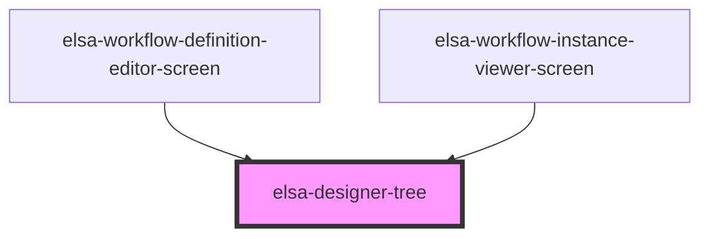

# elsa-designer-tree

<!-- Auto Generated Below -->

## Properties

| Property              | Attribute   | Description | Type            | Default                                                                                             |
| --------------------- | ----------- | ----------- | --------------- | --------------------------------------------------------------------------------------------------- |
| `editMode`            | `edit-mode` |             | `boolean`       | `true`                                                                                              |
| `model`               | --          |             | `WorkflowModel` | `{activities: [], connections: [], persistenceBehavior: WorkflowPersistenceBehavior.WorkflowBurst}` |
| `selectedActivityIds` | --          |             | `string[]`      | `[]`                                                                                                |

## Events

| Event                | Description | Type                         |
| -------------------- | ----------- | ---------------------------- |
| `activityDeselected` |             | `CustomEvent<ActivityModel>` |
| `activitySelected`   |             | `CustomEvent<ActivityModel>` |
| `workflow-changed`   |             | `CustomEvent<WorkflowModel>` |

## Dependencies

### Used by

 - [elsa-workflow-definition-editor-screen](../../../screens/workflow-definition-editor/elsa-workflow-definition-editor-screen)
 - [elsa-workflow-instance-viewer-screen](../../../screens/workflow-instance-viewer/elsa-workflow-instance-viewer-screen)

### Graph

----------------------------------------------

*Built with [StencilJS](https://stenciljs.com/)*
