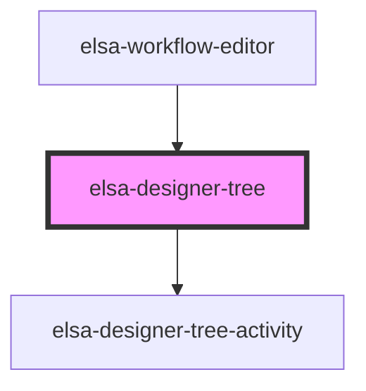

# elsa-designer-tree

<!-- Auto Generated Below -->

## Properties

| Property | Attribute | Description | Type            | Default                             |
| -------- | --------- | ----------- | --------------- | ----------------------------------- |
| `model`  | --        |             | `WorkflowModel` | `{activities: [], connections: []}` |

## Events

| Event              | Description | Type                         |
| ------------------ | ----------- | ---------------------------- |
| `workflow-changed` |             | `CustomEvent<WorkflowModel>` |

## Dependencies

### Used by

 - [elsa-workflow-editor](../../../editors/elsa-workflow-editor)

### Depends on

- [elsa-designer-tree-activity](../elsa-designer-tree-activity)

### Graph

----------------------------------------------

*Built with [StencilJS](https://stenciljs.com/)*
