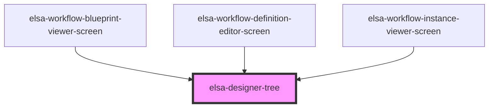

# elsa-designer-tree

<!-- Auto Generated Below -->

## Properties

| Property                                    | Attribute                     | Description | Type                                                                                           | Default                                                                                             |
| ------------------------------------------- | ----------------------------- | ----------- | ---------------------------------------------------------------------------------------------- | --------------------------------------------------------------------------------------------------- |
| `activityBorderColor`                       | --                            |             | `(activity: ActivityModel) => string`                                                          | `undefined`                                                                                         |
| `activityContextMenu`                       | --                            |             | `ActivityContextMenuState`                                                                     | `undefined`                                                                                         |
| `activityContextMenuButton`                 | --                            |             | `(activity: ActivityModel) => string`                                                          | `undefined`                                                                                         |
| `enableMultipleConnectionsFromSingleSource` | `enable-multiple-connections` |             | `boolean`                                                                                      | `undefined`                                                                                         |
| `layoutDirection`                           | `layout-direction`            |             | `LayoutDirection.Horizontal \| LayoutDirection.Vertical`                                       | `LayoutDirection.Vertical`                                                                          |
| `mode`                                      | `mode`                        |             | `WorkflowDesignerMode.Blueprint \| WorkflowDesignerMode.Edit \| WorkflowDesignerMode.Instance` | `WorkflowDesignerMode.Edit`                                                                         |
| `model`                                     | --                            |             | `WorkflowModel`                                                                                | `{activities: [], connections: [], persistenceBehavior: WorkflowPersistenceBehavior.WorkflowBurst}` |
| `selectedActivityIds`                       | --                            |             | `string[]`                                                                                     | `[]`                                                                                                |

## Events

| Event                              | Description | Type                                    |
| ---------------------------------- | ----------- | --------------------------------------- |
| `activityContextMenuButtonClicked` |             | `CustomEvent<ActivityContextMenuState>` |
| `activityDeselected`               |             | `CustomEvent<ActivityModel>`            |
| `activitySelected`                 |             | `CustomEvent<ActivityModel>`            |
| `workflow-changed`                 |             | `CustomEvent<WorkflowModel>`            |

## Methods

### `removeActivity(activity: ActivityModel) => Promise<void>`

#### Returns

Type: `Promise<void>`

### `showActivityEditor(activity: ActivityModel, animate: boolean) => Promise<void>`

#### Returns

Type: `Promise<void>`

## Dependencies

### Used by

 - [elsa-workflow-blueprint-viewer-screen](../../../screens/workflow-blueprint-viewer/elsa-workflow-blueprint-viewer-screen)
 - [elsa-workflow-definition-editor-screen](../../../screens/workflow-definition-editor/elsa-workflow-definition-editor-screen)
 - [elsa-workflow-instance-viewer-screen](../../../screens/workflow-instance-viewer/elsa-workflow-instance-viewer-screen)

### Graph

----------------------------------------------

*Built with [StencilJS](https://stenciljs.com/)*
