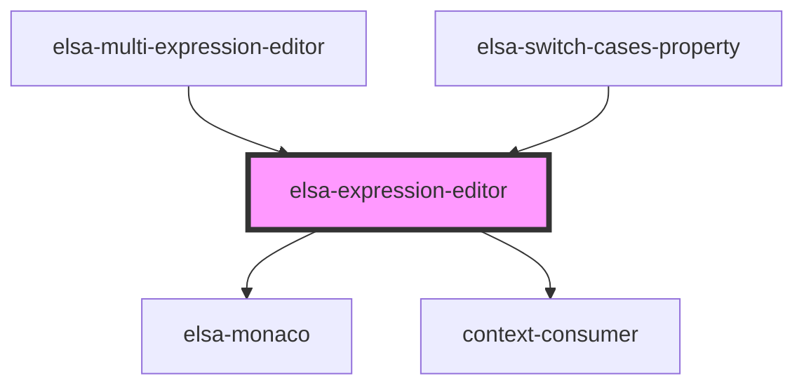

# elsa-expression-editor

<!-- Auto Generated Below -->

## Properties

| Property               | Attribute                | Description | Type                  | Default     |
| ---------------------- | ------------------------ | ----------- | --------------------- | ----------- |
| `context`              | --                       |             | `IntellisenseContext` | `undefined` |
| `editorHeight`         | `editor-height`          |             | `string`              | `'6em'`     |
| `expression`           | `expression`             |             | `string`              | `undefined` |
| `language`             | `language`               |             | `string`              | `undefined` |
| `opensModal`           | `opens-modal`            |             | `boolean`             | `false`     |
| `padding`              | `padding`                |             | `string`              | `undefined` |
| `serverUrl`            | `server-url`             |             | `string`              | `undefined` |
| `singleLineMode`       | `single-line`            |             | `boolean`             | `false`     |
| `workflowDefinitionId` | `workflow-definition-id` |             | `string`              | `undefined` |

## Events

| Event               | Description | Type                  |
| ------------------- | ----------- | --------------------- |
| `expressionChanged` |             | `CustomEvent<string>` |

## Methods

### `setExpression(value: string) => Promise<void>`

#### Returns

Type: `Promise<void>`

## Dependencies

### Used by

 - [elsa-multi-expression-editor](../elsa-multi-expression-editor)
 - [elsa-switch-cases-property](../properties/elsa-switch-cases-property)

### Depends on

- [elsa-monaco](../../controls/elsa-monaco)
- context-consumer

### Graph

----------------------------------------------

*Built with [StencilJS](https://stenciljs.com/)*
