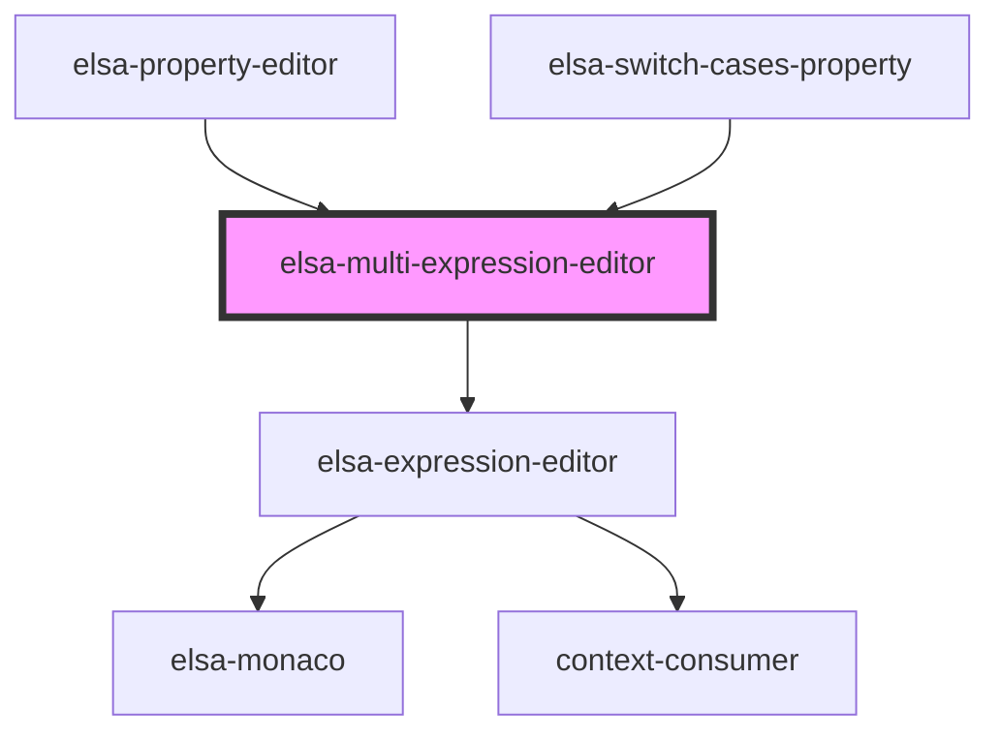

# elsa-multi-expression-editor

<!-- Auto Generated Below -->

## Properties

| Property            | Attribute        | Description | Type                         | Default               |
| ------------------- | ---------------- | ----------- | ---------------------------- | --------------------- |
| `context`           | --               |             | `IntellisenseContext`        | `undefined`           |
| `defaultSyntax`     | `default-syntax` |             | `string`                     | `SyntaxNames.Literal` |
| `editorHeight`      | `editor-height`  |             | `string`                     | `'10em'`              |
| `expressions`       | --               |             | `{ [key: string]: string; }` | `{}`                  |
| `fieldName`         | `field-name`     |             | `string`                     | `undefined`           |
| `isReadOnly`        | `is-read-only`   |             | `boolean`                    | `undefined`           |
| `label`             | `label`          |             | `string`                     | `undefined`           |
| `singleLineMode`    | `single-line`    |             | `boolean`                    | `false`               |
| `supportedSyntaxes` | --               |             | `string[]`                   | `[]`                  |
| `syntax`            | `syntax`         |             | `string`                     | `undefined`           |

## Events

| Event               | Description | Type                  |
| ------------------- | ----------- | --------------------- |
| `expressionChanged` |             | `CustomEvent<string>` |
| `syntaxChanged`     |             | `CustomEvent<string>` |

## Dependencies

### Used by

 - [elsa-property-editor](../elsa-property-editor)
 - [elsa-switch-cases-property](../properties/elsa-switch-cases-property)

### Depends on

- [elsa-expression-editor](../elsa-expression-editor)

### Graph

----------------------------------------------

*Built with [StencilJS](https://stenciljs.com/)*
