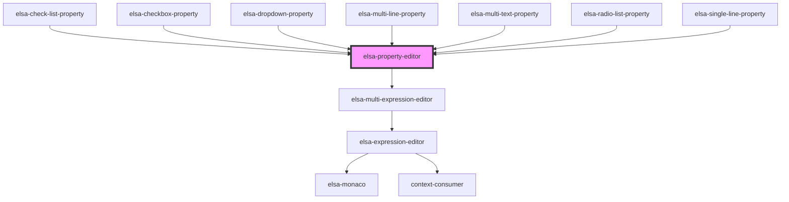

# elsa-property-editor

<!-- Auto Generated Below -->

## Properties

| Property             | Attribute       | Description | Type                         | Default     |
| -------------------- | --------------- | ----------- | ---------------------------- | ----------- |
| `context`            | `context`       |             | `string`                     | `undefined` |
| `editorHeight`       | `editor-height` |             | `string`                     | `'6em'`     |
| `propertyDescriptor` | --              |             | `ActivityPropertyDescriptor` | `undefined` |
| `propertyModel`      | --              |             | `ActivityDefinitionProperty` | `undefined` |
| `showLabel`          | `show-label`    |             | `boolean`                    | `true`      |
| `singleLineMode`     | `single-line`   |             | `boolean`                    | `false`     |

## Events

| Event                       | Description | Type                  |
| --------------------------- | ----------- | --------------------- |
| `defaultSyntaxValueChanged` |             | `CustomEvent<string>` |

## Dependencies

### Used by

 - [elsa-check-list-property](../properties/elsa-check-list-property)
 - [elsa-checkbox-property](../properties/elsa-checkbox-property)
 - [elsa-dropdown-property](../properties/elsa-dropdown-property)
 - [elsa-multi-line-property](../properties/elsa-multi-line-property)
 - [elsa-multi-text-property](../properties/elsa-multi-text-property)
 - [elsa-radio-list-property](../properties/elsa-radio-list-property)
 - [elsa-single-line-property](../properties/elsa-single-line-property)

### Depends on

- [elsa-multi-expression-editor](../elsa-multi-expression-editor)

### Graph

----------------------------------------------

*Built with [StencilJS](https://stenciljs.com/)*
