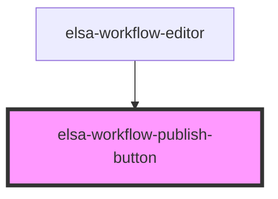

# elsa-activity-picker-modal

<!-- Auto Generated Below -->

## Events

| Event            | Description | Type               |
| ---------------- | ----------- | ------------------ |
| `publishClicked` |             | `CustomEvent<any>` |

## Dependencies

### Used by

 - [elsa-workflow-editor](../elsa-workflow-editor)

### Graph

----------------------------------------------

*Built with [StencilJS](https://stenciljs.com/)*
