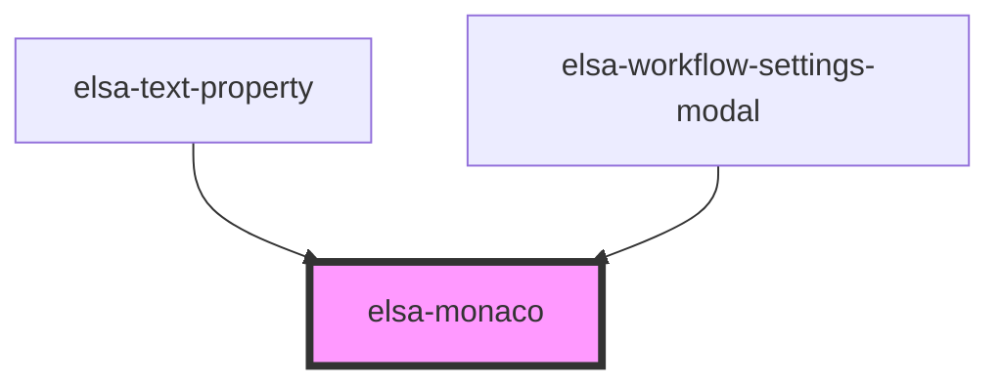

# elsa-modal-dialog

<!-- Auto Generated Below -->

## Properties

| Property         | Attribute       | Description | Type      | Default     |
| ---------------- | --------------- | ----------- | --------- | ----------- |
| `editorHeight`   | `editor-height` |             | `string`  | `'6em'`     |
| `language`       | `language`      |             | `string`  | `undefined` |
| `singleLineMode` | `single-line`   |             | `boolean` | `false`     |
| `value`          | `value`         |             | `string`  | `undefined` |

## Events

| Event          | Description | Type                                  |
| -------------- | ----------- | ------------------------------------- |
| `valueChanged` |             | `CustomEvent<MonacoValueChangedArgs>` |

## Methods

### `addJavaScriptLib(libSource: string, libUri: string) => Promise<void>`

#### Returns

Type: `Promise<void>`

## Dependencies

### Used by

 - [elsa-text-property](../../properties/elsa-text-property)
 - [elsa-workflow-settings-modal](../../workflow-editor/elsa-workflow-settings-modal)

### Graph

----------------------------------------------

*Built with [StencilJS](https://stenciljs.com/)*
