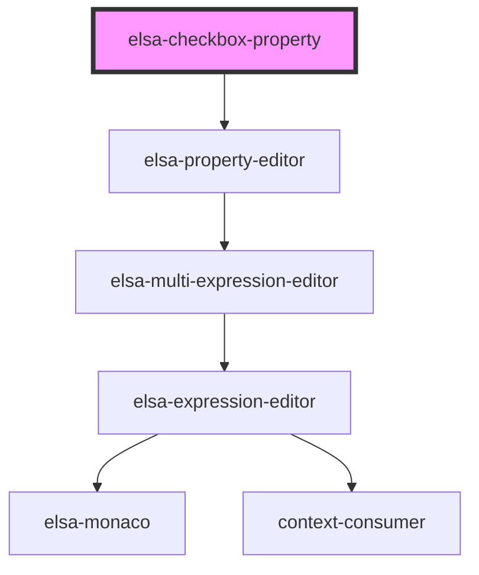

# elsa-checkbox-property

<!-- Auto Generated Below -->

## Properties

| Property             | Attribute | Description | Type                         | Default     |
| -------------------- | --------- | ----------- | ---------------------------- | ----------- |
| `activityModel`      | --        |             | `ActivityModel`              | `undefined` |
| `propertyDescriptor` | --        |             | `ActivityPropertyDescriptor` | `undefined` |
| `propertyModel`      | --        |             | `ActivityDefinitionProperty` | `undefined` |

## Dependencies

### Depends on

- [elsa-property-editor](../../elsa-property-editor)

### Graph

----------------------------------------------

*Built with [StencilJS](https://stenciljs.com/)*
