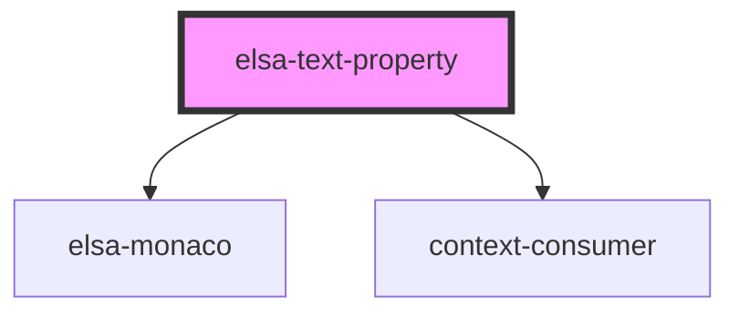

# elsa-modal-dialog

<!-- Auto Generated Below -->

## Properties

| Property               | Attribute                | Description | Type                         | Default     |
| ---------------------- | ------------------------ | ----------- | ---------------------------- | ----------- |
| `context`              | `context`                |             | `string`                     | `undefined` |
| `editorHeight`         | `editor-height`          |             | `string`                     | `'6em'`     |
| `propertyDescriptor`   | --                       |             | `ActivityPropertyDescriptor` | `undefined` |
| `propertyModel`        | --                       |             | `ActivityDefinitionProperty` | `undefined` |
| `serverUrl`            | `server-url`             |             | `string`                     | `undefined` |
| `singleLineMode`       | `single-line`            |             | `boolean`                    | `false`     |
| `workflowDefinitionId` | `workflow-definition-id` |             | `string`                     | `undefined` |

## Dependencies

### Depends on

- [elsa-monaco](../../monaco/elsa-monaco)
- context-consumer

### Graph

----------------------------------------------

*Built with [StencilJS](https://stenciljs.com/)*
