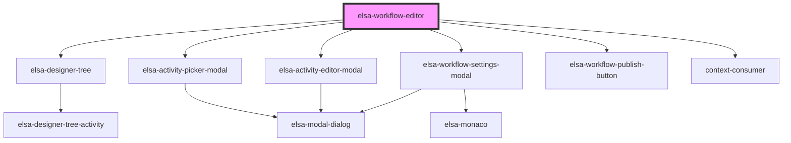

# elsa-workflow-definition-editor

<!-- Auto Generated Below -->

## Properties

| Property               | Attribute                | Description | Type     | Default     |
| ---------------------- | ------------------------ | ----------- | -------- | ----------- |
| `serverUrl`            | `server-url`             |             | `string` | `undefined` |
| `workflowDefinitionId` | `workflow-definition-id` |             | `string` | `undefined` |

## Methods

### `getServerUrl() => Promise<string>`

#### Returns

Type: `Promise<string>`

### `getWorkflowDefinitionId() => Promise<string>`

#### Returns

Type: `Promise<string>`

## Dependencies

### Depends on

- [elsa-designer-tree](../../../designers/tree/elsa-designer-tree)
- [elsa-activity-picker-modal](../../../pickers/elsa-activity-picker-modal)
- [elsa-activity-editor-modal](../elsa-activity-editor-modal)
- [elsa-workflow-settings-modal](../elsa-workflow-settings-modal)
- [elsa-workflow-publish-button](../elsa-workflow-publish-button)
- context-consumer

### Graph

----------------------------------------------

*Built with [StencilJS](https://stenciljs.com/)*
