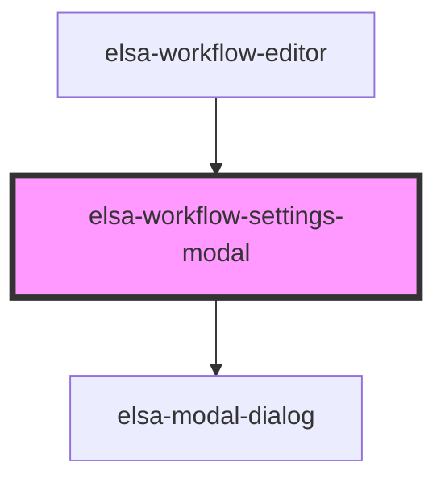

# elsa-activity-picker-modal

<!-- Auto Generated Below -->

## Properties

| Property             | Attribute | Description | Type                 | Default     |
| -------------------- | --------- | ----------- | -------------------- | ----------- |
| `workflowDefinition` | --        |             | `WorkflowDefinition` | `undefined` |

## Dependencies

### Used by

 - [elsa-workflow-editor](../elsa-workflow-editor)

### Depends on

- [elsa-modal-dialog](../../shared/elsa-modal-dialog)

### Graph

----------------------------------------------

*Built with [StencilJS](https://stenciljs.com/)*
