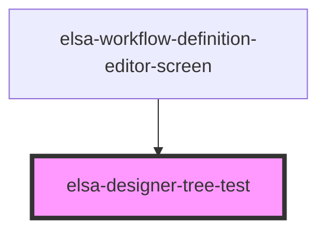

# elsa-designer-tree-test

<!-- Auto Generated Below -->

## Properties

| Property                                    | Attribute                     | Description | Type                                                                                                                        | Default                                                                                                             |
| ------------------------------------------- | ----------------------------- | ----------- | --------------------------------------------------------------------------------------------------------------------------- | ------------------------------------------------------------------------------------------------------------------- |
| `activityBorderColor`                       | --                            |             | `(activity: ActivityModel) => string`                                                                                       | `undefined`                                                                                                         |
| `activityContextMenu`                       | --                            |             | `ActivityContextMenuState`                                                                                                  | `undefined`                                                                                                         |
| `activityContextMenuButton`                 | --                            |             | `(activity: ActivityModel) => string`                                                                                       | `undefined`                                                                                                         |
| `activityContextTestMenu`                   | --                            |             | `ActivityContextMenuState`                                                                                                  | `undefined`                                                                                                         |
| `activityDefinitions`                       | --                            |             | `ActivityDefinitions[]`                                                                                                     | `[]`                                                                                                                |
| `connectionContextMenu`                     | --                            |             | `ActivityContextMenuState`                                                                                                  | `undefined`                                                                                                         |
| `enableMultipleConnectionsFromSingleSource` | `enable-multiple-connections` |             | `boolean`                                                                                                                   | `undefined`                                                                                                         |
| `layoutDirection`                           | `layout-direction`            |             | `LayoutDirection.BottomTop \| LayoutDirection.LeftRight \| LayoutDirection.RightLeft \| LayoutDirection.TopBottom`          | `LayoutDirection.TopBottom`                                                                                         |
| `mode`                                      | `mode`                        |             | `WorkflowDesignerMode.Blueprint \| WorkflowDesignerMode.Edit \| WorkflowDesignerMode.Instance \| WorkflowDesignerMode.Test` | `WorkflowDesignerMode.Edit`                                                                                         |
| `model`                                     | --                            |             | `WorkflowModel`                                                                                                             | `{     activities: [],     connections: [],     persistenceBehavior: WorkflowPersistenceBehavior.WorkflowBurst   }` |
| `selectedActivityIds`                       | --                            |             | `string[]`                                                                                                                  | `[]`                                                                                                                |
| `workflow`                                  | --                            |             | `WorkflowModel`                                                                                                             | `{     activities: [],     connections: []   }`                                                                     |

## Events

| Event                                  | Description | Type                                    |
| -------------------------------------- | ----------- | --------------------------------------- |
| `activityContextMenuButtonClicked`     |             | `CustomEvent<ActivityContextMenuState>` |
| `activityContextMenuButtonTestClicked` |             | `CustomEvent<ActivityContextMenuState>` |
| `activityDeselected`                   |             | `CustomEvent<ActivityModel>`            |
| `activitySelected`                     |             | `CustomEvent<ActivityModel>`            |
| `connectionContextMenuButtonClicked`   |             | `CustomEvent<ActivityContextMenuState>` |
| `workflow-changed`                     |             | `CustomEvent<WorkflowModel>`            |

## Methods

### `removeActivity(activity: ActivityModel) => Promise<void>`

#### Returns

Type: `Promise<void>`

### `removeSelectedActivities() => Promise<void>`

#### Returns

Type: `Promise<void>`

### `showActivityEditor(activity: ActivityModel, animate: boolean) => Promise<void>`

#### Returns

Type: `Promise<void>`

## Dependencies

### Used by

 - [elsa-workflow-definition-editor-screen](../screens/workflow-definition-editor/elsa-workflow-definition-editor-screen)

### Graph

----------------------------------------------

*Built with [StencilJS](https://stenciljs.com/)*
