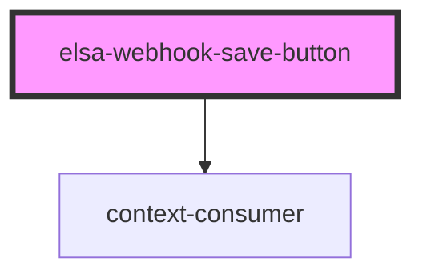

# elsa-webhook-save-button

<!-- Auto Generated Below -->

## Properties

| Property            | Attribute | Description | Type                | Default     |
| ------------------- | --------- | ----------- | ------------------- | ----------- |
| `saving`            | `saving`  |             | `boolean`           | `undefined` |
| `webhookDefinition` | --        |             | `WebhookDefinition` | `undefined` |

## Events

| Event         | Description | Type               |
| ------------- | ----------- | ------------------ |
| `saveClicked` |             | `CustomEvent<any>` |

## Dependencies

### Depends on

- context-consumer

### Graph

----------------------------------------------

*Built with [StencilJS](https://stenciljs.com/)*
