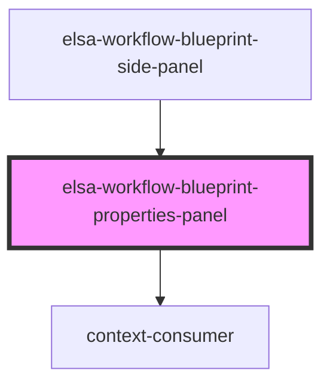

# elsa-workflow-properties-panel

<!-- Auto Generated Below -->

## Properties

| Property               | Attribute                | Description | Type                | Default     |
| ---------------------- | ------------------------ | ----------- | ------------------- | ----------- |
| `culture`              | `culture`                |             | `string`            | `undefined` |
| `expandButtonPosition` | `expand-button-position` |             | `number`            | `1`         |
| `serverUrl`            | `server-url`             |             | `string`            | `undefined` |
| `workflowBlueprint`    | --                       |             | `WorkflowBlueprint` | `undefined` |

## Dependencies

### Used by

 - [elsa-workflow-blueprint-side-panel](../elsa-workflow-blueprint-side-panel)

### Depends on

- context-consumer

### Graph

----------------------------------------------

*Built with [StencilJS](https://stenciljs.com/)*
