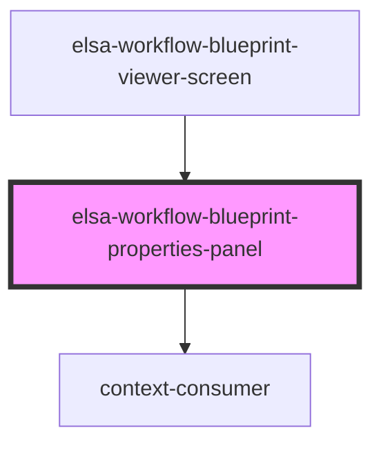

# elsa-workflow-properties-panel

<!-- Auto Generated Below -->

## Properties

| Property     | Attribute     | Description | Type     | Default     |
| ------------ | ------------- | ----------- | -------- | ----------- |
| `culture`    | `culture`     |             | `string` | `undefined` |
| `serverUrl`  | `server-url`  |             | `string` | `undefined` |
| `workflowId` | `workflow-id` |             | `string` | `undefined` |

## Dependencies

### Used by

 - [elsa-workflow-blueprint-viewer-screen](../elsa-workflow-blueprint-viewer-screen)

### Depends on

- context-consumer

### Graph

----------------------------------------------

*Built with [StencilJS](https://stenciljs.com/)*
