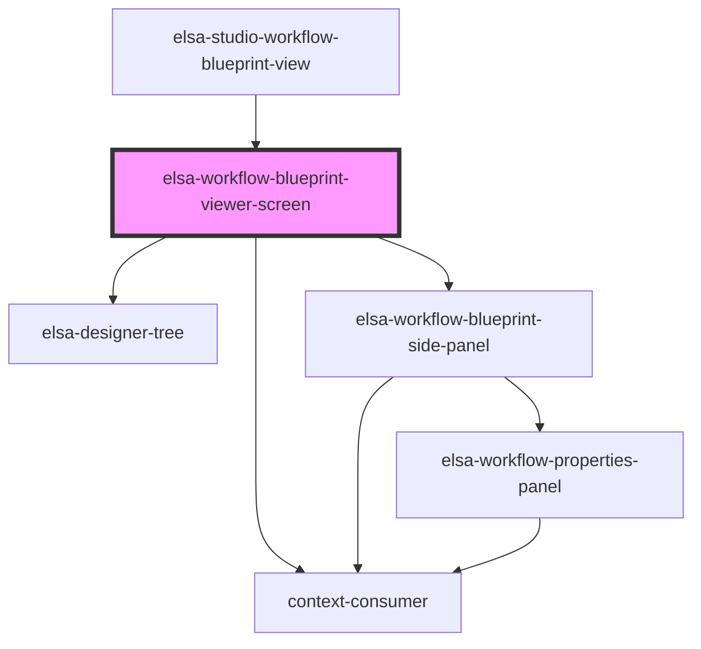

# elsa-workflow-instance-viewer-screen

<!-- Auto Generated Below -->

## Properties

| Property               | Attribute                | Description | Type     | Default     |
| ---------------------- | ------------------------ | ----------- | -------- | ----------- |
| `culture`              | `culture`                |             | `string` | `undefined` |
| `serverUrl`            | `server-url`             |             | `string` | `undefined` |
| `workflowDefinitionId` | `workflow-definition-id` |             | `string` | `undefined` |

## Methods

### `getServerUrl() => Promise<string>`

#### Returns

Type: `Promise<string>`

## Dependencies

### Used by

 - [elsa-studio-workflow-blueprint-view](../../../dashboard/pages/elsa-studio-workflow-blueprint-view)

### Depends on

- [elsa-designer-tree](../../../designers/tree/elsa-designer-tree)
- [elsa-workflow-blueprint-side-panel](../elsa-workflow-blueprint-side-panel)
- context-consumer

### Graph

----------------------------------------------

*Built with [StencilJS](https://stenciljs.com/)*
