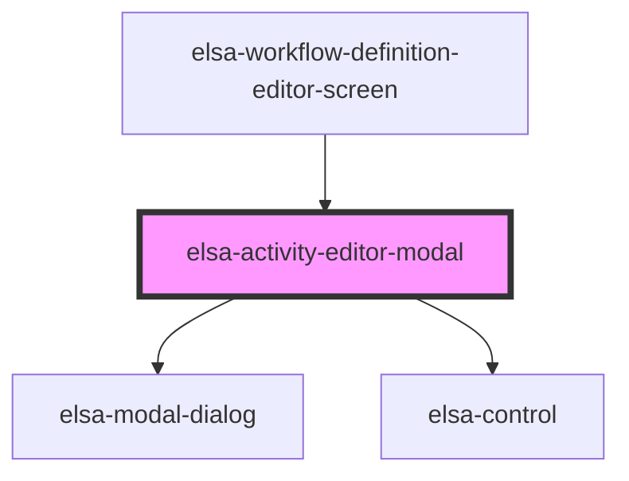

# elsa-activity-editor-modal

<!-- Auto Generated Below -->

## Properties

| Property  | Attribute | Description | Type     | Default     |
| --------- | --------- | ----------- | -------- | ----------- |
| `culture` | `culture` |             | `string` | `undefined` |

## Dependencies

### Used by

 - [elsa-workflow-definition-editor-screen](../elsa-workflow-definition-editor-screen)

### Depends on

- [elsa-modal-dialog](../../../shared/elsa-modal-dialog)
- [elsa-control](../../../controls/elsa-control)

### Graph

----------------------------------------------

*Built with [StencilJS](https://stenciljs.com/)*
